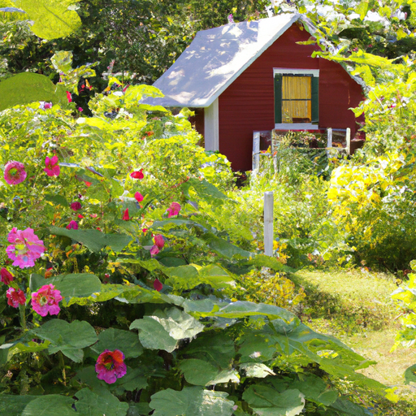
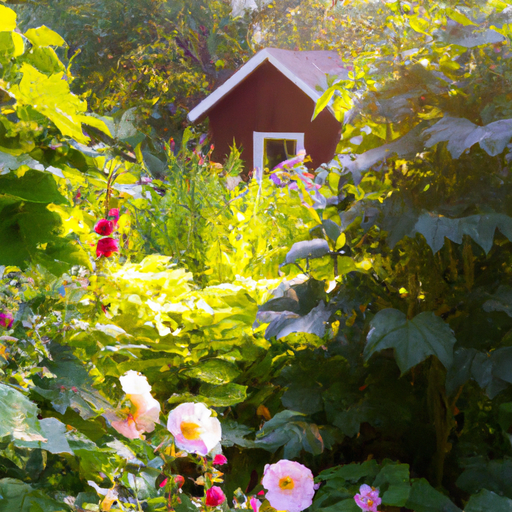
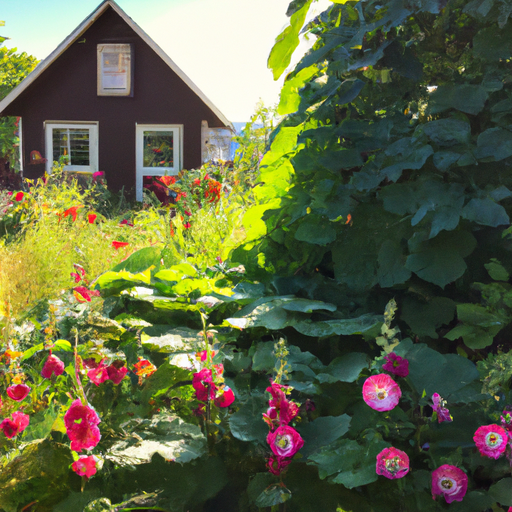

## [It is time to move on - shifts and changes in a rural valley](https://www.youtube.com/watch?v=FwT3NUZ6vk8)

<table align="center">
	<tr>
		<td align="center">
			
		</td>
		<td align="center">
			
		</td>
		<td align="center">
			
		</td>
	</tr>
</table>

My summer is ripe, the raspberries are perfect for eating, the calindala and hollyhocks are in full bloom. It's beautiful and I cannot wait to make something delicious with my harvest.

This week, I realized something important. I've made so many videos about my transition to a new life, shared the ups and downs, and yet in my heart, I still haven't moved on from my old little cottage. I still find myself missing my old routines and everything that was so familiar. Everything is so new and different, I can't help but think back to my old life and suddenly see things as so much simpler. But they weren't, not really. Life is always beautiful and messy. I still felt complicated emotions back then too. It's funny how we look at the past through rose-colored lenses, remembering what we want to, not necessarily what was.

I was so happy at my old cottage, but also impatient to start a new life with my partner. If there is one truth my little home and experiences have taught me, it is that your relationship with life is one not unlike that of a friend or partner. You must fall in love with it again and again, find new ways to see joy, and new routines and habits to help you along the way.

Then, I think it's okay to have complicated emotions and resist change, even when we want it. Humans are funny that way, and like learning anything new, it takes time and dedication to reap the rewards. And we must allow ourselves to step into the unknown from time to time if we feel that the benefits are well worth the risk.

My little home is now a memory, and my new life is here in my present, full of all the necessities of shelter, safety, and love. And so, there really isn't any reason to hold on to the past because all I ever needed was here all along.

So, I do have some exciting news, and that is that I am sitting on a couch. We have been looking for a couch for a very long time, and if you order a couch, it can be quite difficult to deliver it here because of the long winding dirt roads. And, um, we finally did it. We finally found one, so we finally have somewhere to sit while I've been going on this journey of learning to handle my emotions while I'm going through such a drastic shift in life.

I, um, did notice that I have been dwelling on my former cottage quite a bit on social media. I notice it is quite popular to showcase the transition to a new life, be that moving to a new country, starting life after marriage, or just moving into a new house. I think, of course, it is really exciting and fun to share all that, but I do think there's a side to it that can be just so, so difficult.

You know, as you may know, I was a military child. My father was a naval officer in the military for my entire life, and so I moved around a lot. And I moved to new countries very often because we were going to different places and moving to different bases. And there was always this side of it that was so exciting and wonderful and beautiful, the side you want to photograph and share. But then there was this other side of it that was just, it was really hard. It was an enormous shift and change. Everything was different. There were very few things that felt familiar about your new lifestyle and your new routine. And it could take days, if not weeks, if not years to get really used to a new pace of life in a different place.

And thankfully, I know that what got me through all big changes in my life was the people I love. You know, and my family being there made anything possible. Luke being with me on this journey of starting a new life makes everything possible and makes it all better and easier. But it can still be very challenging. And of course, in the scheme of things, it's so normal and not really a big deal. At the end of the day, everyone needs an adjustment period. But I thought it was just worth sharing because I think it would be maybe useful to talk about. It's okay that things are not perfect off the bat. It's okay that things are messy and rough sometimes as you figure things out in a totally new type of life.

And I have had so many incredible moments of joy and so happy I made this decision, but also, we've had moments where Luke and I have been like, "Wow, former lifestyle seems so much simpler compared to this." All these experiences are bringing us closer. So yes, I just thought it might be really great to talk a little bit about how we often romanticize the past when we are facing challenges in the present.

But yes, in realization that I was dwelling more on the past than perhaps was helpful to me, I decided, you know, to try to turn my energy a little more towards the future. And you may have seen that in my last couple of videos where I focused a lot more on decorating and making my house a home and making it feel like a cozy space, you know, just ready to accept all those incredible new memories.

Oop, I'm sorry, sorry for the sudden shift and change. The mailman stopped by to deliver a package, and my dog went crazy, and my cat went crazy. Everyone went crazy. So we have finally brought peace back to the household.

So I can add my last note, which was to say thank you. Thank you so much for all your kindness and support. If you happen to have ordered my book, I'm going to go more into detail with this in a future video. But after taking a look at the final copy, my editor and I realized that there were just some formatting changes that really had to be made. And so, to try to ensure the best quality and best end result, we just decided to go ahead and push back the release date to be able to make those changes.

So if you ordered the book and were anticipating for it to come out this month, I sincerely, sincerely apologize for the delay. It is still coming out this year. I do appreciate your understanding. So thank you again for the support in that way. It is a dream come true. And I hope you all have a wonderful week and take care of yourselves. I'm sending you all my love, and I will see you very soon. Goodbye.