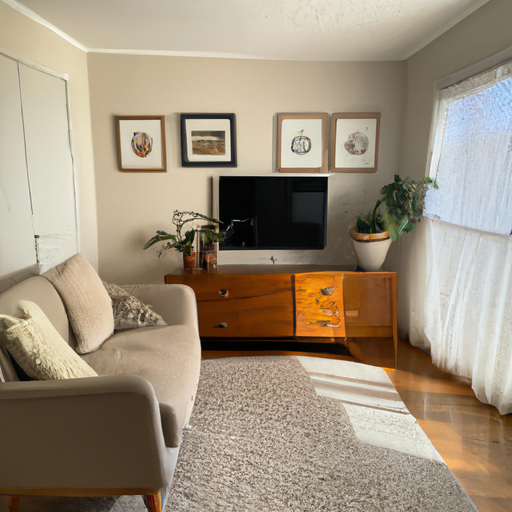
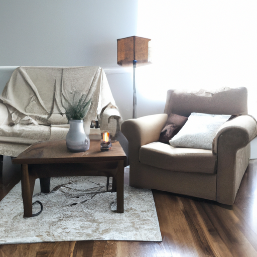
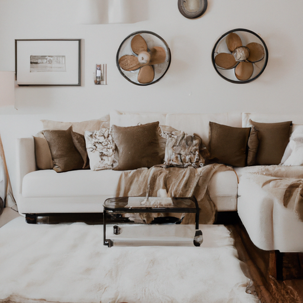

## [Journey to a simple life - my story](https://www.youtube.com/watch?v=3Wd70GBa62c)

<table align="center">
	<tr>
		<td align="center">
<<<<<<< HEAD
			
		</td>
		<td align="center">
			
		</td>
		<td align="center">
			
=======
			
		</td>
		<td align="center">
			
		</td>
		<td align="center">
			
>>>>>>> ffe52613361410ad9d371a0f80e81de4dd24175f
		</td>
	</tr>
</table>

In this video, I wish to share my own journey in regards to simple living. Everyone has a different definition of what this means, and I think that's perfectly fine since everyone's life and choices are unique. This is a little bit of my personal story.

My lifestyle change was motivated by my younger self, who was a far more anxious and fearful person than I am now. I spent my teens and first years as an adult saving money in any way I could, convinced it would somehow keep me safe from the scary world.

I lived as far below my means as possible and saved the rest. I worked long hours and had friends who thought I was crazy for living the way I did. In hindsight, obsessively saving money was a sign of a spiritual void that I was trying to fill by attempting to control what I could not.

As I matured, I became more comfortable spending money on things I needed or that would add value to my life, and I've come a long way since. I now cherish investing in a cozy and beautiful home, my hobbies, and experiences.

However, I have come to respect my earlier choices as a teen since it helped me achieve my dreams, but also made me realize that I needed to grow in wisdom and let go of my fear of losing what I worked hard for. I now practice a far more moderate version of that lifestyle, one that is motivated by seeking internal fulfillment over being a constant consumer. I now find deep enjoyment in traveling and experiencing new things while not relying on it to be happy.

As a creative person, I love decorating my space and having access to all the art supplies I need. I also like to house old books and antiques, my own art, and that of others. In general, things of beauty, as well as purpose, bring me joy. So does living in alignment with my beliefs that we need to learn new habits of consumption in order to build a brighter tomorrow and healthier earth.

While I am not emotionally reliant on objects, they do add quality to my life, especially my books and art. Of course, having too much creates clutter, which is detrimental to my peace of mind. I try to stop and consider each item that I bring into my home, where it comes from, and what role it will have. I love to support small businesses and second-hand shops. I'm far from perfect and unable to adhere to this philosophy all the time, but I try, and that's all we need to do.

I still live below my means, and it keeps my mind feeling peaceful while motivating me to develop my internal spirit. I continue to save and invest in my dreams, ensuring that my future will be that much more stable because of it. I imagine owning my own home someday, being able to provide for my future children, feeling free from the idea that I need more and more to feel secure. Instead, this, right now, is enough. I believe in myself and my ability to deal with situations as they come.

I'm grateful for what I have and see it as such a blessing to have my basic needs. I am enough as I am, and I cannot control the future. I can make good choices, but life is unpredictable, and that's not a bad thing. If I suddenly lose everything, I still have my soul. I'm doing just fine, and so are you.

I'm sending you my love and wish that your year be abundant in every way that your spirit needs.