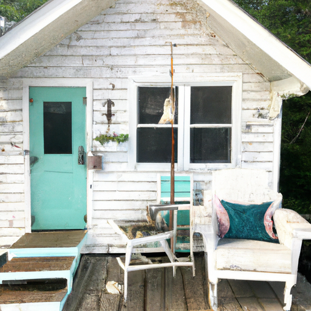
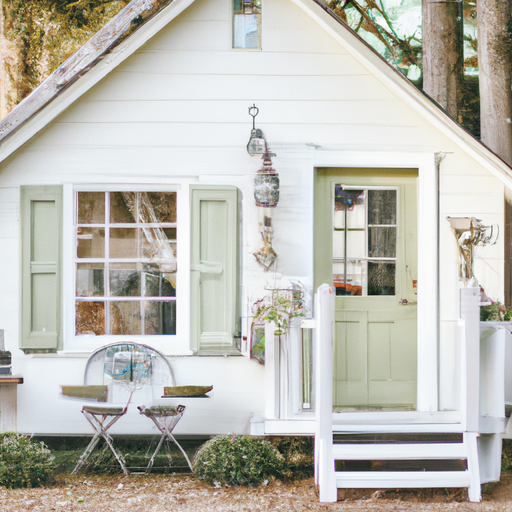
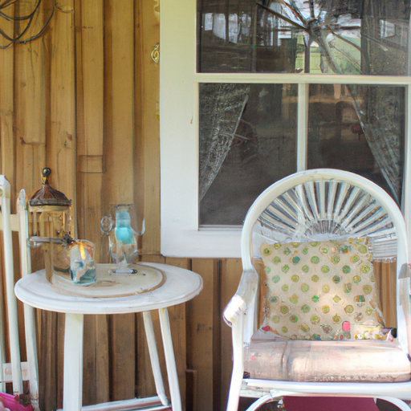

## [Let s tour my cottage..](https://www.youtube.com/@TheCottageFairy)

<table align="center">
	<tr>
		<td align="center">
			
		</td>
		<td align="center">
			
		</td>
		<td align="center">
			
		</td>
	</tr>
</table>

Hello everyone and welcome to my little corner of the world. Today I wanted to do a cottage tour, since so many people have requested to see inside my home.

When I first moved in I took some time to make it feel like a little piece of wonderland that I could escape to after work and unleash my creativity. For me, what makes my cottage special is all the tiny little details, from making pressed flower art from my walls to my little tea collection that I have been growing this year... and of course my mini houseplants and miniatures.

Even though it is a one-room cottage, it feels like the perfect size for me. I think that even if I had a family in the future, I wouldn't want a place that much bigger. It is so easy to keep clean and tidy, and that makes me happy since I'm capable of creating enormous messes, especially in relation to my art projects. You can see here that I've been painting the walls. I find it a wonderful way to personalize the space.

You may also notice that I'm obsessed with books. I get them mostly secondhand but I did use to work at a bookstore. If I could only recommend one to you, it would be “the boy the mole the fox and the horse” (link below). It is a hybrid between a children's book and an adult book and it is beautiful.

To those who have inquired about my wardrobe, pretty much all of it has been thrifted or gifted to me by family members. My bathroom actually doesn't have a sink with running water, but I get along just fine with a pitcher and basin. It's amazing how over time with living this way I've become accustomed to it. I don't really need anything else to feel comfortable. My boyfriend brings me crystals that he has found out on his hikes in the mountains and I love to decorate my space with them.

Of course, my favorite part of my cottage is my art desk. It is where I like to sit and think up all my new ideas for future projects. That is where I also keep some of my favorite old books. It is so wonderful to hold a piece of history in your hands.

As you can see, this cottage is small and simple. I love to fill it with little unusual pieces that I find at thrift stores or natural things that I find around my property. I have so many plans to paint the walls even more and I hope you enjoyed looking around. I decided not to do a garden tour since many of my plants have been taken by the autumn frost. However, I have many plants next year to grow a multitude of herbs and flowers and I will definitely share it with you.