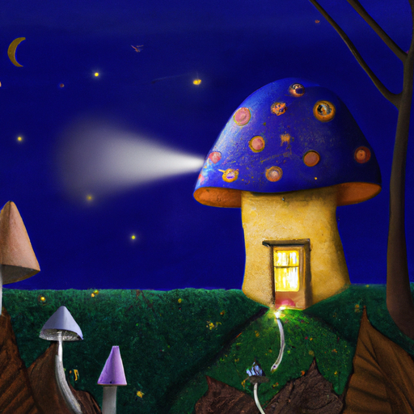
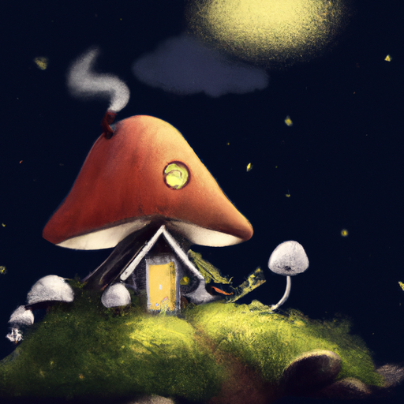
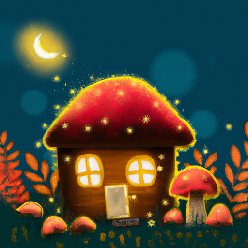

## [Living seasonally in October - a simple day](https://www.youtube.com/watch?v=E1TYNqqCXLw)

<table align="center">
	<tr>
		<td align="center">
<<<<<<< HEAD
			
		</td>
		<td align="center">
			
		</td>
		<td align="center">
			
=======
			
		</td>
		<td align="center">
			
		</td>
		<td align="center">
			
>>>>>>> ffe52613361410ad9d371a0f80e81de4dd24175f
		</td>
	</tr>
</table>

It has been an extremely eventful Autumn so far for me, as you well know. After getting engaged there’s suddenly been a lot to anticipate and consider for the future. No doubt, I will be experiencing some great changes in my life in the coming year, and so it has made it clear to me that I really need to appreciate my time in this sweet, cozy little cottage.

Recently, I decided to experiment with growing my own mushrooms. I love wild mushrooms, particularly morels, they have a very distinct taste that I crave all year. I was told oyster mushroom are also delicious, and so I decided to pick up some local grow bags. I have always found mushrooms fascinating, not only do they look interesting but the way they grow seems so different from many plants. I imagine if they could talk, they would be quite gentle creatures. It takes very little space and water to grow them, every part of the process is compostable, and they don’t need any light. They are possibly one of the most energy efficient things you can grow. They are also known to have amazing health benefits.

My father was a navy doctor and we lived in Italy for a while, and while I was there I developed a deep appreciation for simple, high quality whole foods and connecting to the source of what we eat each season. While in a modern setting – depending on where you live - that is understandably hard to do, especially because high quality ingredients can be expensive or hard to come by. I love to find little ways to connect with the food I consume and understand how it grows, even if it’s something as simple as growing sprouts on my windowsill. It’s so easy and always delicious.

One of my favorite things about learning to use a camera is taking time lapses. Something about the seeing the way that things grow always reminds me of the magic in this world, and the way a spore or seed sprouts an entire lifeform is incredible.

I once read a book on mediations written by a very wise mystic. In it he described how in the midst of winter he would walk through a dormant apple orchard. The trees would have no leaves and look completely dead. And yet, when he touched the bark and put his face up close, he could smell the apples. The essence of the fruit was deep inside, in the core and roots of the tree. Even in the dead of winter, there was life. That tree held within it a thousand apples, they just hadn’t been formed quite yet. I like to apply that idea to our own spirits, how we have within us so much potential for giving. If we let it grow, much like apples – it has the capability to feed the spirits around us as well as ourselves. In my case, I like to imagine a seed of light inside my heart during this time of year, when the days are quickly getting darker – almost like holding a single star that reflects the night sky. I need to take care of that star and not let anything suppress its light. It is a thought I use to inspire my meditations, perhaps it is something that will inspire you as you reach the end of the year and begin to think about the possibilities of the next. Perhaps we don’t need to set any particular goal for the future, only to dedicate ourselves to tending the light we hold within, and do whatever we need in order to let it shine the greater.

As you can see I’ve been spending a lot of time on my porch star gazing and I have become infatuated with the night sky, I swear moon bunnies are dancing around in my head as I speak. Thank you for indulging my nighttime musings. I hope you have a lovely day or night.