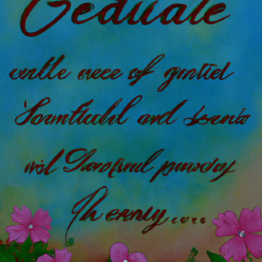
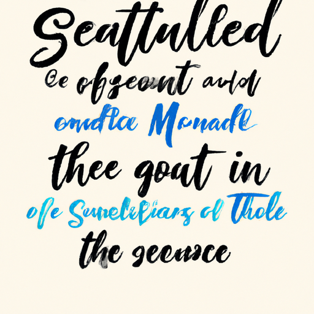
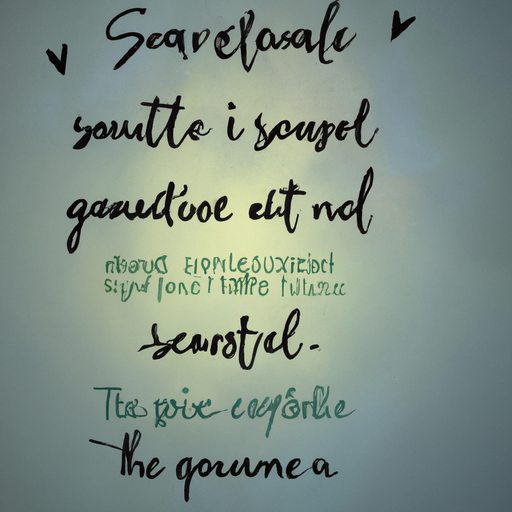

## [Losing my confidence + how I deal with criticism](https://www.youtube.com/watch?v=uCLtDExp3ac)

<table align="center">
	<tr>
		<td align="center">
			
		</td>
		<td align="center">
			
		</td>
		<td align="center">
			
		</td>
	</tr>
</table>

I went to the post this morning and picked up some letters from some of you, and spent the morning reading them. Each one is so touching and I often find myself reflecting on your words and stories for the rest of the day.

One wonderful viewer in particular asked me how I have developed confidence, considering I make videos and have accepted the positive and negative criticism that entails. They also asked me how I combat allergies this time of year, and unfortunately that is a constant battle I have yet to find a lasting solution for.

I considered myself a very quiet and nervous child, but despite it I did really enjoy my own company and had an inner confidence in myself even though I was very shy around other people. Then, I turned 18 and was living with my family on a naval base in Italy. I wanted to study literature nearby, and so I started my degree in Ireland and later finishing it in the states. This was a wonderful experience, but also difficult. I had always lived with my family, and the sudden change was a lot to take in. Everyone said I’d stop missing them in time, but that never changed.

I was in a very vulnerable position for those years of learning how to be an adult and unfortunately it caused me to be a poor judge of character. I was lonely and desperate for anyone who could make me feel safe in a world that felt suddenly so chaotic, and unfortunately that desperation attracted people with the opposite intention. I was blind to the difference between someone who wants to support and help, and someone who wants to control and suppress who you are. I was so young, and I say that knowing I still am, but it’s incredible how certain experiences give you a completely new perspective on life. As naive and unbelievable as it sounds, I truly could not believe that someone would intentionally be unkind, or that mean people don’t necessarily want to change. So, I believed the excuses and apologies, always ready to forgive and forget.

To this day, I still don’t understand people who do cruel things, and honestly, I don’t think I ever will.

In retrospect, I learned a lot. I realized that I had to become stronger and assertive, and not to agree with things just to be agreeable. I also had to distance myself from people who did not consider my safety or wellbeing. Of course, I will not give those people the compliment of saying that my experience with them led me to become confident, because that is not true. I am on a journey of self love and confidence despite them. I had to be brave and make my own decisions instead of letting someone else take over. I had to learn to be at peace with the body and mind and soul that was given to me. To let go of wishing things were different. To treat my mistakes with gentle understanding.

Lastly, I decided that past experiences wouldn’t keep me from loving again and being open to the fear that comes with that. I’m happy to say that I know have someone in my life that if I could describe in two words, it would be kind and gentle. Someone who wants to compliment you, not control. And that’s all I ever really needed. With a unshakable foundation of love and respect, everything else slowly fell into place.