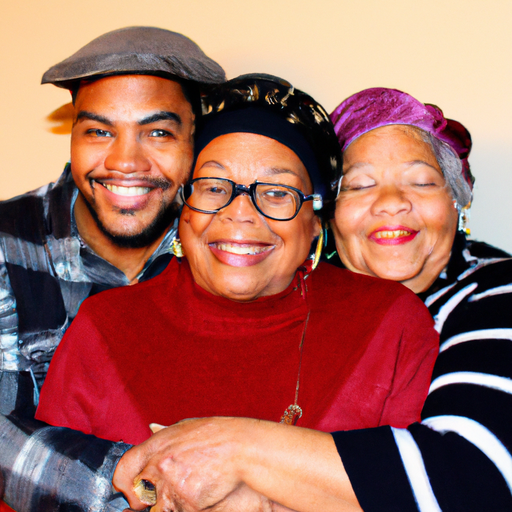
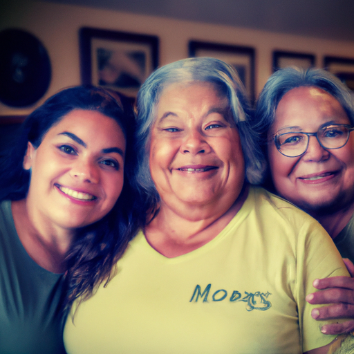
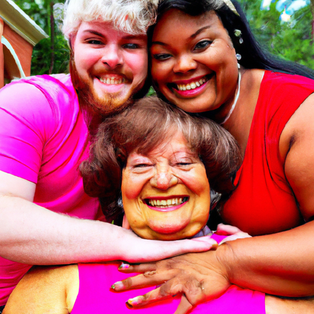

## [Meet Three People I Love + answering your questions](https://www.youtube.com/watch?v=xIMFVV1eTTM)

<table align="center">
	<tr>
		<td align="center">
			
		</td>
		<td align="center">
			
		</td>
		<td align="center">
			
		</td>
	</tr>
</table>

Hello everyone, I wanted to make one extra video this week because I just had the idea to share a little bit about the people that mean so much to me and consequently a little bit of my life outside of these videos. I find my husband, my mother, and my grandmother to be people that really inspire me and always help me feel better when I'm not at my best. So, I wanted to just add this little video in as just something extra. Feel free to skip this for next week for my more usual content, but yeah, it was just an idea I had and I thought it would be really lovely to kind of chat with some people that I love and share a little bit about them with you. So, I hope you enjoy. I'm sending you my love. I will see you soon.

My name? Yes, um, so could you share where you grew up? I grew up in Puerto Rico in Santorse, which is part of the capital San Juan. And I lived in, I was born in Barrio and then we moved to La Samapoles, which was a project still in Rio Piedras area.

So, you were a first-generation college student, right? You moved to the US, right? Um, to New York, right? When? What age were you? I was 22. And what was your experience like there? It was very challenging. I didn't know English when I arrived. It was very hard for me to learn English because I was living in a Hispanic community. So, I joined the Navy Reserve because I thought going away and being immersed in English-speaking culture and people and environment would help me. Even though there were a lot of traumatic experiences, it also made me grow and I learned so much, be more self-reliant.

Well, it's just water. Well, I want some fake tea. You want a sip of my fake tea? Mmm, I just, if it's water in a mug, I call it tea. Okay, just makes sense to me. Nobody.

Hello everyone, at long last, I have been able to have Luke sit down to dispel a common statement. Are you my cameraman? I am not. Okay, or cameraman, do I have a camera crew that films my videos? You do not. Okay, anyway, trying to dispel some myths now that I have a witness. How did we meet, would you say? Oh, I just spilled tea on myself. However you want to say, you were really into it. You kind of ignored me for the first couple minutes when we met. I don't think I even made icons. No, yeah, we were kind of set up on kind of a blind group date, honestly. Yeah, and um, I specifically, you know, I was absolutely not interested in a relationship at the time. I thought I wasn't. You just moved over here, yeah. Yeah, I didn't know it was a group date until I kind of got there, pretty much. And so I was, I was very upset. And so Luke, um, unfairly received the brunt of shoulder. Yeah, yeah, but, uh, yeah, you kept in contact. I think it took like two months, wasn't that before we went on a date? Or a month or so? Yeah, yeah, close to a month. Yeah, yeah, so before you accepted my invitation, yeah, kept thrilling a little while. Yeah, we, yeah, we went to a lake for our first date called Cutthroat Lake. And I mentioned it to my sister and she felt like that was a very concerning name for a lake to go on your first date. But it all worked out, nothing horrible happened. Nope, you tried to get me to jump into the water. I did, and I refused. There's still snow around the lake too. Yeah, glacial temperature water. It's not my fault I couldn't get her to go for it. Three years later, I still haven't been able to. No, I noticed the other day, um, I was trying to find a specific link for my book and I put in "The Cottage Fairy" on Google and one of the first questions that came up of recently searched questions or I think often popular searches is, "Is The Cottage Fairy real?" Oh, she's real. And she's real, alright. Am I real? I know her, yeah. How does it feel living with someone else after spending so much time living on your own? Because I think we both came, yeah. Very good question. Yeah, it feels wonderful. It's a very nice change of pace, one that I've been looking forward to for a very long time. Yeah, yeah, I feel the same way. Alright, well, anyway, here he is. Thank you all. If you made it this far, leave your questions down below and I'll have him answer for you. That's The Cottage Fairy. You just gotta reply me. You got a few hearts, your flowers. Okay, rainbows at the end of each sentence. Thank you, everyone. Do you?