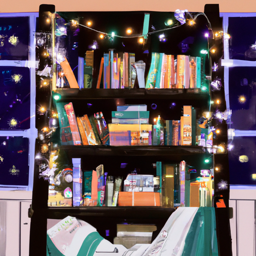

## [My Bookshelf Tour and Home Library + the books that made me who I am](https://www.youtube.com/watch?v=quYxmKPOtlw)

<table align="center">
	<tr>
		<td align="center">
<<<<<<< HEAD
			
		</td>
		<td align="center">
			
		</td>
		<td align="center">
			
=======
			
		</td>
		<td align="center">
			
		</td>
		<td align="center">
			
>>>>>>> ffe52613361410ad9d371a0f80e81de4dd24175f
		</td>
	</tr>
</table>

I have been adding honey and grapefruit to my green tea every morning lately and I have to admit it is just delicious. I only have caffeinated drinks about once a week or so, but today this green tea was much needed because I have to admit to you, I'm very tired. I am so tired and I don't really know why. I cannot come up with an explanation, only that I am. I had plans to go skiing and go on a big hike and adventure through a certain part of the forest I haven't gone to yet, and all of those plans are disintegrating before my eyes. However, my spirits are still quite high because I have an extremely exciting project today and it has to do with books and bookshelves. Luke has been kind enough to make me some new bookshelves and they are a great improvement on the ones I had, which, while they look lovely, are quite rickety. So, I am so happy about it and I'm very excited to be reorganizing and decorating my books and hopefully dividing them up to find which ones I should give away because let's be honest, I have too many books. I've said in past videos that there's no such thing as too many books, but in my case, starting this new year because I no longer work at my bookstore, I'm taking a break for now to try to figure out some other things with my schedule. I am going to be using the library a lot, so I want to minimize my selection, give some away, give some to friends, but of course, that's going to be very hard to do because they're my books. They are your non-sentient children, so it will not be easy, but I am excited because what better way to spend the evening for a book lover than organizing a bookshelf?

So, these are the bookshelves that Luke made me. When he asked me what my vision was, I just said that I wanted to feel like I had a little library and a fairy home in the forest, and so he made these raw wood-edged bookshelves, and I just think they're so unique and beautiful, and they smell delicious too. So, I couldn't be happier, and I feel like it is going to look just magical once I load them.

So, after much deliberation, I think these are the books I'm gonna go through and decide which ones I'm going to re-home and donate. I have a lot of people in my life who love to read. I worked as a bookseller for years and went to little thrift shops often to get books, so I think probably the average price of any of these books is a matter of cents or they were just free. So, it has been very easy to collect books over the years due to that. So, I think it is high time though that I gave some of them away to people who also love to read. So, I think these are the books I'm going to keep. It was quite difficult to make that decision, but at least I downsized quite a bit, so it is a good start. I think it is now time though to load them onto the bookshelf, which is really exciting. I've had just the most wonderful time doing this. It has been raining outside and so I wasn't really planning to be outdoors. It's super icy and slippery, so this was the perfect entertainment. I'm so grateful for my husband because he found these pieces of wood at affordable prices or just for free because it was scrap wood or recycled wood, and he put so much time and effort into this, and I just think it's so unique and so beautiful. I'm gonna go ahead and do a bit of a bookshelf tour. I am not going to go through every single book, but I thought I would point out my favorites within each section. I'm not necessarily going to recommend all the books on my shelf. There are, of course, mixed in ones that I have not read and cannot give you an opinion on, so I will stick to the ones I know. And then I will share with you some of the books that were very important to me throughout my life growing up.

At the top left of my bookshelf, there are all my cozy mysteries. They are definitely guilty pleasures. Then we go on to mostly fantasy and fiction mixed together. A lot of them are advanced readers copies or copies I got at a discount. Then there is my section for reference and more spiritual books, as well as non-fiction. Then, on the third shelf, are all my classics and much older books that I've gotten at thrift stores, usually for just a couple dollars. And then, of course, there is more fiction. I have a section just for graphic novels. I love seeing art and writing put together in this way, as well as a lot of other series and other collections of books, most of which I've had since I was very, very young. I grew up in a family of big readers, and my parents were always encouraging me by taking me to the library and getting me books for my birthday. And at the very bottom, there are reference books as well as collections of short stories, as well as all my childhood books, many of which are very battered and worn.

This month, I got my hands on an advanced copy of "The Moth Keeper," which I really loved. I also read this cute little book called "Garlic and the Witch." If you are an English major, I think you might like "The Book Jumper." It is such a fun adventure. I also love the book "Kenny and the Dragon." It is just an adorable adventure story. I also recently discovered this children's book, "Hardwood Hotel," which is just so cute and innocent.

So, I wanted to take a moment to just go through some books that were very influential and meaningful to me growing up and have had a part to play in who I am today. And so, I will add the disclaimer that these are not impressive books. These are not some self-help books or highly academic or intellectual books at all. These are mostly children's books. However, I believe that the books we read as children and the books we love as children influence us greatly in ways that we could never measure, particularly as we become adults. And that is certainly the truth for myself. And one of the reasons I believe that is that when I worked at a bookstore, I would ask people what they were reading recently, and they would have a hard time coming up with some book recommendations. But if I asked them the books that they loved as children, they could always give me at least two or three titles of books they were obsessed with. And it's something that really sticks with them and stays with them. And I think that's really beautiful. I am no different. So, I will begin with this battered copy of "The Girl's Book of Flower Fairies." It was certainly one of the most important books for me, especially as an artist, because I would page through it again and again and again. And it has water damage. It has gone through all the elements. It is just about falling apart. But it is so special to me because it really helped me get inspired to start painting fairies and creating fairy art, which is now one of the types of art that I create for my Etsy shop. The same goes for Beatrix Potter's collection of Peter Rabbit stories and beyond. And they really influenced my art as well.

And speaking of, thank you so much for the support of my Etsy shop. It really helps keep everything over here happening with my channel and with my art. Thank you. Other books that influenced my imagination and love of reading were the Redwall books by Brian Jacques, "The Apothecary" by Maile Meloy (I feel like I'm butchering that name), but I love this series growing up as well. I also absolutely loved "The Penderwicks" and "The Evolution of Calpurnia Tate." I've read so many books about young girls figuring out how to be their best selves and find their confidence, and I think that was really important for me when I was very young. Sometimes, all you need is a hero or heroine to look up to that really inspires you to really make that extra step to, you know, kind of become someone you want to be. Last but not least, there is "Arthur's Spiderwick's Field Guide," which is a field guide based upon the book series, "The Spiderwick Chronicles," which I was obsessed with as a child. And I think this field guide was extremely special to me growing up because it got me outside in the forest looking for fairies. I was an enormous believer, and I was taking this book out with me along with binoculars and magnifying glasses, and I was dedicated to finding some of these creatures. And I even remember I wrote to the author of the books, Holly Black, and I asked her for some advice for finding fairies, and she gave me detailed advice in her letter on how to do it. It was so sweet, and it definitely fed my passion.

I have a lot of classic books for adults and things like that that I've read that have impacted me greatly. But when I was thinking of the books that have had the greatest impact on me, I really can only think of childhood books because as an adult, I think you are a little more critical, and maybe books do not have the same weight as often as when you were a child. And so, that's why I wanted to mention those. But for books for adults that I love and recommend, I've made countless videos on them, so I will leave links down below if you would like more book recommendations. I hope you have a wonderful week. Thank you so much for being here and for sharing your lovely comments down below, and I will see you very soon. Goodbye.