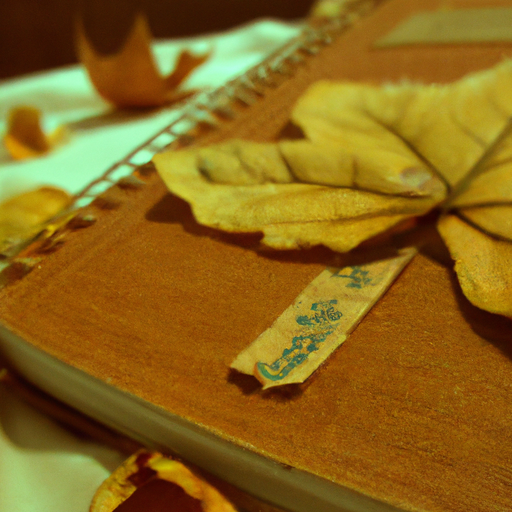
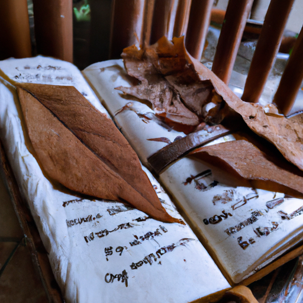
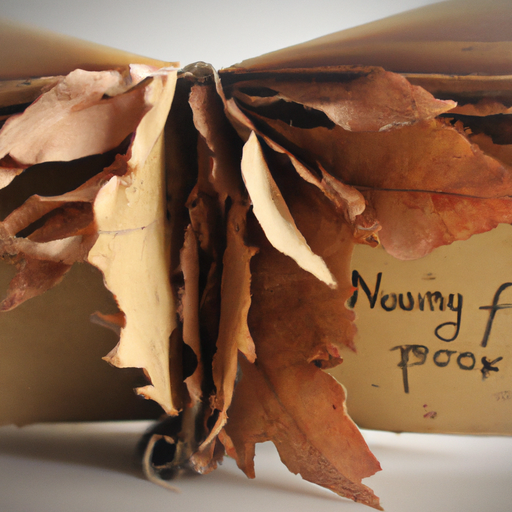

## [Preparing for Autumn - a cozy vlog](https://www.youtube.com/watch?v=8JWGjBLwpeg)

<table align="center">
	<tr>
		<td align="center">
<<<<<<< HEAD
			
		</td>
		<td align="center">
			
		</td>
		<td align="center">
			
=======
			
		</td>
		<td align="center">
			
		</td>
		<td align="center">
			
>>>>>>> ffe52613361410ad9d371a0f80e81de4dd24175f
		</td>
	</tr>
</table>

It is only a few weeks until autumn is officially here, but I can already detect a few subtle shifts in my world. The days are just a little cooler, and we have finally had some rain. A few tentative leaves have started to show the first dapples of red and orange. A richness of color is on its way, and will sweep over the valley at the end of the month, transforming the landscape and kissing the tamarack trees with a gold hue. However, full autumn isn’t here quite yet.

But there are things that I like to do in September to prepare. I still have flowers in my garden, but since many will soon go to seed I am spending the next few weeks harvesting what I need for my winter teas and herbs, and finishing any last art pieces that I’ve been putting off. Of course, as a special summer celebration for myself this morning, I decided to decorate my hair with fresh flowers. If you’ve watched my other videos you will know that I have a passion for flowers, and the only downside of autumn is that I won’t see them again until next spring, so I am enjoying them while I still can.

I read more books during the darker months, and I like to keep a journal full of my observations and ideas. I also like to decorate it with dried leaves and plants, and add some poems that inspire me or that I have composed myself. I am not a professional journal maker and to be honest, have little patience for it. I sometimes rush my steps to the detriment of the end result, but really value having a special book that I made myself where I can share my heart in writing.

Often our immediate inclination when we want something new like a journal or decorations for our home is to buy it, especially when items are so readily available. And yet, I think when it comes to highly personal objects, like diaries - making it can be a sort of peaceful ceremony, where we imbue our own love into the process and come out of it with something truly unique. Maybe it doesn’t have the perfection of a factory produced item, but it is a product of our time and care. It has a story.

I believe the same goes for decorations. I carefully consider each item I bring into my home, often asking myself that if instead of buying an item, I could instead gain the knowledge and experience of creating it? This October I will be making my own broom, some fall themed art for the walls, and other crafts. I am very excited to work with my hands and discover what I’m capable of. I encourage you to do as well, and please share it with me, while I cannot respond to all my messages I still love to see what you’re working on.

I will be honest with you, this summer has been tough on me. I have even noticed that my last few videos were far more introspective than usual. I appreciate all of you who have been so supporting during this time. With the approach of Autumn I am feeling light and positive again, hopeful for a wonderful season of frost, and rose hips, and fallen leaves.

The huckleberry is a fascinating plant that is native to this region. It is a great source of nutrients and can be used in a variety of different ways. Berries can be made into syrups and teas and cakes. Huckleberries prefer to grow in mountainous areas - for example, in a basin like this you can find them covering most of the ground, they are so abundant it’s hard not to crush juicy berries underfoot as you walk. That’s why, in late summer when the first rain softens the mossy rocks and trails, I like to walk barefoot. The wet earth feels so comforting under my feet.

One of my favorite things about the huckleberry is that it doesn’t like to be tamed. Growing it in a more domestic garden is very difficult, and it prefers to be wild, living its natural cycle among the mountain peaks. I find this little berry very inspiring. It makes me wonder if all of us have a little wild streak - something more primitive - that doesn’t quite fit into the mundane world. I think that undomesticated side of me is what brings me up to these mountains time and again to reap the harvest of the wild lands. I think we all have a wild side, one that cannot be controlled, and maybe that’s a good thing. If we listen to it, it calls to go out in nature, to preserve the magic in this world.