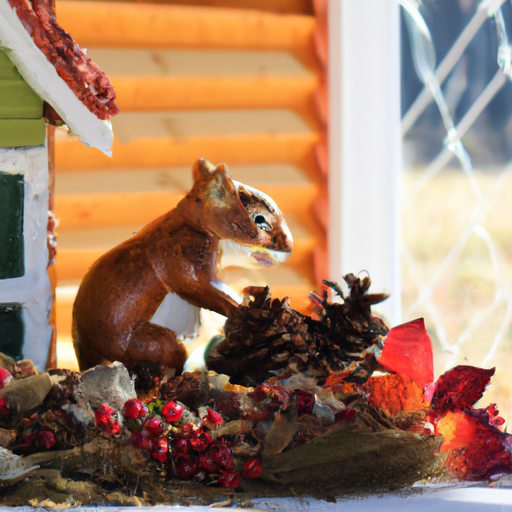
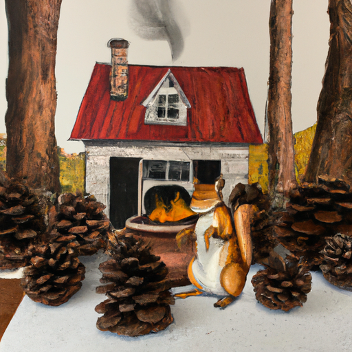
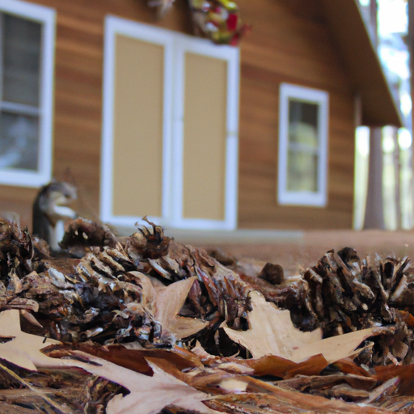

## [Preparing for a rural autumn - and a very strange experience in the forest](https://www.youtube.com/watch?v=9Bf5GCngTpY)

<table align="center">
	<tr>
		<td align="center">
<<<<<<< HEAD
			
		</td>
		<td align="center">
			
		</td>
		<td align="center">
			
=======
			
		</td>
		<td align="center">
			
		</td>
		<td align="center">
			
>>>>>>> ffe52613361410ad9d371a0f80e81de4dd24175f
		</td>
	</tr>
</table>

So, this week I thought I'd share a little bit of what I've been up to preparing for autumn. I love September's it's this in-between time when the forest takes a deep breath, preparing for the colder months ahead. I absolutely love this time of year, even though it's not full autumn, there's the tiniest little tinge of red and orange on the edges of the leaves. The big transition is about to begin, all the animals are so busy as they are preparing for winter, and it is just so exciting. There's so much energy and life in the air, and all the animals talk to you because they're all just so busy and they really don't want you distracting them or in their way, so it's really funny, especially the squirrels. They get very bossy this time of year. 

I was actually going through my garden bed the other day and digging up some weeds and dead flowers, and I noticed that there was just about 70 to 80 pine cones buried under the soil in big hoards. So, I realized that the squirrels are busy at work and they think that my flower beds would make wonderful storage for their winter treats, which I have mixed feelings about, but I'm gonna leave it as it is for now and deal with it next year. Anyway, I'm out here looking for a lot of little treasures in order to transform my cottage from a summer cottage to that autumn feel, so I am going to see what I find. Probably a lot of bunch grass and leaves and branches, and I want a lot of pine branches as well because they always fill the house with such a wonderful smell. 

So, there is a little squirrel in the tree right next to me that's quite upset that I am in their way and probably very near a little pinecone horde, so I'm gonna move along and see what I find. This time of year, I always write up a little to-do list to complete. Today, the goals were to gather branches and decorate my home for the coming season, do some cleaning, put away my summer clothes, and prepare an autumn wardrobe of the earthy colors I love, reflected in the forest this time of year. 

Now, I must tell you that I did have a fascinating experience in the forest this morning. I was following an overgrown path and came to an unexpected grove full of late summer wildflowers and a ring of evergreens. The light was filtering in such a delicate way through the branches, and it felt otherworldly. And I suddenly became aware of how completely quiet it was. I couldn't even hear an insect or the wind. Now, it could have just been a figment of my imagination, but I felt a strong sense of love and belonging in that moment. So inexplicably happy that it brought tears to my eyes. It only lasted for a moment, but it felt like a presence of some sort, even if it was just my own perception. It was a wonderful experience and very mysterious. I thought perhaps I would share as it seems to be fitting for the autumn season. Perhaps it can inspire you to get outdoors and connect, no matter what you believe. I've heard so many people from different spiritual and non-spiritual backgrounds say that nature feels like a conduit to something very special, and I couldn't agree more. 

As you can tell, this video is very short and sweet. Hopefully, it is a lovely little celebration of autumn for you, inspiration to fall in love with seasonal living. It's always something that has brought me a lot of joy, not only considering how I want to imbue my home with the kind of feeling of each season, but also enjoying all the fruits and vegetables and foods that are so widely available at different times of year. The reason this is a short and sweet, hopefully little video is because after recovering from my hospital visit and all that that entailed, I jumped full speed back into work the first day I felt like I possibly could. And I'm realizing now that may not have been the best decision. You know, I really realized this week I needed to take a step back, you know, and take things a little bit easier in order to kind of fully allow myself to get back into the groove of things. We only have so many life minutes, and I think it's so important to remember to really enjoy those, especially this time of year when, you know, things are slowing down for many of us. The days are getting darker, and all these things are signaling to us that change is coming and the dawn of a new year soon enough. I hope you all take care of yourselves. Thank you so much for all your support on my Etsy shop. It has meant the world reopening it, and I will see you very soon. Take care, goodbye. You.