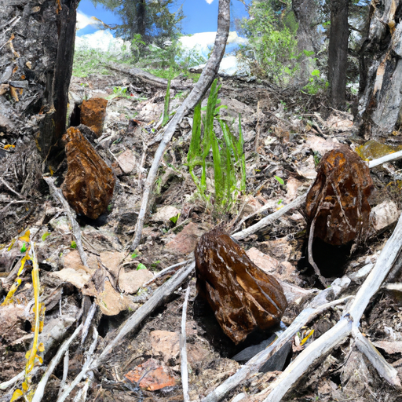
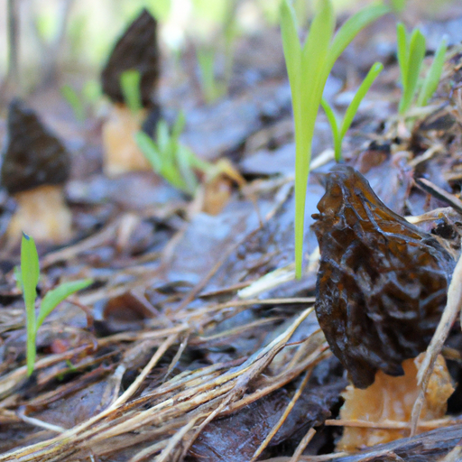
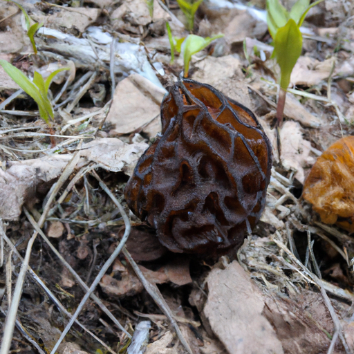

## [Summer at the cottage and mushroom hunting](https://www.youtube.com/watch?v=U228_sx7Yz0)

<table align="center">
	<tr>
		<td align="center">
<<<<<<< HEAD
			
		</td>
		<td align="center">
			
		</td>
		<td align="center">
			
=======
			
		</td>
		<td align="center">
			
		</td>
		<td align="center">
			
>>>>>>> ffe52613361410ad9d371a0f80e81de4dd24175f
		</td>
	</tr>
</table>

In many places around the world rainfall is a given. It comes and goes without being much of an event. But here in my home, we celebrate the rainfall, knowing we will soon go months with barely any, the land will become parched and dry and prone to wildfires.

Soon after the rainfall, a very elusive but delectable life form appears on the forest floor. They are known as morels, and often grow in disturbed areas or ones that have experienced fire. They are absolutely delicious, and very different from the mushrooms you usually see in the stores.

I mentioned this once before, but one of my greatest fears is fire. I’ve experienced a home fire, crawled on my knees while choking on soot, and it is terrifying. When I shared this fear with a friend, they wondered why I would move to a place that regularly experiences wildfires. And that’s a very good question. But I suppose my answer is because sometimes the benefits of a decision far outweigh the risk. I am so happy here, and even if things went horribly wrong, right now I wouldn’t want to be anywhere else.

When I was a teenager I was living in Cuba during hurricane Sandy. On the coastline, we feared tsunami’s and earthquakes. Wherever we went, there was risk, and here it is no different. As tourist season comes around I become a little more anxious, knowing that many non-locals either are unaware or not concerned with safety and will light campfires even though they are prohibited. The smokejumpers are also vigilant, and my town prepares accordingly. We water the grass around our homes, and put together a box of valuables. In my box I put all my documents and pet supplies and my favorite paintings. I try to be practical and only take what is needed or most important to me. At any point we can lose everything.

The memory of fires is everywhere in my valley, where miles of dead trees stretch across hillsides. But to dwell on fear and worry won't resolve the problem. Instead, I let those emotions take hold of my heart for a few minutes, hold them there and respect that this is something that is on my mind. Then, I force myself to let it go, and instead turn to action by donating to my local nature conservancy, as a teacher we would have smokejumpers visit our classrooms and talk to the children. There are so many proactive things to do instead of worry and despair.

In our world right now, it is easy to see things through the eyes of negativity and cynicism. But I will always believe that that feeds despair instead of cultivating hope and action. Even as I accept the possibility that the fires may take what I love away from me, I know that I cannot live fearing what may or may not happen. Instead, I look to nature, and see that while I waste time worrying that it may be destroyed, it is thriving and abundant and alive.

With wildfires come new plants and undergrowth that feed the animals, a variety of plants that thrive in ashy soil, and, of course, delicious mushrooms. In destruction I chose to build hope. And enjoy the delicacy’s nature has to offer.

I hope you have a lovely day or night.