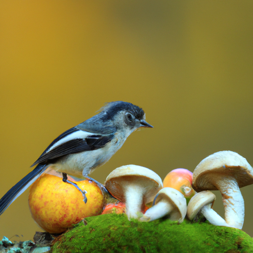
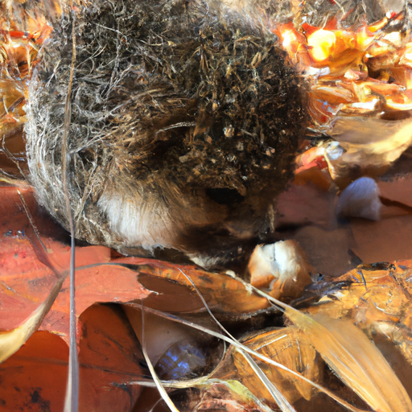
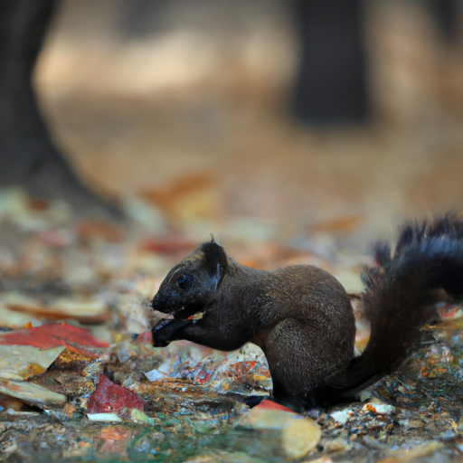

## [The Cost of Rural Cottage Life - being honest with myself looking for a quick fix](https://www.youtube.com/watch?v=OHucv0YV9c4)

<table align="center">
	<tr>
		<td align="center">
			
		</td>
		<td align="center">
			
		</td>
		<td align="center">
			
		</td>
	</tr>
</table>

Good morning everyone, today I'm out foraging for supplies and it is a crisp, cool autumn day. I absolutely love it, it is the perfect day to work on some new projects I have in mind.

In this video I thought I'd share some ways that I manage my finances while living rurally. Moving here definitely affected how I spend money and I manage it very differently now. This video isn't meant to be advice as we're all in different situations that I will not compare or generalize, but I thought I'd share my personal story with how my relationship with the more economical side of life has evolved over time.

As I talked about in a past video I will link below, I used to have a very anxious relationship with money and at times I still do, though I've made a lot of progress. I think it's worth admitting that because despite what our salary is, some of us don't have the best relationship with it. For example, many university students graduate with large debt and that can impact our view of money.

In my case experiencing extended times without making enough to get by and having to ask my family for support in many situations made me attach anxiety to the idea of money in general, thinking that if I only had enough of it I would feel safe and not need to worry so much. When I finally moved, got a new job, and began making enough to live comfortably I still held on to these anxious feelings associated with money. I would opt to save instead of spend it at every opportunity, sometimes to the detriment of my health or safety.

Thankfully I have a wise father who explained why I should never do that and encouraged me to make good choices and invest in my future retirement even if it was only a few dollars each month. Another reality check I had was when I was living with my sister in her apartment. One night she got appendicitis, if she hadn't had health insurance she would have been over fifteen thousand dollars in debt simply to have the surgery that would save her life. It was shocking and really made me understand the importance of finding ways to afford those costs if I possibly could - consequently, this led me to watch many hours of youtube videos about financial management. There is so much to learn I'm amazed we aren't taught more about it in school as it is so very useful.

I equated money with feeling safe, as if through it I could manage any unexpected circumstances life threw at me. It was very interesting to transition into a stable situation and realize that that wish to feel safe didn't go away, because the safety I was looking for went beyond affording groceries and health insurance. I wanted the safety of a peaceful mind as well a haven from intrusive thoughts and worries, money wasn't going to resolve that. That's something I've been thinking a lot about this year, especially as my channel has grown.

I still find myself afraid my life will change again unexpectedly - that my business will fail or that I can't rely on my current situation. I can't be sure things will work out how I would like them to. There's no amount of hard work that can guarantee it and sometimes I convince myself that everything will somehow fall apart. I've consequently realized that I desperately want to find a way to assert some control over my life, to somehow see into the future and know I can handle anything. I also wish to have children and own a home someday and I think that if I only sacrifice enough and deprive myself of enough in the present somehow I can make that dream a reality. But that isn't always how things work, and the spiritual part of me knows deep down that all that worrying is fruitless. While sometimes we need to sacrifice something in the present to ensure the future, when we do this all the time something important is at risk for being lost.

I'm still on a journey towards creating a harmonious relationship between saving and spending. For example, I'm someone who greatly values their home life and atmosphere, so I enjoy investing in my home. With basic skills I can transform thrifted furniture and, as you see in this video, create my own items. I realized that being so far away from malls and large retail outlets that I don't really feel any urge to go shopping. I'm amazed by how much less I buy or want simply because I'm not surrounded by shops. Consequently, when I visit the city it is so exciting to stock up on any items I need when it comes to food I shop in bulk and store food in a freezer and can save money that way.

By buying in bulk, reducing waste, thrifting home items, and using free services such as the library, I'm able to invest in some hobbies that I deeply enjoy such as my craft supplies and, of course, reading. In this way I'm now able to prepare to own a home someday and for my future family. It's amazing how just learning a little about finances can help you transform your relationship with it and make you feel empowered and like you're making progress towards your dreams, slowly but steadily. In my case I have to pair it with a more spiritual understanding that nothing material can make me feel truly safe and secure. It is something far deeper that can answer that call there must be balance in everything, in giving and taking, spending and saving, and today versus tomorrow.

I hope you found this video somewhat interesting. I think it's always fruitful to consider our relationships with more material things and see how we can improve it. It is a fact of our lives that we cannot really escape, so I would love to hear your experiences as well. Wishing you a lovely day or night and I will see you next week.