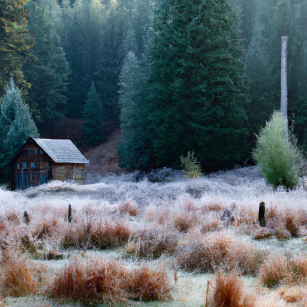
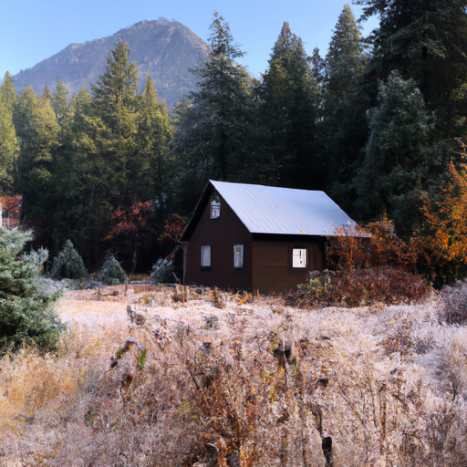
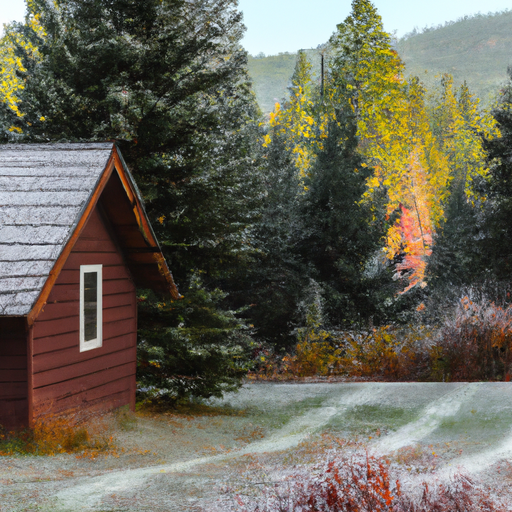

## [The Downsides of Life in a Rural Cottage - and why I need a change](https://www.youtube.com/watch?v=rf97SOokQaI)

<table align="center">
	<tr>
		<td align="center">
<<<<<<< HEAD
			
		</td>
		<td align="center">
			
		</td>
		<td align="center">
			
=======
			
		</td>
		<td align="center">
			
		</td>
		<td align="center">
			
>>>>>>> ffe52613361410ad9d371a0f80e81de4dd24175f
		</td>
	</tr>
</table>

Hello everyone, and welcome to a cold, rainy day in the cascade mountains.

I remember I read a book of a tree man who lived at the top of a hill and who could smell the air and accurately predict the weather - I always thought it was a funny idea, and yet now that I’ve been here for over two years I can say that I understand it now.

There is a very definite shift in the scent of this environment when the seasons change, when the air isn’t mixed in with of the smell of petrol and crowded places, you discover it carries with it a thousand aromatic notes of the earth.

Right now I can smell sage and cedar, as well as the minty bite of frost.

The autumn gnomes are no doubt collecting the very last of the apples, and the squirrels are topping their stores.

After last weeks video I noticed some people shared that they are hoping to move and start a new life soon.

I noticed a few expressed that they believed I am living off grid and very isolated from people, hundreds miles away from civiliation.

I wanted to clear this up in regards to my location, not to discourage your lifestyle preference by any means, only to explain myself.

I also felt that perhaps it could be helpful to share some less desirable things I have faced while living in a rural area, knowing that nowhere is perfect and each place has challenges depending on who you are.

So, due to respecting their privacy I do not show the homes of my neighbors, but I can assure you they are there.

I am neither off grid nor am I isolated, and I enjoy about a 15 minute drive from town.

Hundreds of people live similarly in this area.

I prefer things that way, and I will explain why.

In relation, one of the biggest challenges I face living here is social connection.

When I lived in the city it was easier for me to meet people within my age group and that share my interests.

This isn’t always as facilitated in the countryside, for the simple fact that there are less people.

For example, in the city I loved spending time with peers who spoke Spanish, had lived in the Caribbean, or had also grown up in a military family.

I automatically felt like I had so much in common with them.

While there are young people with similar backgrounds here, it isn’t as common, and so I rely a little more on communicating with others via e-mail and social media.

Now, this isn’t to say you cannot connect with an incredible community wherever you are, but for me it took a little more work and creativity to do that out here.

And I think your own personality and social needs should be considered when making a move to a rural area.

Because despite my introversion, this has been tricky for me.

That is one of the reasons I enjoy living close to town.

I admire people who are in very isolated and off grid locations, they are impressive and must have a lot of mental strength, because I am not like that - I find that loneliness is a very real thing that can creep up on me if I am too far removed from other people.

It isn’t easy to live like that, if anything being isolated and alone could be very hard to deal with if you are like me - and that’s something I know because I live so near town and I even struggled with feeling disconnected from others when I first moved here.

Thankfully, through working as a teacher and getting involved, that has changed over time.

In addition, I also feel much safer being near people.

Its unrealistic for me to live isolated as I have a job that requires me to work in town, and I cannot work remotely.

I don’t have a lot of free time nor the knowledge or ability to invest the cost and energy needed in a homestead to keep it functional.

Another big reason I live near town is that I can easily get help if I need it, for emergencies and otherwise.

If you saw my last video you know that I have experienced medical scares in my family before, my father has a heart attack over year ago even though he is very healthy and fit and still young, and so examples like that make me want to always be within a short drive to the hospital.

That’s not always possible if you are very isolated, and I think that’s something everyone should take into consideration, especially if you have a handicap, medical issues, pets, children, or - like me - need peace of mind.

Maybe I sound like a big wimp, but that is the main reason I live like I do.

I just thought it was important to explain how I live, because I wouldn’t want anyone to get a different impression.

And I also believe that we can live in alignment with the earth and take the planet into consideration no matter how or where we live, in the city or otherwise.

We can just take simple steps to learn about our environment and support organizations who want to make lasting change.

I have always thought a great thing to do when considering a move is, if feasible, to find a small rental in their location of interest, do seasonal work, and experience what it’s like to live there throughout the year before committing to a completely new environment.

I know of several people who bought houses in the summer over here only to realize they hate the grueling winters and sadly, there are many homes that are left empty the majority of the year, making it hard for people working in town to find a place to live.

That isn’t a problem all small towns face, but it is a challenge to be aware of.

In short, I encourage anyone to follow their heart to where and how they want to live, but there is rarely a need to rush into things.

I planned my move for a long time before I actually left the city and I still think I could have planned some more.

It was well worth it to skip the stress of not being prepared.

I think that no matter how beautiful the location or the home, getting into a situation that is stressful or financially unstable will ruin the experience.

And while I’m here talking about more challenging aspects of rural life, I hope that my channel is a testament of the reasons I do love to live here, and wouldn’t want to be anywhere else.