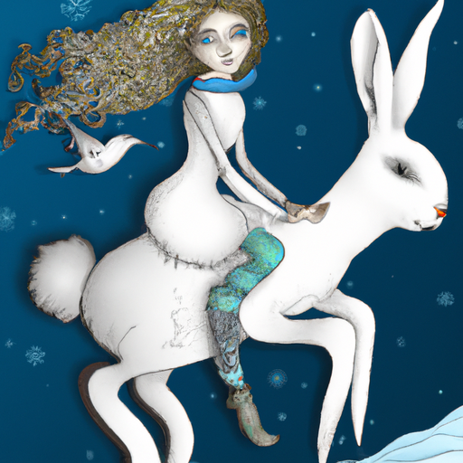
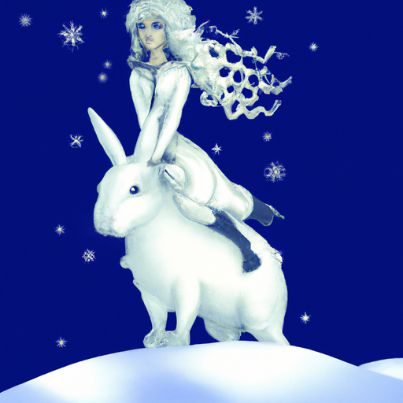
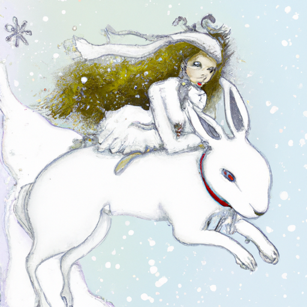

## [The Snow Fairy - a winter tale](https://www.youtube.com/watch?v=G1D9C7kRx10)

<table align="center">
	<tr>
		<td align="center">
			
		</td>
		<td align="center">
			
		</td>
		<td align="center">
			
		</td>
	</tr>
</table>

When I was a child, I liked to imagine that fairies brought about the change of seasons. A little pixie would plant spring wildflower seeds, while Lord Summersprite would coax the sun rays over the meadow. And then there was the snow fairy, whose image has stayed with me throughout the years. I always imagined her riding a rabbit, with long curly hair and mysterious melancholy eyes.

The snow fairy was often misunderstood by the other fairies, who feared her strange looks and ways. They would banish her to the highest mountain peaks when her time was over, forcing her to wait in a lonely ice cave until she could return again. Naturally, this made the fairy feel quite unwelcomed, as she longed to visit the other seasons and discover their treasures. She dreamt of wandering flower fields barefoot and tasting the crisp sweetness of fall fruit.

But the other fairies were uninviting, fearing that her frosty fingers would wither anything she touched. The snow fairy was hurt, and the next time she was sent to the mountains of eternal winter to wait out the year, she vowed never to return. No one cared, no one wanted her in the land below.

Sequestered in the mountains, the snow fairy spent her days casting spells of frost, raining snowflakes, and summoning blizzards. It was a beautiful world she created, weaving a tapestry of ice and crystal. Here, in the thin air, she felt safe - there were no fairies or townspeople to grumble at the snow, wishing for spring to come sooner. She decided to stay in her mountains, thinking it would please everyone.

However, when the cold was supposed to come to the rest of the land, it didn't. The open fields remained untouched by snowflakes, the lake water unfrozen, and the sky blue and cloudless. The land suffered from a lack of water, and the other fairies could not fulfill their duties. The parched land was infertile, and something had to be done.

The fairies pleaded with the woodland animals, hoping that some brave beast would scale the mountains and call back the snow fairy. But they were met with reluctance. “It is too cold for us,” they said. “We will freeze our toes and get lost in the blizzard. And even if we did find her, she would not listen to us, we who were so cold and cruel to her and sent her away.”

Then, a small but courageous rabbit stepped forward. He was unafraid of snowdrifts and volunteered to fetch the snow fairy. However, even the hardiest of rabbits cannot scale a mountain slope easily. When he finally reached the fairy, he had only one breath left in his little body. He told her that the land was dying without her help, and that she had to return. He also expressed how much he missed her dearly. With that, he closed his eyes.

The fairy wept over the noble rabbit as she had never wept before. Her heart, which had been safely locked away for so long, broke in two. When a fairy's heart breaks, a special magic is released, one that can grant a single wish. The fairy held the wisp of pixie dust in her palm and was tempted to wish for a winter that would come and go without her assistance. She could then stay in the mountains forever, away from all that caused her pain. But that was not what the fairy did, because in its broken state, her heart had felt love for the very first time.

Now, each year, once the harvest has been gathered, the snow fairy begins her long trek down from her mountain. She carries a basket of snowflakes to spread over the countryside. Her job is difficult, and there are still those who don't enjoy her visits, but she no longer hears their words. And now, she has a friend to accompany her. If you ever catch a glimpse of the snow fairy through your window as the frost sets in on wintertide's eve, you will see a small rabbit trail behind her, following her steps and gazing in awe at the beauty of her snowy world.