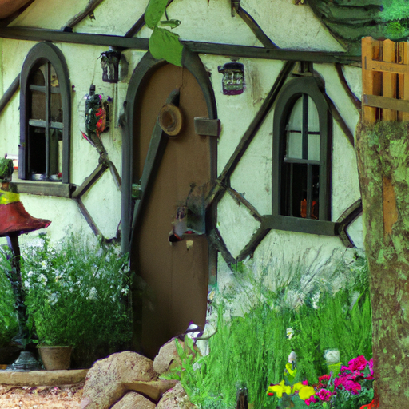
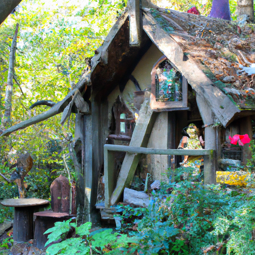
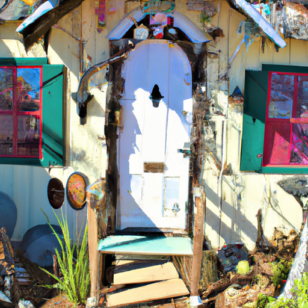

## [Tour My Completed Cottage finally - Hand-Painted Folk Inspired](https://www.youtube.com/watch?v=aT2sCd_8oEk)

<table align="center">
	<tr>
		<td align="center">
<<<<<<< HEAD
			
		</td>
		<td align="center">
			
		</td>
		<td align="center">
			
=======
			
		</td>
		<td align="center">
			
		</td>
		<td align="center">
			
>>>>>>> ffe52613361410ad9d371a0f80e81de4dd24175f
		</td>
	</tr>
</table>

Good morning, it is a rainy spring day and the cherry trees are in full bloom. They're stunning and I simply had to go and see them and take a couple branches to decorate my home.

Today, I wanted to give you a little tour of the lower level of my cottage as it is finally complete. No doubt you'll be able to follow my journey of continually transforming the space over the next several months.

It has been a very rainy day and the last several weeks have been so cold and, for the most part, overcast. So it's been a very slow coming of late spring and it's hard to believe that soon it's going to get quite warm. So I'm enjoying this era of chilly mornings and cozy evenings in the cottage with the furnace still on, which is kind of crazy this time of year.

Now, the cottage is complete from a physical standpoint, as in it has been renovated. Finally, the staircase is in, the showers are finally done, and plumbing and electricity is all done. So it is officially complete, but there still needs to be a lot of little things done around the house to make it feel like the home space I have in my mind. So we are still in great need of a couch or somewhere that we can sit in the evenings, which is really nice. We currently do not have anything like that. We still don't have Wi-Fi. There's little things we're working on, but you know, we'll get there eventually. If you stay tuned for the next several months, you will see updates as I start to finalize every room and finish painting, which is definitely my soul song when it comes to creating a home space.

I'm just going to pop in here really quick because I forgot to say that I have a little fairy living inside my heart that definitely likes to express herself in her home space. And so it reflects a lot of what I love and yeah, I am incredibly lucky to be marrying a man who embraces this side of me and has encouraged me to personalize the space and let the little fairy princess in my heart speak out and express herself. So sending you my love and I hope you enjoy.

To prepare this home for you, I did need to get a few things done, even though I'm still settling in. Painting on the walls always makes me feel like I am where I'm meant to be. It reminds me of my own power to create my own story and beauty no matter where I am. All our stories are different and we all express ourselves in different ways. And for me, my home is a space where I can truly allow myself to be me.

We do have a little spare room and of course, a bathroom in this house. However, it is very plain and uneventful, so I will not show you those rooms since they are bare or still full of boxes that are yet to be unpacked. So I ask your understanding that there are certain nooks of the house that will be kept private, but that over time, I will be able to share more.

Because tourism and general interest has grown so drastically in this area, homes over the last few years have become incredibly expensive. There's no way that my fiance and I would have been able to get a house in the forest here if it wasn't for the kindness of his parents who moved here long before it was such a hot spot and were able to purchase this piece of land and sell it to us for a price that we could afford. As we both work full time, Luke is a surveyor in the area. It is a very physically demanding job, especially out here in the mountains. And since I as well work long hours, it is so nice to come home to a place that feels simple and safe, where we can recharge and enjoy the company of so many lovely pine trees.

If you watch this channel, you know that I've lived in some unsafe apartments and been in some relationships with people who put me in danger. All those life experiences, while challenging, also taught me that a sense of safety physically, emotionally, and spiritually is an incredible feeling. After love, perhaps it is the most important thing we can imbue into our space.

This corner of the house is currently the plant nook, but hopefully, it will be transformed into a personal library soon. Luke has a lot of experience in woodwork and construction, and so he's making me some customized bookshelves as a wedding gift.

So yes, yes, before you say it, I am turning in my fairy wings. The camera is so shaky during these attempted panoramic shots. It utterly failed, believe it or not. I truly thought the camera was smooth. By the time I drove into town and saw it, it was too dark to refilm it. I appreciate your understanding. I am simply standing in the middle of the room and poorly attempting to move in a circle. Oh my gosh, this looks so bad. Thank you guys for being so patient with me.

I already made a video about the upstairs of the cottage and more or less how it's decorated, so I'll leave it for another day and we'll link videos down below that show it some more if you're interested. Currently, this is my little makeshift workstation for my Etsy shop. Thank you so much everyone who has supported my art. It really helps me keep this channel running. And as a thank you again this week, I will be including an extra bookmark and my usual quote card and sticker in each order. Thank you so, so much. I am so grateful.

My main inspirations for my space definitely are fairy tales and folklore and folk art. And there are a lot of movies that have inspired me in the way that I decorate, as well as books and music. And so I will leave links to some of my favorite music, books, and movies down below because I know that's something that has interested people in the past. And I would like to share some of my favorites in case they may become your favorites as well.

So I also encourage you to look in the description bar down below because I want to mention some incredible creators who I've connected with that have really inspired me in their styles or in their art or just in their way of looking at the world. Some that come to mind are Poems for the Moon, It's a Charming Life, Parking on the Wild Side (I hope I get that word right), I was recently gifted some incredibly beautiful handmade ceramics by an artist on Instagram that connected with me that enjoys these videos. And I wanted to share her work too because it is absolutely gorgeous. I will leave all links to these people down below. Please check them out. They're incredible and creative.

With all that being said, stay tuned because each room is going to be continually transformed throughout this year as I keep working on it and getting new ideas for paintings and finally get some more basic pieces of furniture. A lot of our resources went to the down payment of this house and just getting the basic things put together. And so now that I am able to start, little by little, decorating, it's going to be a slower process but extremely rewarding to me because I always find this process so calming and just wonderful.

I hope the space inspires you to reconsider the power of buying things from unique places, thrift shops, and antique shops, and even resale shops. That there are so many incredible, more sustainably-minded ways to decorate your home that make it extra unique. But of course, nothing is perfect. None of us can avoid buying new things most of the time. Consider other ways to imbue that kind of unique whimsy into a space.

That's one of the reasons I usually am unable to link items from my home in videos because I don't know where they're from. They are, I'm sure, not one of a kind. I'm sure there's a lot of other very similar things out there. But I don't always know the brand and I don't always know exactly where something has come from, be that a flower pot. These were, I think, Goodwill and I have no idea. They say Japan on the bottom, but that's as much as I know. Some of the things that I did have to buy new because I just couldn't find them anywhere were rugs and curtains and some little things like that. And I will link those down below in case you are looking for something similar.

I hope you enjoyed. If you are a whimsical, creative person, definitely encourage yourself to express yourself in your space. You know, I think when we let go of that fear about what other people may think, we can really be free. And you just become more and more embracing of just who you are and not worry so much that some people may take a double take when they see flowers on your wall. But that doesn't mean that they aren't intrigued. And it's just very exciting to share this all with you and to share with you the continual journey because I will be painting murals and all types of things and making the space even more eclectic. I'm gonna use the word eclectic. Yeah.

I'm sending you wonderful dreams full of pixie dust and I will see you soon. Goodbye.