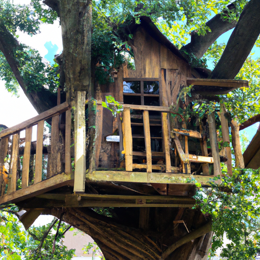
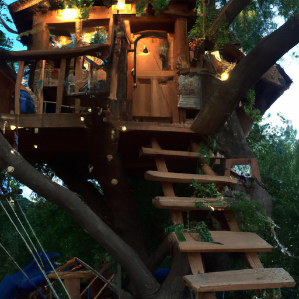
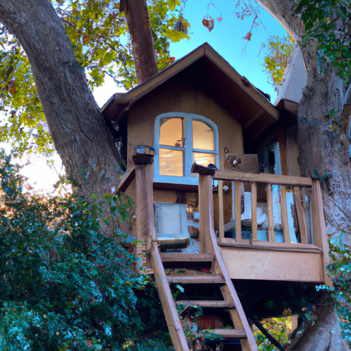

## [Tour my New Home - Treehouse Apartment in the Forest](https://www.youtube.com/watch?v=sGRQMkbQoMg)

<table align="center">
	<tr>
		<td align="center">
			
		</td>
		<td align="center">
			
		</td>
		<td align="center">
			
		</td>
	</tr>
</table>

It has been a long two weeks. I've been in the process of moving and it's been daunting at times. I'm slowly settling in and unpacking my things. I'm certainly not moved in yet and the process is taking longer than I anticipated.

I am currently moving into the second story of the house since Luke and his father have not yet finished the downstairs. As you may already know, this home used to be an open stable for horses. I've decided to call this top story the Tree House because it definitely feels like everything from the wood walls to the elevated view of the pine trees out of every window makes me feel like I'm in a little forest home nestled between the tree branches and the sky.

I like the smaller rooms and simple nostalgic feel of the wood walls. It doesn't feel like home yet but I know it will in time. Making a space cozy is very important to me, it may sound rather strange but I personally have found that if I unpack and decorate in a frenzied and anxious state of mind it feels as if I imbue that feeling into the new space, making the process of settling in more difficult. By taking deep breaths and trying to keep my heart calm during big changes taking as much time as I can, I find it makes the transition much more gentle and healthy.

I will show you a walkthrough of the space at the end of this video and I would love any decorating tips or ideas you have. I also appreciate your patience during this time of transition since I can't make my more usual type of videos. I do have this old desk which my father gifted to me when I was a teenager, plus several other antique or secondhand items that I've been able to take out of my parents home where they have been stored. I love earthy colors and definitely want to bring more life into this space.

Moving forward, in these videos you will be seeing a lot more trees as we are in the forest now. Also, my future in-laws have a really lovely dog and cat, who I'm sure will be introducing themselves soon enough. So I did want to give you a bit of a walkthrough, I appreciate your patience, with my camera this space feels so different from what I'm used to. I'm definitely excited to have an actual stove and running water all year round, which is a huge bonus. When I first walked in here I felt like it was the set of an old TV show. It feels like it's from a slightly different time and I really like it.

Perhaps the thing I'm most excited about in regards to this new space is that I have an actual bathroom. As you know, in my last home it was just a simple compost toilet and it is nice to have a working shower. As you can see, this place is ready to be lived in. Luke's parents used to rent this top story out with a kitchenette and bathroom, so it is all ready for someone to live up here if needed, which is useful since the bottom level of the house isn't complete.

But I'm not living here full time right now because I'm still in the process of moving. I'm kind of dividing my time between my parents' home and here, so this back room could either be a bedroom or perhaps a little working space for art and craft projects. We are not sure yet, but I do know that I think these walls are very lovely, they're an old cedar and put here a long time ago. I also think we'll have to take out the carpet at some point, it's fairly old and perhaps a new layer or at least a carpet to cover it would freshen up the space.

I suppose that is the tour. I do really like it, I think spaces like this can definitely feel very different after you've moved in with a bit of decorating. So far I've sourced the majority of what I have from thrift stores and secondhand shops. I'm excited to see how this place forms and how I feel about it in a few months. I did go to a craft store recently and picked up some knobs and other little metal handles that I think will personalize the space quite a bit. They were only a couple dollars so I'm gonna get creative and give you an update as I go.

So I hope you can hear me, my audio setup is not super great right now, but yeah I wanted to just check in and say hello because it's been a little while since I uploaded. I knew I at least had to have a week off to be able to prepare moving and all that and what taking a week off has taught me has been that moving is a lot more involved and takes a lot more time than just one week, so I'm definitely learning a lot and taking it one step at a time and taking a lot of deep breaths.

It's really interesting to walk through a home that isn't yours after you have created such a strong connection with the one you already had and so I'm looking forward to creating a closer relationship with this space and feeling more cozy and at home here very soon. I am, however, so excited to start this new chapter and have fun decorating. I already found a couple items at my local thrift store for a few dollars that I think will be really wonderful. I have an old desk that was gifted to me by my father years ago that he also found at a thrift store and I am very excited to use it since I've never had room for it at my old house.

So I don't have anywhere to do my art or bake or work on a lot of things right now, besides an office space, and I feel a little bit in limbo of course, which is natural, but it is very difficult to create a video. But I do hope that by next week I will be able to have settled in a lot more and have a lot more to show you. I actually would really love to make some videos about decorating and how I decorate on a very minimal budget, but also how I'm going to be preparing my garden because I'm actually going to have room for a proper garden over here. I would love to share all that with you.

This all feels really weird, I have to admit. I think it's just so many transitions. But it's gonna be okay, I'm taking it a day at a time and change can be really uncomfortable sometimes but that doesn't mean it's not worth it. Now, tell me if I'm crazy but I do feel like certain houses have different kind of feelings associated with them, bear with me, I don't want to sound super silly but my cottage felt very peaceful and very serene because while I was there I really worked on having it be a space that no matter how stressful long workday, I would come home and then my cottage was the space to rest and a space to enjoy my hobbies and interests. And here, I do feel a very similar feeling of it feeling very peaceful. But right now it feels peaceful, but just so empty, so void of kind of life and memories and all that. So I definitely need to create that story in this house and it seems like such a sweet house.

Anyway, thank you again, I really really appreciate all your support of my Etsy shop during this time. It has meant a lot, it has been something I've been able to hold on to during this time and really focus on, and it has really helped me stay a lot more calm and relaxed during this time because I've had a very specific set of projects I need to get done and people to communicate with. Thank you for that and thank you for all the encouraging messages you have sent with your orders. I really appreciate that.

I think I'm gonna try to go get busy and make this house a home, at least a little bit more of a home, until you guys see me again. Yes, I will see you very soon, let me know if you have any questions about the house and I will try to answer them in a future video. I'm wishing you all the very best, goodbye.