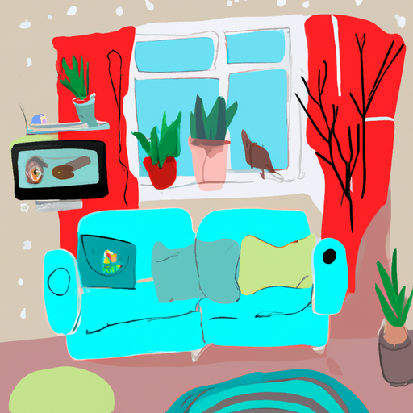
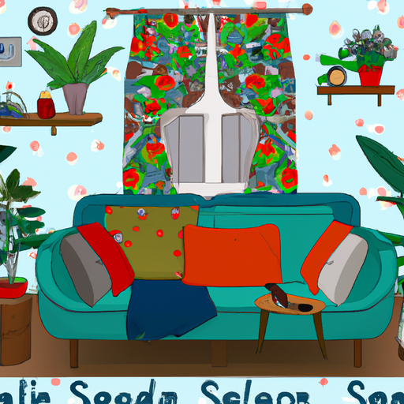
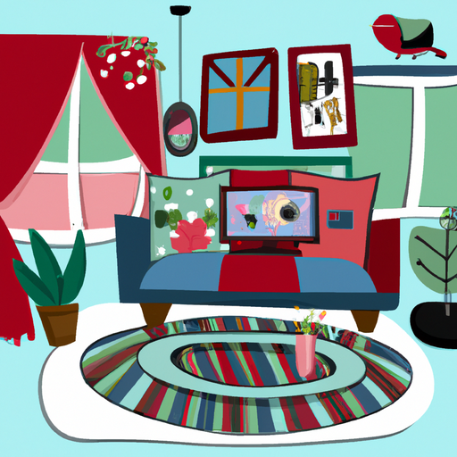

## [Walkthrough House Tour - details and renovations more updates](https://www.youtube.com/watch?v=LpIDd9El5lM)

<table align="center">
	<tr>
		<td align="center">
			
		</td>
		<td align="center">
			
		</td>
		<td align="center">
			
		</td>
	</tr>
</table>

Hello everyone, today I wanted to give a little update in regards to how the home is turning out. When I first moved in here, I kind of put furniture everywhere, but since then we've decided to do some renovations and change some things. So, it definitely still feels like we're moving in and I was waiting to show you a more completed picture of the home, but I decided why not show you kind of where we're at right now. Maybe I can get some good ideas from you. Thankfully, my husband is here today, so he is the cameraman. Contrary to popular belief, I film my own videos most of the time. He is just helping today, so I am very grateful. Thank you, love. You're welcome.

Alright, I thought I would start in kind of the main part of the house where I spend the most time in, and this is the living room. It is definitely one of my favorite places. I picked quite a few flowers just to celebrate this occasion. So, these go back. And this is where you like to watch your historical dramas and more movies. Oh yes, maybe some zombie movies sometimes. You know, mix it up with the little My Little Pony. Yes, and princess movies because I'm a child. This is definitely one of my favorite pieces of furniture because even though I don't use the TV, I like how elegantly it can be kind of tucked away. So, I really enjoy that. And then I clearly have a lot of plants. So many of them. And I thought I'd tell you a secret. If you ever want to have your room feel like it's just full of plants and it feels green and alive, but you struggle to find the time to water every single one of them, you can get fake plants from a thrift store. Usually, there are quite a few there, and you can mix them in with the real ones. I think my other favorite way to have plants is in jars. I think that's one of my favorites. I think they're just so unique, and I like the little terrariums. And you can just show all the details here if you don't mind. Love, I love to hang all sorts of little creations from the windows. You made this? Mm-hmm. He finds crystals up in the mountains and then he does wire wrapping and wire weaving, and he made that. And then he also made this beautiful fascinator, and it has little bunnies with wings because, of course, he knows me very well. And it's just one of my favorite things in this entire house. I love having little decals of birds on the window. I think it helps deter actual birds from running into the window. And I also really enjoy these curtains. I found these ones. They were fairly affordable, very airy and light. And if you ever want your house to feel like a whimsical fairy cottage, you can always get little butterflies and attach them to anywhere they can possibly go. And then when people walk in, they can be really concerned about your taste. So anyway, more little things here. I have quite a few decorations that are from subscribers, such as these. Someone sent me a set of these. And yeah, there's quite a few little things that a lot of you have sent me. So I really, really appreciate that. We have some cat toys on the floor, you know, because there's a cat somewhere. She's hiding. This is another favorite nook of mine because I incorporate it often in videos. I love my little stove. I have decorated it, of course, with some summer flowers because I just think that really brightens up the space when it's not in use. And I used to love just actual wood-burning stoves and I love the feel and the smell of it. But I have to admit, I really like the gas stoves. They're so much easier to clean and you don't have to spend all summer chopping wood, which is really, really lovely. So I like too that it keeps the air in the house a lot cleaner. So I really appreciate that. And of course, I made some decorations. I am a watercolorist, and so I like to spend quite a bit of time working on my art pieces, always trying to think of new aspects of nature to portray. Plants, more plants. There's just so many of them. Yes, and this is just the main couch. It is definitely one we use quite a bit. When I got it, I was a little concerned because I saw that it was this very bright blue and it just wasn't what I thought it was gonna look like from the pictures online, which I think is always the case. And so I actually just got this couch-sized throw to put over it, and then this one as well. So if you ever have a couch that is not quite the right color or the right look that you were expecting, then there's always a solution because there was no way I was gonna buy another one because it would have been too expensive. So that's kind of how we've made it work. I think I said every corner of this part of the house is my favorite, but this is actually my favorite for a reason you will soon understand. It is the library. Oh, and this is the main door as well. And we would love to get this door replaced at some point. That is a huge goal. It is just kind of one of the cheapest doors you can kind of get, and I would love to have like a really nice door for the front of the house someday. That would be lovely, but they are so expensive. So that's definitely years away, and right now it's a bit of a daydream. But so far, I've really enjoyed this little mantelpiece on top that just has all these little, what would you call it, doodads? Some of these things are from subscribers, and so they've sent them to me, and they're all very special. These are also some other things I've been given by subscribers, such as candles and this little embroidered piece. This little dish here, I got when I was a child in a thrift store in Wallace, Idaho, and it was just one of my favorite things. That is from Japan, and it was like two dollars, I think. My dad got it for me. Then here, I have more plants and more books. I have too many books at any given moment, so you know that's just kind of an ongoing issue. But I will do a more detailed, like every single book I own, if you would like to see that. I'm more than happy to talk about books, but someday. So if you let me know if you'd like to see a detailed bookshelf tour, because I could definitely do that. So there are definitely a lot of plants here, a lot of these art pieces. So I thought it would give you a little bit of insight on how I like to think when I'm decorating. One is that I knew that the walls are going to be this kind of sage green with a little bit of blue, and I also thought that because of the artist's color wheel, complementary colors to green are red tones. And so that's one of the reasons Christmas is so appealing, the tones of green and red together. And so that's why I got kind of a red blanket to go with a more green wall. So that's often what I'm thinking about when I'm decorating. I like to think about how colors work together and then also throw all those rules out of the window whenever it doesn't work and just do whatever you want. But that is at least a little bit of insight on what I like to do. Anyway, here is my bookshelf. Luke was so lovely to make this. He is so talented, and I love the raw wood edges. It's just one of my favorite things, and it's so unique. And I mean, there's never going to be any other bookshelf exactly like this, and I think that's so special just to have something so beautifully made. Well, down here, I just have kind of this little area where I can sit and work on projects if I want to. I love this chair. I actually found it on the side of the road. It is a chair that belonged to an artist, and under it, it says it was refurbished in the 90s. So, it's quite an old chair, and you can tell if you look up close. It's pretty old, but we don't need to look too close to it. But I really like how it looks. It's such a unique design. So, if you know what style of chair this is, do let me know. I'd love to find another one in this style. But yeah, I absolutely love it. So, yes, there's just a lot of little tiny details all around these bookshelves, and I'll try to do close-ups of all of them later so you can just get a feel. And here is one of my very favorite paintings. Subscribers have sent me all sorts of paintings. This one was one that was sent to me a while ago, and it was right after I lost my rabbit, Mr. Darcy, and so it's very special. I think that is everything. So, I think instead I can just show you the upstairs of the house, which is definitely what's a lot more in progress. I'll show you a little more of the kitchen before I go upstairs, but the kitchen's pretty boring. So, honey, Mommy. Hi, honey. Alright, so this is the kitchen area. It is quite simple. I just have some flowers out here for decoration. I love to have candles in here as well because this tends to be the darkest part of the house, especially in the winter time. So, hopefully you can see some of the details. So, one detail I like to do on houses to just make them a little bit more special is just to add these switch plates into make them quite decorative and interesting. So, it's just a little thing, but I think it just adds a really unique touch to a home because most people never think about switch plates. So, that was just an idea. That one, I think, is ceramic. They tend to not be that expensive. I budgeted for them for a while, but yeah, I really like how this looks. So, here is my collection of tea. Of course, I have tea pretty much every single day. And I would love to have a vintage oven and a vintage microwave, but those are very expensive and don't tend to work well. So, we're going modern here. So, it's a lot more practical, and it is what was already in the house. So, we just have over here, we have the kind of dining area. Right now, we have a really worn-out table that desperately needs to be sanded and repainted. And it's just definitely, yeah, it looks like we picked it up at a thrift store, which we did. We did. My mom did. Yeah, so there you go. But yeah, I think with a new coat of paint, I think it's going to look lovely. And hopefully, we can find two more chairs that match. So, over here, I also like to put all the dried flowers that I have been harvesting throughout the year. I just like to leave them up there. I think they look lovely. And now and then, I then come up with a use for them. Usually, I use them as a wreath or something like that. And so, yeah, I really enjoy this part of the house. I just wish it got a little bit more light because it is quite dark in here. And then here, we have a monstrosity of coats and shoes, mostly mine. Yeah, sorry about that. Luke works as a surveyor, and he's outdoors all day working really hard. So, he's allowed to put his boots and his coats anywhere he wants. I also got this piece of furniture. It was quite inexpensive, but it's great for just taking off your shoes. And I will show up-close shots of the carpets. I did get those for fairly inexpensive too. A new discovery that I had in this house is barn doors and how beautiful I think they are. I love these doors that just slide back instead of opening. And this just leads to a bathroom and the washing machine. So, it's really lovely to dry clothes outside in the summer when the sun could disinfect it. But definitely, you know, when it's very dirty or in the winter, washing machines become even more useful. So now, we're gonna go upstairs to the part of the house that is in progress and still being renovated. Alright, Luke is doing this on a Saturday, and it's really nice of him to be doing this. I'm trying better. I don't feel like I'm doing the greatest job. Oh, I think it's everything. So maybe that can be some inspiration for you to think about upcycling, recycling, using old items, and just revamping them. I take a lot more pride in things that I create, you know, when I really put time and energy into them. So, that's just an idea for you. So, I'm not gonna open this door just because it's a small room, and I just have the bunnies in there. They spend the night in there for safety so that nothing goes after them during the night. But they also have outdoor little homes, but Luke is also building a large sanctuary enclosure for them as well. So, I will show you clips of all that for sure. Alright, so we can go up here. This part of the house feels quite plain to me. I've just put up a few little things like some orange garlands. I always wanted a piece of stained glass. I think stained glass is such a beautiful art form, and I could never afford one because they're so expensive. And this was from my grandfather's home. After he passed away, his things inside his home were being given away, and this stained glass piece was left. And so, I thought I just had to put something from his home here, and I just think it looks so beautiful. So, this is the room that probably about a year ago you saw completely furnished, and now it is empty because we are trying to move the bedroom in here so that there can be one little spare room for an office space or future family. And yeah, this is just definitely a work in progress. So, if you have any decorating ideas for this part of the house, let me know. But this is going to be a closet, right? That's what you're building here? Yeah, and then there's going to be a bed here, and hopefully it will all turn into a really lovely master bedroom someday. But that is a work in progress for sure. Over here is a little bathroom. It's very simple. There's nothing to it. It is very minimal. I would love to decorate it, but I've just decided to wait because I want to hopefully have this to be an office space at some point. And I do have some of my paintings and one little shelf here. And I also have just some shelves full of all sorts of little items that have been either gifts for birthday or Christmas, or I found at medieval fairs. All sorts of unique, interesting things. So, here is just the porch. It is, again, another spot I use frequently. I have planted quite a few plants. They have a hard time surviving during the winter because it gets so cold and snowy here. So, my plan is to just have these for now and then put them in the ground in the fall so hopefully they make it through the winter. And so, I love to sit up here and read my book and just listen to the birds and the rain. And if you ever want some fun ideas for decorating, you might want to use bells. I love hanging bells everywhere. And yeah, so I also have these vines here. They've been flowering all spring and summer, which has just been such a gift. They are so happy here. So, I just have some random wildflowers growing in here. I don't know what's happening, but I hope you enjoyed this. This was the whole house for the most part, except for one tiny room. And yeah, you could hopefully get a feel for where we're at right now. I really want to do a little bit more changes and improvements. There's definitely a lot of little things that need to be fixed, but it's an ongoing process, and so far I've been really enjoying it. And we're excited for the future. So, if you have any decoration ideas, do please let me know. And I will see you all very soon. Thank you so much. Thank you. I hope you enjoyed that home tour. It's been really fun to be working on this space. I will not show my pet housing situation yet because it is a work in progress. We're trying to build this outdoor arena area for them. And so, I will give an update on all of that very soon. But I wanted to put it all in one video. Please leave questions down below. Thank you so, so much for watching. I appreciate all the support of my work as an artist and my Etsy shop. It keeps this channel going. I do not put mid-roll ads in these videos, neither do I do sponsorships. And part of the reason that I'm able to keep from doing those things is due to my work as an artist. And so, that means the world. Thank you. And I will finish on one note that I think it is very important to know that I did, of course, tidy up my home before filming this. Things will get cluttered or dirty or, you know, just normal life happens. So, do keep that in mind when watching this video. Also, the things in your home are great. I am an artist. I love items that I have found on my adventures outdoors. I have a lot of nature, a lot of plants. All these things are wonderful. But what really makes a home a home to me is the memories and the thoughts and ideas and feelings you bring into it. I think that is why, you know, when I work on my own self and I'm able to sustain a feeling of more peace and less stress, my home feels better. It's not about the things in it. Of course, we should all love to express ourselves. I love art. I will always decorate my home. But it is not what makes my home special to me. It is that coziness. It is that feeling of safety. And it is my own self and how I'm feeling projected into my surroundings. I think that is often how many of us function. With that being said, I hope you can take a moment to enjoy your own place of shelter. It is such a gift to have a roof over your head at any point. And I appreciate you being here. I'm sending you so much love. Goodbye.