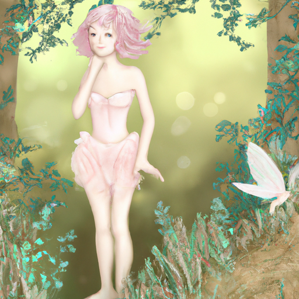

## [We finally bought a new home - empty house tour coming soon](https://www.youtube.com/watch?v=GzAANe1RWqE)

<table align="center">
	<tr>
		<td align="center">
			
		</td>
		<td align="center">
			
		</td>
		<td align="center">
			
		</td>
	</tr>
</table>

At long last, things are set in stone. We're signing papers in the next coming weeks to officially purchase our home. I'm very relieved that we seem to finally have a floor with much more coming soon. As some of you may know, we're trying to renovate an older barn in the forest on Luke's parents' former property. It will be an interesting change to no longer be surrounded by open fields, leaving the more arid hills and prairies for something very different. It will be lovely to live among so many trees. I always give them names and attach personalities to them. It might sound strange, but I do look forward to making friends with the pines. You will meet them soon enough.

Due to getting a little seasonal cold, I did not get much done this week, but I appreciate you coming along anyway. I was working on this linocut today, and a memory just came to mind which I thought was quite funny. I got an email from someone several days ago that told me they had looked at my shop and enjoyed my art, but they were wondering why all my fairies looked so sad. What I have in mind when I'm painting them is that if I am traipsing about in the wilderness in an enchanted meadow or by a babbling brook, or a somehow enchanted grove, I feel that if I came across them by accident looking through the leaves of grass, they would actually be rather curious or introspective or thoughtfully gazing back at me, unsure as to what to make of this strange little human staring at them. I just love the idea that they would be quite concerned about my presence and perhaps a little curious, and also wondering whether or not I'm a fairy friend. So yes, so there you go, that is why my fairies are not always smiling gleefully. They are more demure and more gentle in their expressions, and the reason for that is because I have a very, very, very strange mind. I am a strange little lady. So I also think as well, probably a little bit of my own personality is projected onto it because I smile when I'm around people, but when I'm by myself or especially out in nature, I'm usually not very self-aware at all. I can be quite serious, and a lot of what is happening is through my other senses, through my eyes and my ears. I'm listening and looking with such intensity around me and around at all the beauty that I do often forget what the expression on my face is.

So the other thing I got up to this week was that I went and inspected the house that we are going to purchase. It does seem like everything is pretty much set in stone at this point, so it's very, very exciting. But I went to go see it and went to go see the renovations that are happening, and it was very exciting. I have noticed that online on YouTube, it seems very popular for people to share how they renovate a home, and I wanted to tell you guys that unfortunately, I'm not going to share that part because I'm not taking any part in it. Luke and his father both have worked in construction for much of their lives, and they're very educated on how to do it, and I definitely would be more of a burden than help if I tried to insert myself in that situation. So I've been watching from the sidelines and cheering on, aware that I'm absolutely terrified of power tools and I really couldn't do much of anything in regards to working on a house. But we do have a floor, though, so that's really great. We didn't have that for quite a bit, so it is very exciting.

I did, however, put quite a bit of emphasis on being able to find some things to decorate the house because I do love to paint and decorate, as you guys can tell. It is definitely a passion of mine, and I really like to do it on a budget as well. That is very important to me, to try to DIY anything I possibly can or find secondhand items or thrifted items. It's about a two to three-hour drive to get to the nearest city, and it was very exciting to go visit. I really don't get out that much. I don't think I travel almost at all anymore, only to see family, and it was just a blast. I got to see all these antique shops and second-hand shops and try to look for furniture to purchase if I am able to. It was funny because I initially went to the city specifically looking for a couch, and then I went into a new furniture store and I saw that the couches were thousands of dollars, and I just walked out of there almost immediately. Then I went to an antique shop and a secondhand shop. I still couldn't find anything. I decided that I would just upholster an old couch that Luke was going to get rid of. So my abuela is visiting from Puerto Rico. She's very good at upholstering furniture, so she's going to help me upholster the couch, which is really exciting. So I'm very excited to introduce her and have you meet her.

That being said, I appreciate you guys understanding this week was a little bit different, and I really wasn't able to do as much as I usually do. And I will see you very soon. I'm sending you all my love, and I hope you have a wonderful day. Take care of yourselves, and I will see you very, very soon. Goodbye.