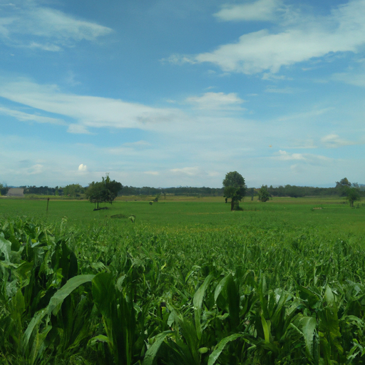
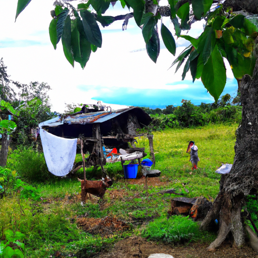
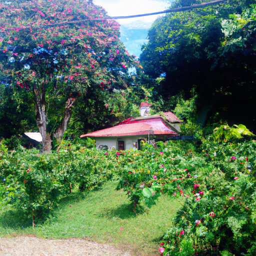

## [What I Learned from Living in a Rural Cottage - how I live a quiet peaceful life](https://www.youtube.com/watch?v=jZB08H8ND8o)

<table align="center">
	<tr>
		<td align="center">
			
		</td>
		<td align="center">
			
		</td>
		<td align="center">
			
		</td>
	</tr>
</table>

About a year and a half ago, I quit my job, moved to the countryside, and started a new life. Since then I've learned quite a few lessons on how to cultivate a feeling of abundance while living simply.

I grew up moving quite a bit, living in multiple different countries and traveling to even more. When I moved here without any plans to move or travel again in the future, it was a cathartic experience in which I had to redefine what it was to live a meaningful life.

True fulfillment doesn't come from the acquisition of material things, nor is it acquired through traveling, visiting new places, and constantly having new exciting experiences. It's a little more complicated than that. I find it's part of the life journey in which we continue to discover what it is that makes us happy.

There is no easy cure for sadness, instead I find that to cultivate joy you must treat it like a seed. You must take care of it and let it grow and watch over it. Sometimes it doesn't produce the abundance that you were hoping for, but with time - maybe next year - it will. The key is to know that things don't ever stay the same for long... the seasons change and so will you. It's impossible to predict where your life will be in the future, I could have never predicted that I would be here.

City life was overwhelming to my more sensitive quiet spirit, I longed to move to the countryside, it wasn't until I came here that I realized how crucial one's environment is to their creativity and their mental health.

Living in a rural area did not solve my lack of fulfillment, but it did create a foundation in which I could start to build up my courage to live my life how I wanted, instead of comparing it to that of others. I never realized how oppressing it was to live by someone else's standards.

Over time I got back in touch with what it is that makes me truly happy - the day-to-day experiences and joys of simple living. I no longer needed to travel or acquire things in order to feel as if my life was a success, instead the sweet smell of calendula tea was enough to make my day just about perfect.

For example, I take care of young children as my primary job and spending time with them and experiencing the world through their eyes constantly reminds me to change my perspective and see the little moments of life as what is truly meaningful, and what is truly living.

I am constantly surprised how my new lifestyle ignites my creativity. Not only do I enjoy painting, reading, and writing, but I am trying all types of new skills and crafts. While we often covet the ability to travel the world at a whim, I find that there is long-lasting fulfillment from learning new skills and experimenting with new ideas.

I hope this video brought you some peaceful thoughts, I'm not offering solutions to anyone's difficulties, I'm just simply sharing the little things that I've learned through living in a rural area on how to cultivate a feeling of abundance in a society that often focuses on scarcity and negativity. There is so much joy to be had in this world and while we can recognize the darkness, we must make sure to also encourage the light in our own hearts.