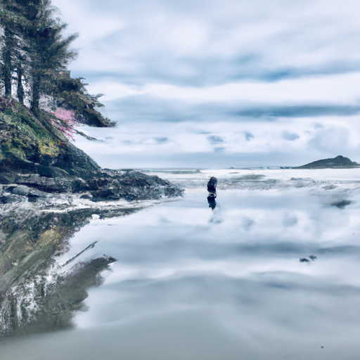

## [What I learned from traveling full time](https://www.youtube.com/watch?v=ysbQ3QYZ9CI)

<table align="center">
	<tr>
		<td align="center">
<<<<<<< HEAD
			
		</td>
		<td align="center">
			
		</td>
		<td align="center">
			
=======
			
		</td>
		<td align="center">
			
		</td>
		<td align="center">
			
>>>>>>> ffe52613361410ad9d371a0f80e81de4dd24175f
		</td>
	</tr>
</table>

It has been a long time since I ventured beyond my county. I took a needed trip to the coast to visit my father - I spent some of my childhood here and it is a place full of memories. Consequently, I found myself reflecting on my life and how far I've come and being satisfied with what I have.

As the daughter of a military man, I traveled a lot as a child, having grown up in many parts of the US, Cuba, Puerto Rico, Italy, and Ireland. I was always moving. While I wouldn't trade my childhood for the world, I also yearned for a stable community, friendships that didn't have to be long distance, and a closer connection to a specific place I could call home. Now I barely venture out of my county, much less my state.

While there are lands I still plan to see someday, I'm content to explore my own home, discovering new things and learning about the environment I live in. Staying put has given me a chance to observe the seasons in one place and notice the changes from year to year. Traveling is wonderful but it doesn't always need to involve far away places. Sometimes it's simply an exploration of one's local area, or, if you are in a particularly adventurous mood, an exploration of your own spirit. There's so much to discover about oneself, that is the one journey that is never over and is always available to take. External experiences are fleeting, but your inner self is the one that you carry with you wherever you go, and yet oftentimes it is forgotten in the midst of busyness.

While exciting new experiences can be life-changing and memorable, it is the little more ordinary details that take up the majority of our time, and it is often the part of the story that only you truly know. In a way, that gives us power to make it whatever we wish it to be. Who we truly are is not always seen by other people, it is also our thoughts, our ideas, and feelings. We can show each other where we've traveled and what we've achieved... it is much harder to communicate who we are on the inside, and yet that is the only thing we carry with us all the time.

I believe we can be very well traveled without physically going anywhere, we can explore our imaginations, our questions, our spiritual perspectives... If you are unable to travel, do not feel as if you are missing out. You can always choose to go on a journey, simply of a different kind, and it is no less meaningful.