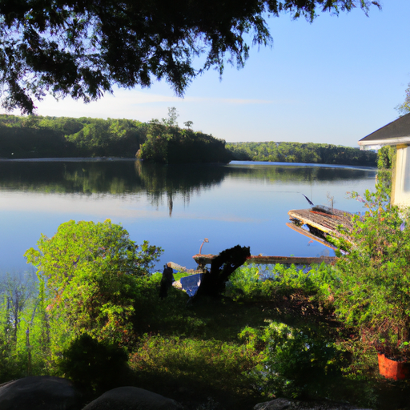
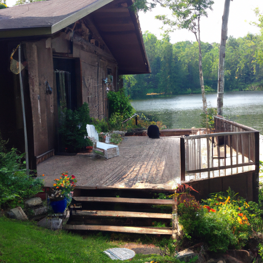
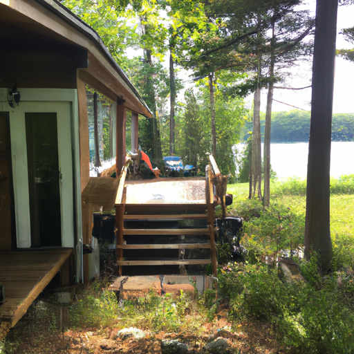

## [What it s like to live rural - my country cottage experience](https://www.youtube.com/watch?v=XOXeNdhiIC4)

<table align="center">
	<tr>
		<td align="center">
			
		</td>
		<td align="center">
			
		</td>
		<td align="center">
			
		</td>
	</tr>
</table>

Salutations, at the time of making this video it is 7 a.m when I wake up every single morning... not buying my own accord so much as that my dog Aegir decides around this time that I have slept long enough. Let me know if your schedule is also dictated by animals...

Today i wanted to reflect a bit on what my home has taught me - these are my personal experiences and they have guided me in many ways.

One thing I quickly learned once I moved is that your space complements your happiness but can't necessarily sustain it. My cottage taught me that I am responsible for my own satisfaction in life. We often fill our minds with what-ifs and dreams of living somewhere beautiful that melts away our troubles... but from my experience, this isn't an effective long-term remedy. The excitement of living here temporarily distracted me from my troubles, but eventually I had to face them. If I didn't, the void in my spirit would poison each new environment I found, forcing me to keep moving and trying new things in order to outrun personal growth.

As a side note I know some people were wondering how and where I shower, and the answer is kind of strange... in the summertime I have a little outdoor extension that works really well but in the winter when it's cold and I can't have heated water I go to a tiny house that is actually connected to the property and right behind my cottage. It is currently empty and so i'm able to use the facilities.

Something else I learned is that some inconveniences are a matter of perspective... it can be easy to see a flushing toilet, a stable internet connection, and various other resources as necessary for comfortable living. This may be true for some people and I absolutely respect their preference. As for me I have found much freedom in altering my mindset away from wants and towards needs. I don't have a shower inside my cottage, I use a compost toilet and I have to take a short walk every day in order to get a stable connection to the internet. I do my work on my computer and - increasingly - disconnect for the rest of the day. Don't get me wrong, I love technology and it is a wonderful resource. At home I use it intentionally, listening to audiobooks, watching pre-downloaded videos and documentaries. I try to use technology in a way that benefits me and makes me feel more energized instead of inadequate and mentally dull (which I find I feel sometimes after staring at my phone for a long time). This is only my experience and of course I would love to hear yours.

Another inconvenience i've learned to deal with is looking forward to traveling out of town in order to buy bulk groceries. Food in town is a bit limited and expensive so I try to stock up when I can. I've had friends who visit who have found these inconveniences very troublesome since they're used to having these things available all the time. I've come to see these limitations as a small price to pay for all the other resources available to me... such as endless hiking trails, substantial land to use for gardening and, honestly, the beauty of the mountains and forests and grasslands... that being said, rural living is definitely not for everyone.

One of the biggest lessons I've learned from my cottage is that boredom is not only underrated, it is a tool that has endless potential for creativity and innovation when you take something out of your life you often naturally fill it with something new... the less time you spend on your phone or maybe doing other more mindless tasks the more you realize how important it is to have hobbies or interests that are your own... be it learning new things like creating art, going on adventures, writing, planning. For example, I would have never started my youtube channel or my etsy shop if I hadn't found myself without anything in particular to do in my free time! So, I decided that I wanted to start working on making my passions into something that would help me sustain myself in the future.

Lastly my cottage has also reminded me to be ever more grateful. I live in an environment of extremes with burning hot summers and icy winters. I'm so grateful for warmth windows a furnace and winter I also recognize all the little blessings that have brought me to where I am and cherish each in my heart. In a future video I wish to speak more on my unusual childhood and wonderful family.

Thank you all for your lovely comments and support I truly wish I could reach out to each one of you and answer you personally. While that is not possible for me know that I read all that you send me and that I deeply appreciate it. Sending my love, have a lovely day or night.