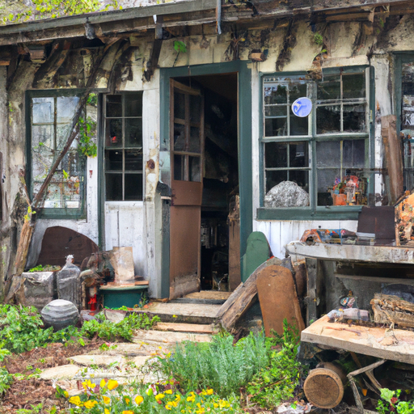
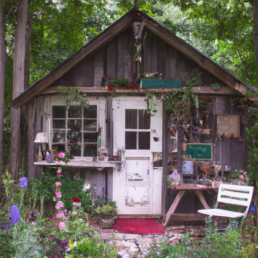
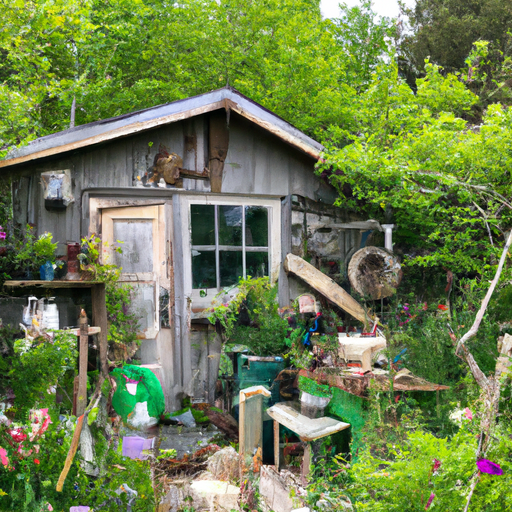

## [Why I live simply and not minimally](https://www.youtube.com/watch?v=s-MEy4Oy7Pg)

<table align="center">
	<tr>
		<td align="center">
			
		</td>
		<td align="center">
			
		</td>
		<td align="center">
			
		</td>
	</tr>
</table>

My name is Paola, it's a popular name in my mother's native country of Puerto Rico. It means small which is ironic since thanks to my American father I'm five feet and nine inches.

I've always been interested in country living, my need for quietness drew me to my home in Northeast Washington. Also, my wish to help preserve this beautiful place, here in my valley spring is nascent, the soil is finally workable, and it is rich, long missed after four months buried under snow.

I don't know of a single definition of living simply that applies to everyone. I believe you can live mindfully and sustainably most anywhere, depending on what's reasonable for you. For example, I try to avoid over consumption but I've never been a minimalist in the more mainstream sense of the turn. When I've tried it I have failed miserably. I like to have many things in my life and value what they can do for me. I have about a thousand hobbies and each comes with a set of craft supplies. When all of it is laid out you would be shocked at the amount of books and paint and paper and ribbon that I own. I indulge my love of crafting and design and purchase as needed. What has changed is the amount of thought I put into bringing something new into my home, and where and how it is made.

As you can see my home is only one room and mostly floor space, I've put a lot of thought into what I bring into it. Most of the items are between $2-30 dollars, and that is including my new table which was bought at auction for cheap since one of the legs had fallen off. Nothing that a new screw can't fix.

As I was making this video I realized that I've slowly adopted my true form as a squirrel and have a growing collection of little objects. My boyfriend is also a collector of pretty things and so the realization is a bit concerning since together we could probably start our own museum in another decade.

What I do appreciate about each item in my home is that the vast majority of it is old they have been found while perusing antique shops and thrift stores some items are over 100 years old. Others are recently secondhand. The new items are mostly gifts. I can't avoid buying new things, but once I started prioritizing second hand and reusing items many things became far more affordable. For example, I painted most of my walls instead of using wallpaper, sprayed old furniture to look new, thrifted an eclectic but hopefully charming set of dishware. The same goes for my clothes, which I try to source locally, though it can be tricky for someone of my height. Depending on what I'm looking for, I do my best to avoid synthetic fabric if I'm purchasing something new.

I'm an artist after all and can confidently say that things of beauty, though maybe not practical, do add value to my daily life. Be it a work of art, or a beautifully made piece of furniture, a teacup. Many of these items are well crafted and will last a lifetime and it feels like owning a piece of history. While I'm not emotionally dependent on these things, they bring me joy to use and look at every day. The reason I'm highlighting all these random things in my cottage is because while reflecting on the future of us as humans, I considered the fact that while we can never stop consuming we can consume differently, and that's, I think, our greatest hope.

I love interior design and I think there shouldn't be any reason I need to give up what I love. I simply look for new ways to sustain my hobbies that bring the planet into consideration.

I will definitely give you a more thorough spring tour of the cottage once the garden is up and running. Take care and I will see you next week, sending my love.