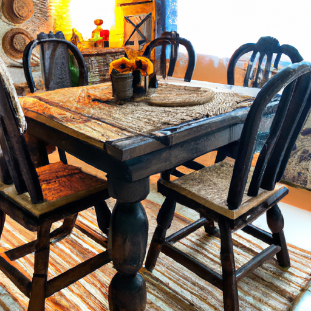
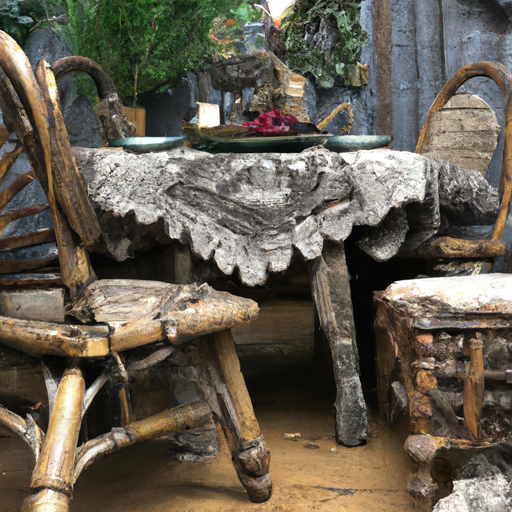
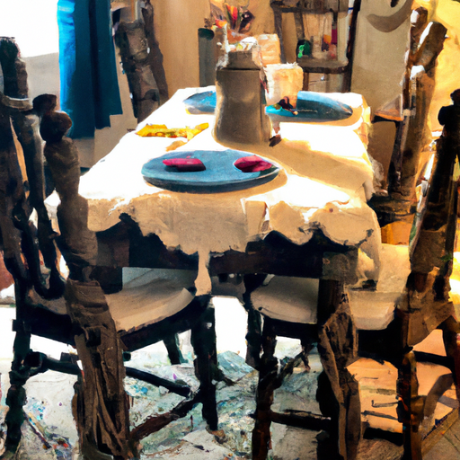

## [a casual week in my life - antique shopping and home update](https://www.youtube.com/watch?v=X36YMpLN3Ok)

<table align="center">
	<tr>
		<td align="center">
			
		</td>
		<td align="center">
			
		</td>
		<td align="center">
			
		</td>
	</tr>
</table>

So my mother and I took a trip last week and we went to the coast which is not actually that far away but it is over the mountains and so the climate is quite different over there. It's a lot more humid and rainy over here. Some of our regions are the high desert, so it's a very different sort of environment. I focused mostly on having a really lovely time with her, of course, but I did get some things I wanted to share.

One thing was that I went to a botanical garden and I had the most amazing time. It was such a beautiful place and so I will share a video of that soon. However, I did have the best time antique shopping and I don't think I've made a shopping-specific, you know, video on here. It's not really the genre that this channel falls into. However, going thrift store shopping, secondhand shopping, antique shopping, all those things, I love doing them. I love upcycling things as well. Most of the things in my home are second hand and you may not think they are because I spend a lot of time making them look, you know, really nice and refurbishing them, but I do enjoy that. It is a really fun hobby for me, especially when I can get a good deal on something.

So, I thought I would share with you a little bit of a fun antique find I found and my kind of process of making it fit into my home. I assume this is not going to be everyone's cup of tea, but I did want to share this. It was a really fun experience and I just simply was excited about the whole process, so I thought I would invite you to come and take shopping with me.

So, I will have to begin at the beginning where I went to Port Gamble with my mother. It is such a cute and quaint little town that I used to visit when I was much younger, and so it was really lovely to come back there and check out some of the antique shops. So, I ended up finding some very exciting things, including some chairs. I think the moment you see them, you will understand why I was so excited.

[Music]

[Music]

[Music]

[Music]

[Music]

[Music]

So, this is one of the best things that have happened on this trip, and I am so happy that I happen to walk into that specific antique shop and find these. I am a very budget-minded person, especially when I am shopping for items, you know, like for my home. I don't like to spend. It is always so exciting when I find what, at least I perceive to be a really good deal. And to me, $45 for three chairs and they have these hand-woven seat covers and I can only assume these are hand-carved designs, you know, maybe not. If you recognize these chairs or they look like something that you found at Target lately, do let me know because that would be very disappointing. But I do assume they are at least rather unique. I don't know anything about them, but I do think they are just so beautiful and just unlike anything I've ever found in an antique shop. And I think that if you've watched this channel for enough time, you would agree that these are very Paula slash Cottage fairy chairs. I think they fit the fairy tale theme perfectly. And the good thing is that I wouldn't have probably purchased these chairs unless I actually needed chairs for my home. But we do have this old little round thrifted table with a couple plain white chairs that you probably saw in my Cottage tour recently, and I wanted to put some new chairs there. It's just enough room for about three chairs, and I want to now paint the table to match these chairs, and that is my goal. I'm going to go to the hardware store because even though we are a very small town, the one thing we do have to have is a hardware store, especially when you live in a rural area and you have to do a lot of your own repairs. So, I'm gonna go check out what they have and see if I can find some paint.

Oh, I forgot, I found something else at a Goodwill, so let's bring that over. So, I also found this jar at a Goodwill. I think it was nine dollars, and I don't know, it just spoke to me. It has this textured surface that makes me assume at least some of this perhaps was hand done, but I don't know. You'll have to tell me if there's anyone out there who knows something about antiques or jars. You can let me know if all that textured surface means that someone hand-painted this or if it's just some sort of amazing machine I don't know about. There is so much texture to it, and on the bottom, it says Satsuma and it says it was from China. So, it is just so beautiful. I'm just enchanted by it. It is such a gorgeous design. Anyway, I'm gonna leave now. I've kept getting distracted, so I'm gonna go find some paint, and I will see you very, very soon. Goodbye.

[Music]

[Music]

So, I got this blue color thinking it was going to complement quite well these chairs, and I don't think it doesn't complement them. However, I think that these chairs are more earthy in their tone and they're kind of rustic, and they're painted a little unevenly, and this table I think now looks too nice, if that makes sense. I think the color is just too crisp, and I think something darker and more weathered would complement things better. So, I'm gonna try adding a layer of paint that is darker and then sandpapering it a little bit to see if I can create a more rustic, weathered look. But I don't know if that's gonna work. I've never done this before, so we're gonna just have to experiment and see.

[Music]

This is so stressful. I don't know if I'm ruining it or if I'm making it better.

[Music]

[Music]

So, I think I'm going to stop here because I'm a little intimidated and unsure whether or not I just ruined this table or I improved it. I think in a few days' time, I will probably know the answer, and we will make a decision then. But at the very least, I do think it matches the chairs, so in that way, we have succeeded. So, I'm going to roll this inside now after it dries a little more and set it all up.

[Music]

Thank you.

[Music]

So, I hope you enjoyed this little project crafting antique shopping update. I've wanted to make some videos on a larger variety of topics, some that interest me quite a bit, one of them being antique shopping and also repurposing old furniture. Thank you so much for all who have supported my Etsy shop. I have a special promotion going on, so you can check out the details down below. I appreciate the support. It makes all the difference for this channel. Please give me recommendations for decorating and any other ideas you have. I hope you spend a little bit of time doing something creative today, and I am sending you all the well wishes, and I will see you very soon. Goodbye.