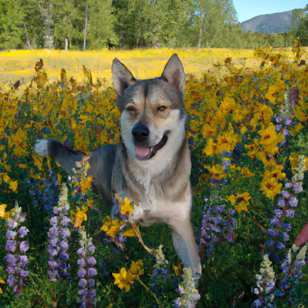

## [a cottage tour updated + Q A](https://www.youtube.com/watch?v=o95BcfhxChY)

<table align="center">
	<tr>
		<td align="center">
			
		</td>
		<td align="center">
			
		</td>
		<td align="center">
			
		</td>
	</tr>
</table>

And just like that, the season of our wild sunflowers is almost over. As they begin to wilt under the quickly warming sun, the lupines bloom, a second wave of wonder. Then, for a glorious and short period, both exist together, a stunning contrast of purple and yellow.

I love this time, before the sun becomes too hot - the world is full of color. The butterflies are awake, and so is the magic. As you can see, I’m not the only one enjoying this season. My dog, Aegir, is even more enthusiastic than I.

Many of you were wondering if he lives outdoors, and I will tell you that while he’d happily spend all day playing fetch if Luke or I had the arm strength, he also enjoys spending most of the day and the night on his dog bed next to my bed. In fact, he refuses to sleep on hardwood at this point, and he is most definitely spoiled.

This video will be a little different this week, because I wish to respond to the many questions regarding my cottage and give an updated tour. The last one I did was many months ago, and not very detailed, so I thought I’d give it another try.

Since last year, I have painted more flowers on the walls, added wallpaper and many pieces of furniture that I love. I’m incredibly grateful to live in an area that has an excellent selection of thrift and antique stores, since I prefer to buy things second hand. I hope this will inspire you to unleash your full creativity in regards to your home space, and not be self conscious about what you love. I get mixed reactions when people have entered my home. Some love it, others are not so sure. But the point, is that here, I feel safe and as if my inner artist and dreamer and introvert has their own space to breath.

This cottage does not belong to me, it is a rental, and I dream of owning my own home someday. I love furniture and objects that appear to be hand crafted and high quality. Through learning how to sandpaper and paint and stain, I realized that I could achieve this look on a budget. It took years to find all these objects, some in very surprising places. For example, believe or not, I found this chair on the sidewalk. An artist was moving out of their house and they didn’t want it anymore, it was so unique that I simply had to pick it up.

This cottage is always in need of some little fix, and it can be hard to come by plumbers and handymen so I usually rely on myself, or Luke, or my mothers innovation to resolve what needs fixing.

Another question I have been asked several times is if the landscape outside of my cottage has been deforested or changed by humans. While there are many trees in this area, they have a tendency to grow most abundantly either in the mountains or on slopes facing away from the sun so that they can survive the hot summers. Where I live is a grassland, home to the native bunchgrass that is crucial for many types of animals. For example, the little quail that you have seen in my past videos nest in these grasslands, and sometimes I spy their little eggs on my walks. I think it is easy to forget that while forests are absolutely crucial for a healthy world, so are prairies and wetlands to a variety of creatures.

I do get a lot of questions about my clothes, and I thought I’d take this chance to explain that much of my clothes are gifts or second hand, and so they are not necessarily companies or brands that I would recommend or purchase as new. Even though I love to patronize sustainable brands if buying something new, I believe the best sustainable habit is simply to reuse what you have. That is also how I find pieces that feel very unique and interesting.

I have a little gas heater for my cottage that was very finicky last year, but I finally got it replaced. Most of the kitchen appliances - such as my stovetop - are actually mobile, and I put them away in my cupboards when I’m not using them. I really like this because it keeps the kitchen looking very simple and clean. The countertops are made of repurposed wood. And they are one of my favorite parts of my house.

The home itself is one room, but there is a small bathroom. This is where Mr. Darcy sleeps in his little house, as he spends most of his time outdoors in my garden or visiting with other furry friends. This bathroom has a compost toilet and it works really well. That, along with the ever faulty plumbing in my kitchen, has made me recognize the true value of clean water, and I like to find ways to reduce my use.

As for my shower, it is in the building next to my cottage, which you see in the window. It was built so that someone else could live here as well.

I hope you enjoyed this little cottage tour, feel free to ask your questions below and I will try my best to answer. Have a lovely day or night, Paola.