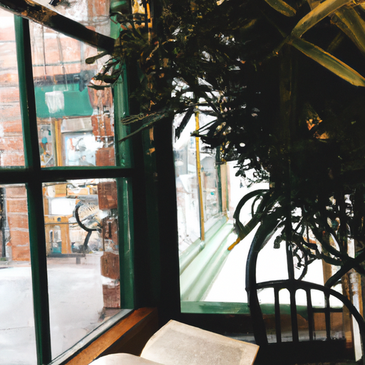
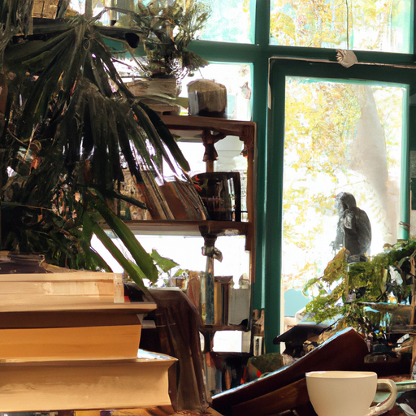
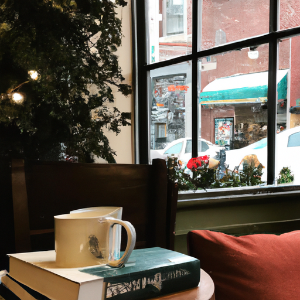

## [a day working at my rural bookshop - my routine as a bookseller](https://www.youtube.com/watch?v=rHR6hcGoR8Q)

<table align="center">
	<tr>
		<td align="center">
			
		</td>
		<td align="center">
			
		</td>
		<td align="center">
			
		</td>
	</tr>
</table>

There is a lovely chill in the air and everything is so beautiful and today I thought I would take you along to a Saturday at my Bookshop where I work on the weekend. I've settled into my job and usually begin the day with my co-worker and dear friend tidying up and making sure everything is ready for opening. I then may work on putting the back stock out on the shelves alphabetizing and making sure that everything is updated. I may spend time cleaning dust away and of course chatting with customers about books. I actually don't have time to read while working here, however sometimes when no one is in the shop and it's a quiet winter evening and all my duties are done for the day, I have been known to read a page or two, but that's a secret.

I am not very good at alphabetizing and doing certain things, but I am learning and getting better with time. Usually by the end of the day, my feet are a bit sore but I always find it enjoyable to spend time in the company of books and my lovely co-worker. But by the evening, I'm on my way home again, often with a new book or two as we do have access to a lot of free books, which is a wonderful benefit of the job. So I spent the evening customizing these books that I want to hopefully give as Christmas gifts. So there is a fun idea for you if you like to gift books but you would like to add something a little more personal.

Of course, I looked at photos online of entire murals that are put on these books sometimes that are extremely detailed and just beautiful, and I knew I wouldn't have time to do something that detailed. I also suspect that getting the proper type of paints to do highly detailed work like that could be quite expensive, so I thought that perhaps you'd be inspired by this more simple version of it that's quite inexpensive and it's just using gel pens or gel markers, and with a delicate touch, you can get quite adorable results even though they might not be quite as sophisticated.

One thing I love is that if you open the book, you can write a little message in the pages that then disappears once you close the book, and so the reader will only get that very personal message from you once they open the book. I definitely recommend picking up a few books that are used or very inexpensive that you can practice on before you try to customize one of your favorite books. With all that being said, I hope you enjoyed this little video. I did want to share a little bit of an update of what it's like to work at my bookstore. I have really settled in over the last several months, and the first time I made a very similar video, I had only just started at the bookstore, and so I have a lot more responsibilities now and other things that I have learned, so I just wanted to kind of share an update on that.

But yes, I was looking at my old video, I'll link it down below, about working at a bookstore when I first started working there, and I remember saying that I got um paid 14 an hour and the average paperback book with my employee discount is about fourteen dollars, so I was pretty much just recycling my paycheck back into the store. That is still very true. I am quite at peace with being a book collector because I do not prioritize kind of brand new books, which would be quite expensive. I love to buy used books, Advanced readers copies that I get as a Bookseller, also just you know any sort of thrifted or you know kind of older book.

If you do keep track of my videos, you'll know that I was Ill last month and I did start reading uh Shady Hollow, so if you do like cozy Mysteries, this is a murder mystery, so you know do with that what you will, but reading the rest of the series, I really liked the second two books a lot more than the first, so I think that they improved drastically with time and the very last book, which was Mirror Lake, was definitely my favorite. If you don't know why I was attracted to this book in this series, you're probably new to this channel, so put a Whimsical Woodland town full of anthropomorphic animals and outfits with personalities um in the middle of this kind of little enchanted forest in a Perpetual Autumn season that is that is what I live for.

So of course after finishing those books, I still wanted to read books with talking animals and so I did ReDiscover an old favorite that I read as a child and they are the cottage Tales. They do have talking animals and of course they have a heroine based off of the real-life Beatrix Potter, and I thought they were just lovely and probably exactly what I want to read this Autumn. Thankfully, each one of them was about 75 cents to a dollar because they're quite old and I could only find them used, so I'm looking forward to reading these as well.

I always feel kind of funny saying that I enjoy these mystery books because many of them do involve some kind of gruesome moments in them. Reading a cozy Mysteries kind of feels like a stage play, you know it's not realistic, you know it's not like true crime or a mystery that actually puts you on the edge of your seat, you know it's more about the Ambiance and the seasonal aspect. Usually, they're based on a season or have a theme. I've had some customers at the bookstore refer to them as old lady books, and I love it because there are many older women who have come in and referred to them as their old lady book because it's just embracing what you like and knowing it might be perceived as a guilty pleasure.

There is a very eccentric and Whimsical old lady in my heart that I will hopefully one day become, and I'm looking forward to starting early with my obsession with cozy Mysteries. But yes, I definitely have been enjoying my time at the bookstore. If this is not the first job I had at a bookstore, I used to work at a bookstore in my old University City, and that one was much larger than this one, so that was, you know, a different experience as well. I do really enjoy talking to customers about books and book recommendations, particularly when they're in the genres that I love to read like adult fantasy.

It is, of course, a customer service job, so that aspect of it, you know, can always be overwhelming and exhausting at times. So I know it is definitely not for everyone, and for some people, it really burns them out. I wanted to say really quick that I did restock my little print of my mushroom bunny. You can only handle a small amount of orders on my Etsy shop as I am doing all the orders myself, so I really do appreciate your understanding that I do often have to close my shop. I was able to restock my little bunny for at least a little while, and I wanted to let all of you know who were interested, and I really absolutely appreciate the support. It means the world.

Let me know what you're reading this October, and I am sending all of you my love. Please take care of yourselves, and I will see you very soon.