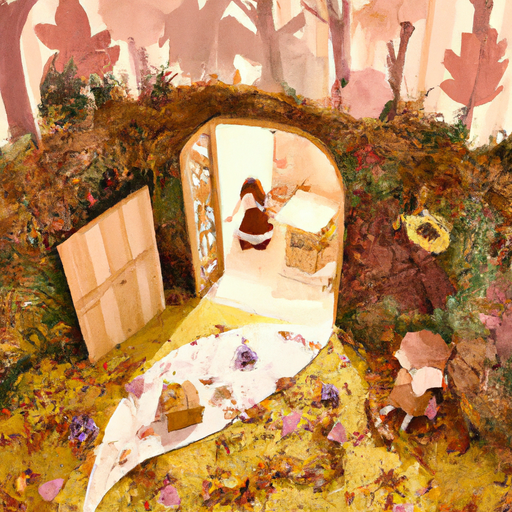
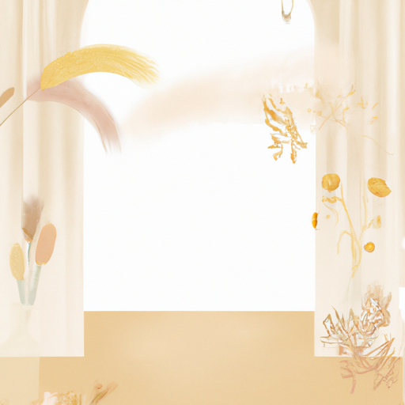
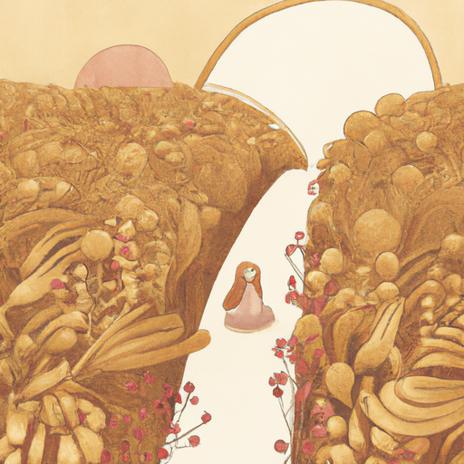

## [a misty morning in the wilderness - enjoying a gentle autumn](https://www.youtube.com/watch?v=Cdwy2AZi2X4)

<table align="center">
	<tr>
		<td align="center">
			
		</td>
		<td align="center">
			
		</td>
		<td align="center">
			
		</td>
	</tr>
</table>

It is far too early for winter, but I did see a sprinkling of snow up in the mountains today and realized no doubt it will reach me far before the autumn is over. I would love a few more months to enjoy the golden fields covered in leaves, but I still need to prepare for the ice and snow.

I got to visit with my sister last week, and so I only had time to film little snippets from my days at the cottage, but I thought I’d still share a little of what I’ve been up to. While my flowers are all but gone due to more frosts, I did manage to save some containers by bringing them indoors. I will no doubt keep these around long after they have wilted and left pollen everywhere because I always forget until they are completely dead.

Recently I received a letter from a lovely viewer who said they just started a creative career and were wondering what inspired me to pursue mine, especially in regards to my art business and creating videos. This is something I’ve been reflecting on recently, because now that I’ve been doing it for a while I have been able to learn a lot, and make many mistakes along the way.

I mentioned this in a past video, but I thought I’d reiterate that I believe the most important thing you can do whenever you start out on life or career path, is to know what you believe in regards to your own values and the vision behind what you’re doing. For example, I always wanted to be able to create the art I love and share it with people, whether or not that meant I could rely on it for a living, which thankfully is now my main job. If you have watched my art related videos and seen my work you know that my art style is a niche, to say the least, it takes a lot of inspiration from fairytales and children’s illustration. It doesn’t appeal to a mass audience, and I never intended it to. Because I knew that if I completely changed my art style or what I created just to be more successful, then my passion for it would disappear. I would rather do another type of job then deny what I love to create.

That is also why I don’t do sponsorships, because before I ever started my channel I decided it didn’t align with what I was personally trying to communicate, and that of course is not a reflection on other creators who do, because I completely support them and am so happy it lets them keep creating. It just didn’t fit the philosophy of my personal channel, and consequently I felt more free to occasionally highlight small business just starting out that can’t afford to do sponsorships. I want to pay these artists since I was in their position not too long ago, and it feels like a meaningful way to give back.

I think that when we achieve a goal - or the success we had in our minds eye - you are often left with the question of: what now? Because there will always be someone out there that seems to be more successful or better at something than you. It is so easy to compare with someone ahead of you and find yourself short, instead of looking back and being amazed and so proud of how far you’ve come. That’s something that means a lot to me, and as my channel has grown I have held on so tightly to the philosophy I had when I first started. Of course, we should always be flexible and openly expand our beliefs, as long as we don’t lose sight of what’s truly important to us and what we set out to do in the first place.

For example, there are so many things I could change about my videos and content that would no doubt attract a broader audience than I have now, but then I would be wandering off the path of what I initially wanted to do. In my case, it was to afford living while also connecting with kindred spirits, inspiring others to go outdoors and preserve wild lands, enjoy the magic of simply living day to day. Everything else is simply a bonus.

In short, follow your heart always - because when your inner self and outer actions are in alignment, that is when you can meet your full potential, and find lasting joy in the process. I hope you have a lovely day or night, sending my love.