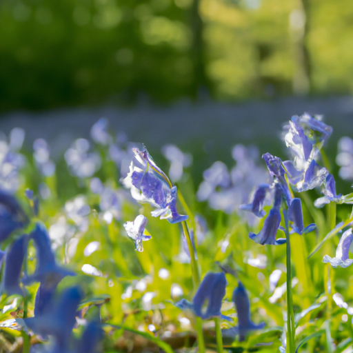
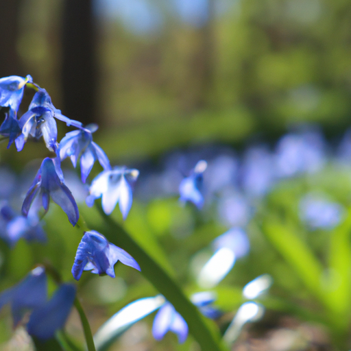
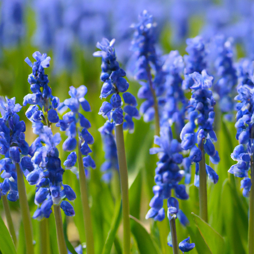

## [a morning routine at my treehouse cottage - daily life in the forest](https://www.youtube.com/watch?v=awBU_8c7kSc)

<table align="center">
	<tr>
		<td align="center">
			
		</td>
		<td align="center">
			
		</td>
		<td align="center">
			
		</td>
	</tr>
</table>

Salutations, it is a little after 7 a.m and I'm enjoying a rare warm spring morning. I've been trying to put some changes into my day recently in order to add more meaning to my life outside of a busy work schedule, which can feel so consuming at times.

I like to consider my daily routine as more of a practice instead of something scheduled out. To have a routine sounds like something that you aren't supposed to break, while a daily practice is something that evolves and develops over time. It isn't about doing things a certain way, it's about learning what we need as we go through the process of living well.

For me, an overly rigid structure to my mornings makes me feel as if everything I'm trying to do in order to prepare for the day is for the sole purpose of being productive and efficient and having high energy. No doubt these things are necessary at times and can be very beneficial, but I've also found a lot of fulfillment in bending those rules and allowing things into my routine that are just there for pure enjoyment, or even - dare I say - and to waste a little time in the best ways I could imagine: reading a story, daydreaming, taking a walk, sipping tea... we focus so much on making every minute count towards a goal and it is so liberating to have the goal to be enjoying that minute.

It's been a very long time since I kind of just really gave my all into enjoying some kind of frivolous hobby - for lack of a better word - and I actually went to my local specialty market and went and spent a long time smelling all the different types of teas and seeing what kinds they had. I've really enjoyed the process, it actually was meaningful because I thought, you know, when as adults do we really prioritize taking at least a few minutes - if not a little part of the day - now and then to just have fun. Speaks to that inner child and I had just so much fun picking out tea and so that's what I decided I would do today, that I would take a little bit of time between work breaks to organize some of it and put it away.

It was so fruitful to add some new things to my routine and to see how they felt, and to be honest, I found that I think the answer isn't to copy other people's routines necessarily, or to just bring in something that people say would be helpful. It really is listening to yourself and seeing what you enjoy to do. You know, I like getting up early but I will never be one of those people that wake up at 5am. It just doesn't work for me, and it doesn't add to my day. Another thing that I do is that I enjoy journaling but I actually really enjoy painting and that is one way that I'm able to communicate my thoughts and feelings about the day in color and in paint and I found that prioritizing some time for that was actually benefiting me more than putting a little time aside for my journal. So it's just so interesting to realize, just to listen to yourself and find what works.

Sending all of you my love, I will see you very soon, take care of yourselves... and I'm gonna go on a walk because I've not yet gone on a walk today and my puppy is very excited and I heard a little fairy told me that there is a field of blue bells up the road and I am really excited to go see if that dream is a reality, so I will take you along, but that being said, have a wonderful week, goodbye.

I decided to adventure up this random little road and I wasn't expecting to find too much because this is where all the fires went through. So much life is here, and it's blooming and it's beautiful and abundant and it's just such a beautiful reminder -to me, at least - that no matter how much destruction can happen there's always always the opportunity to bring back so much and for beauty to grow again and for, gosh it just feels like, if wildfires can tear through an entire valley and the very next year a field of blue bells is here and then anything anything is possible! It is just it is just so beautiful...

Hello thank you again all for all your kindness and support it has really been such an important part this week in trying to rethink how I spend free time when I do have it. I don't have a lot of it but when I do have it, even if it's just a couple minutes, to just stop for a few seconds and to just look up and turn my face to the sky and absorb that light the sunshine and just and just look and just see... wow. If i'm sounding like a fanciful fairy right now it's because I definitely feel like one. I'm feeling very wonderful today and it is giving me courage to face the weak and face work and responsibilities and all these fears with with new enthusiasm, I did think that I would answer at least just a couple questions. A surprising amount of people were wondering if I was gonna go on a honeymoon and I thought that was really funny because I haven't even thought about whether or not I'm gonna go on a honeymoon since I'm getting married this may. After the whole process of purchasing a home it just really isn't something feasible or practical for us to do right now I don't think it would be a very smart decision and we would love to take a very short trip somewhere I would love to go to Canada because i actually have not explored Canada very much I have been there multiple times but I would love to go back to one of my very favorite places which was Prince Edward Island, I went over there when I was 15 years old it was a very special gift that my father gave me because when you are 15 in hispanic culture you celebrate your quinceanera and that quinceanera is kind of like a sweet 16 but it has this added meaning of not only are you you know becoming an adult but you are entering adult society and you have a new level of kind of responsibility and it's usually a very huge party, but my introverted self did not want to party so my father was kind enough to compromise. P.E.I is the home of Lucy Maud Montgomery and she wrote the Anne of Green Gables books and I was absolutely obsessed with the books when I was much younger, so I was able to go over there and see the museums and see some plays and really fall in love with that very unique very special little island. I would love to visit again so that is another option potentially for a future honeymoon when we are in a different place financially, for sure, we would love to go there perhaps. Over here as well the summers are kind of a gamble, sometimes they're going to be beautiful and incredible and you can get out into the mountains and go camping and other years the entire sky is filled with smoke from wildfires and you know you are quite limited in what you can do and so we're kind of waiting to see also what the summer's going to look like because a beautiful clear summer without the smoke pollution is very special and we wouldn't want to miss that. If that is how it ends up being... so we will see what we end up doing. I am very excited for the future, I'm feeling better, I think it takes time to recover from life burnout so every year I collect kind of a little bowl full of spring beauties and I love to find a really abundant field and just collect some for a very special meal and then it is just so wonderful to come back the next year and just see it's so abundant and it really motivates you to learn about the plants in your area learn how to mindfully forage it is also such a beautiful way to connect with nature and be reminded that we can create a beautiful working relationship with it. It's up to us and we can we can really do it almost anytime we can start learning and connecting and finding out incredible unusual things like corms of spring beauties taste like the most incredible floral infused potatoes I've ever tasted it was absolutely delicious and I just couldn't believe how wonderful they were because usually when I forage I have to be more open-minded to unusual flavors... these were just felt such cozy comfort food type flavor that I really really enjoyed it and it's just so wonderful to just have a little special treat and then you get to be excited for next year to have that treat again it's a lot like morel mushrooms. I'm sending all of you my love, and I will see you very soon...