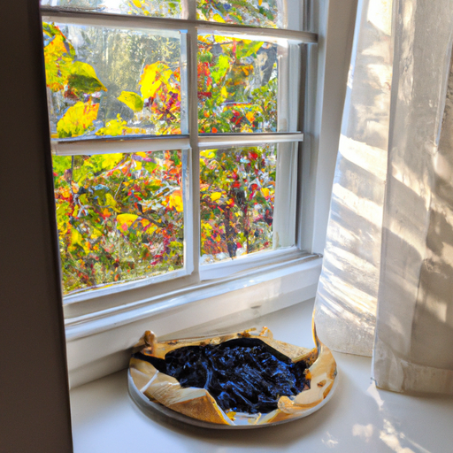

## [a new start - a work update and being a bit emotional](https://www.youtube.com/watch?v=ojBqr4Vl8Zs)

<table align="center">
	<tr>
		<td align="center">
			
		</td>
		<td align="center">
			
		</td>
		<td align="center">
			
		</td>
	</tr>
</table>

[Music]

Summer has settled into my valley, the golden glows are blooming, roses are bright and fragrant, and most importantly, blueberry farms are opening their doors to hungry visitors. The heat of August has made me look forward to autumn, and I cannot wait for the cool, crisp feel of October mornings. I had to travel a ways to get to this forum as I live in a rural area. I rarely drive on highways, and it is always interesting seeing the cars speeding past and how there are always a handful that rush by and tailgate other cars in order to get to the next stop sign just a little bit faster, even if by only a few minutes. When I see this, I can't help but wonder, what are you rushing for? Is there so little to enjoy in the present that we must hurry in order to almost avoid it? And when we get to where we want to go, will we rush through that too? For how long will we cement that habit of going faster and faster? When will it be time to stop?

[Music] Obviously, these are fairly meaningless thoughts in regards to traveling, but I like to find little reasons to concentrate on picking blueberries and savoring every moment, from the juice on my face to the grass underfoot. I keep this sentiment close to my heart to remember that even harvesting on a sweltering summer day, getting all sweaty and tired, is still a gift, and there's no reason to rush.

[Music]

I took several pounds of blueberries home and decided to make a galette to share with friends and family. However, I did not have the proper pastry flour and decided to use hard wheat flour from a whole grain farm only a few miles away. This proved to not work out as well, as the dough was not as pliable and neat, but it was still very tasty and healthier than the alternative. So, I suppose I can't complain. It's always an event when I bake. It's hard to know what's going to happen. For those who've been watching for a long time, you may remember the exploding pie incident. I like to keep things interesting, to say the least.

[Music]

With the day coming to a close, I stored the rest of my blueberries and settled down for a cup of tea with my animal friends. And as the sun set, we read some spooky summer stories by candlelight and looked forward to the coming frost.

[Music]

I'll admit, I'm not in a chatty mood today. I have several people I love in my life having a very hard time. They are quite young and they are trying to find their place in this world, and they are struggling to do that. And I know, while those challenging times are necessary for all of us to learn and grow and become who we want to be, it is still hard to hear people you love having a hard time. And so, I have just been pretty quiet today, doing my best to go slowly, honor how I'm feeling, and accept if I'm not that chatty. So, I did just want to say a few words of some updates.

I am working again at my local bookstore, and it is such a gift. I am so excited about it. I'm actually helping them run their Instagram, and I am able to take photos and chat about books, and that has just been so much fun. I think also, work talking for yourself is really exciting and wonderful, but it is a roller coaster of ups and downs. And so, I think having also a very steady job, something that gives me a very set income, will be helpful for peace of mind as well. It feels nice to mix up the week with a job that is so peaceful. And even though it gets quite busy at the bookstore, it still feels usually fairly quiet most of the time, and I'm able to just spend time tidying and cleaning and alphabetizing, and I really enjoy it. So, do look forward to at least a couple of videos about life at the bookstore because it is a very meaningful part of my week.

Another thing that is on my mind is that you can't tell, but it is actually extremely smoky out right now. We have hit that inevitable time of summer where wildfires start, and so it is quite unhealthy to be breathing outdoors too much. It is an unfortunate but inevitable part of life over here where things can get so dry and hot. Looking forward to the fall because when autumn comes around, there comes autumn rains, also the frost, the coolness. It is always such a wonderful remedy for this time of year, and it is exactly what we need.

And so, I'm sending all of you so much love. Thank you so much for your support of my Etsy shop. I'm sending these extra bookmarks with every order and stickers with every order now that uses the discount code "Whimsical" for 10% off. So, I do appreciate the support there. It helps keep this channel going. It is definitely what has made everything possible. So, thank you so, so much. And I will see you very soon, and I will, I'm sure, be in a much chattier, cheerful mood. But, you know, we all have to honor how we feel every week. Sometimes, we might just be tired. Sometimes, we might be feeling any sort of way. And I think it's wonderful to just accept that. It reminds us of our humanity, and that it's quite beautiful to feel all these things.

I think I will just sit here on my porch for just a little while before I go back inside with the air purifier, and I will just enjoy being here. And I hope the same for you, for now. So, I will say goodbye, and I'm wishing you the very best. See you soon.

[Music]