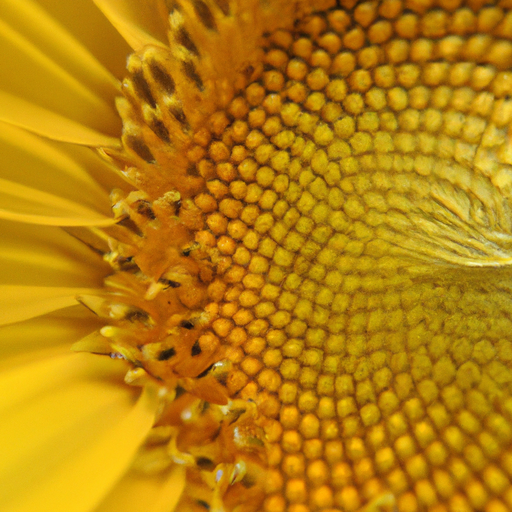

## [a perfect day at home - springtime cottage vlog](https://www.youtube.com/watch?v=3Qv2K_0GEE0)

<table align="center">
	<tr>
		<td align="center">
<<<<<<< HEAD
			
		</td>
		<td align="center">
			
		</td>
		<td align="center">
			
=======
			
		</td>
		<td align="center">
			
		</td>
		<td align="center">
			
>>>>>>> ffe52613361410ad9d371a0f80e81de4dd24175f
		</td>
	</tr>
</table>

I grew my very first plant when I was about six years old. I took a sunflower seed from my mother's bird feeder and planted it in a cup. Several weeks later it bloomed and a lifetime love of flowers flourished along with it.

Growing up I did much of my schooling at home. My mother noticed I love to read and write and that I had trouble concentrating in loud environments, she encouraged me to pursue my passions at home to my heart's contentment. Every few months we'd receive a box full of our homework for the semester, it consisted of our curriculum as well as a dozen books on all topics ranging from biology, history and folklore.

I remember first reading Anne of Green Gables at 11 fascinated by this incredible heroine who was absolutely enraptured by her natural world and had more confidence in her little finger than my insecure self had in their entire being. Intrigued, I continued on to read the story of Laura Ingalls, Calpurnia Tate and eventually turned to biographies on Jane Goodall and Beatrix Potter. I devoured these books and promptly decided that I would be the world's next great naturalist.

Things didn't quite work out that way but these women instilled within me the sight, an ability to magnify one's own gaze to soak in every little detail of life itself. Armed with a microscope in a nature journal full of rushed sketches, my child self would walk out my door into a wooded area near my home and collect samples of everything I could find. A mushroom, a tiny piece of moss, a seed. Under a microscope, they bloomed into tiniest civilizations full of intricate detail and potential. I would write down my scientific observations completely misusing biology terms and sprinkling Latin words here and there for posterity. The end result was a quite nonsensical nature journal that would have made the likes of Mr. Audubon raise an eyebrow.

Over a decade later, I've reclaimed that curiosity and love of plants and flowers. While I do proper research now in order to not inadvertently kill everything I try to grow, I purposefully leave some knowledge gaps open for experimentation. I could read all about how to grow the perfect sunflower down to an exact science, or I could find out myself by taking notes and making observations. I like to take that approach and imagine myself as a student of the plants I grow, they have a lot to teach me, I think, if I remember to listen.

Gardening requires patience and slowness, curiosity and problem-solving. You can be a gardener whether you grow a single flower in a pot or an entire field full of vegetables, whether you know what you're doing or not. Maybe you're like me and like to walk the line...

I have not lived here long enough to have a developed cottage garden. It is still in its infancy, through trial and error I am learning to accommodate an environment that is dry and hot and rather brutal to delicate blooms. I'm fascinated by the fact that even in the driest of grasslands where only sage and bunch grass are abundant, even the most delicate of flowers can be cultivated if given enough loving care. I remember that if I ever feel lost in my story, renewal takes time but it's always possible.

I wanted to thank all of you for your lovely messages and words of affirmation, in my last video it meant so much and I'm feeling so much better. There's such an amazing power in just taking a respite and sleeping well and eating well and I just feel like a new person so I really appreciate all your advice and insight. I felt quite connected to all of you from reading all your lovely words.

As you probably know, my favorite season is spring, the wildflower season is just breathtaking and I've never been anywhere where the flowers are so vibrant and so abundant and I'm so excited to share that with you. The overall goal with this garden is to be a 100% edible flower and herb garden. So, we'll see how that goes, it comes with its own set of challenges because I have a rabbit that likes to eat everything.

I'm very excited to bring you on the journey of growing the garden, I think this year hopefully it will be very abundant unless Darcy escapes from his cage and eats everything. But that may happen and if that happens we'll just have a little memorial for all the plants and we'll move on.