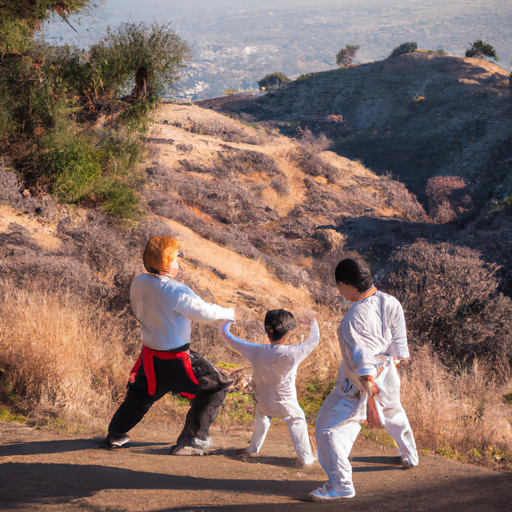
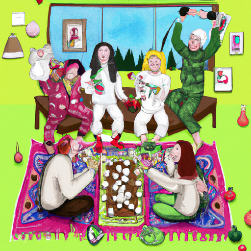
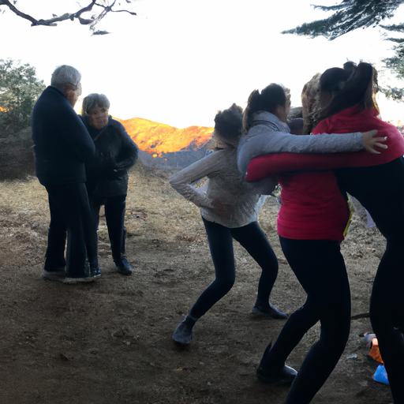

## [a personal chat with my sister while snowed in - get to know my family](https://www.youtube.com/watch?v=yo9s9P-Xugg)

<table align="center">
	<tr>
		<td align="center">
			
		</td>
		<td align="center">
			
		</td>
		<td align="center">
			
		</td>
	</tr>
</table>

Hello everyone, I hope you you are having a wonderful December, I certainly have. I’ve been spending a lot of time with my family recently, and this week has been focused on trying to create a lot of wonderful memories. So, I realized that while I did have some video projects I was working on nothing was going to come together as i anticipated. I realized it was important to let that go, and take some time to be with my family and honor that time together.

My sister is here, Liana. She is one of my favorite people in this world apart from my brother, who is helping me film this video. Anyway, I know this time of year can be tiring as well as enjoyable and that you find yourself tired in January. I am wishing you the best, that you can rest and recover and embrace the new year as full of possibilities.

And I thought since I wont have my sister over here anytime soon, I would have her share one of her New Years goals. Liana: what jumps out at me from what you shared, is I would say to recenter on gratitude and things to be grateful for. Not taking for granted basic needs, all the blessings in our lives, as a family, as individuals, and how that can let us grow. I’m taking this opportunity to foster that gratitude with people I love.

Paola:I would say my New Years resolutions are quite similar. I see in the comments in these videos that are about happiness and how to find happiness, and that usually happiness is more of a location. If you just find the right place to live, the right environment, then you will be happy. And definitely I understand that, I have lived in some nasty places and having a clean and safe home is lovely, having access to nature is lovely. But when I think about was has made the most impact on my joy on a daily basis, it has been none of that.

It’s not about whether or not I have access to a trail or whether or not i have a cottage I can call my own. None of those have come close to the impact of recognizing I have a safe environment. Not only a safe environment as in a shelter, but having people in your life, and only allowing people in your life, that make you feel safe. I came to appreciate that after experiencing some relationships that didn’t make me feel safe and some environments where I didn’t feel safe. And that is something I really appreciated after coming to a place i did feel relaxed and at ease. And that, knowing that the people around you care about you and will prioritize your safety above everything else is something, that not so many years ago in a not-so-great place, I would have given anything for and that is what keeps me going today. No matter where my life takes me, whether I need to leave this place or go back to the city, no matter what I do I am going to be so grateful I have that. That is something so special that we often take for granted.

Yeah, in my very short live I truly believe happiness isn’t a specific location. It is something that can be cultivated in many places and many walks of life as long as you have your basic needs met, and I know not everyone has those basic needs met. It can take so much time, and at times is can feel so discouraging to try to pursue and environment that makes you feel your best and makes you feel safe, and I know that’s very hard. So, I’m sending you all my love and I hope you as well can find some lovely New Years resolutions that make you excited about all the possibilities it holds.

Anyway, I guess that’s what my New Years resolution is as well, yeah, I really like not to make tactile resolutions. Every year for a while I would say less ice cream, and it would fail every time. Yeah, I’ve given up on a lot of those things. But yeah, my New Years resolution is just being grateful for safety. Fun fact about my sister, she fights. Liana:I don’t actually fight. I do martial arts. Paola: yeah, she does martial arts, she’s really good. Liana: yeah, it’s more like I try to beat people up and I get beat up, because that’s how I learn. Paola: She fights, I hike. Liana: I like that. Paola:Sending you all my love, thank you so much for being here, and I will see you next week. Liana:Bye! (Family singing)