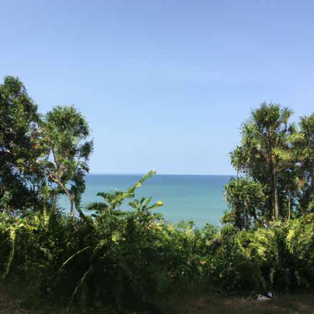
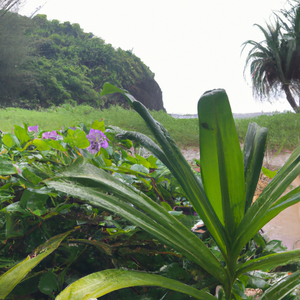

## [a quiet morning in a cabin by the woods](https://www.youtube.com/watch?v=UM0VOrAtnPA)

<table align="center">
	<tr>
		<td align="center">
			
		</td>
		<td align="center">
			
		</td>
		<td align="center">
			
		</td>
	</tr>
</table>

I didn’t think I’d share a video with you this week, because I was feeling quite lacking creative energy. But as I traveled west, and the bare mountains and rugged canyons turned into the lush forests and beaches of the Washington Peninsula, I felt different. The skies were blue and the air had a sweet wet scent. I felt a spark of inspiration, to travel freely and experience the natural world again. I also got to share this trip with my boyfriend, we have never taken a trip together and it was very special time for us.

It got me thinking about my past self, and how my life changed. Loneliness is a feeling I struggled with for many years, as many of us do. I have found it isn’t always a feeling dependent on whether or not you have a lot of friends or an active social life. It’s about your relationship with yourself, about fearing being alone with our own thoughts, and yet feeling lonely because you do not have a deep connection with yourself and others.

I think most everyone feels ‘different’ as some point in their lives. I think for a lot of us it happens during our younger years. These are times when we are discovering who we are and it is natural that we feel like we cannot relate to a vast majority of people. We feel alone, like we don’t belong. Yet, the mere fact that this is such a common feeling shows us that isn’t always true. There are thousands of books and videos and testaments all about this feeling of otherness. It is proof that we have so much more in common with each other than not at any given point.

For example, I’ve never been able to handle more than a couple close friendships at a time, and I am quickly overwhelmed after several days of a lot of socializing. It used to make me feel like something was wrong, but I now know that many people are introverted like myself, its very common. Over time, I have found people that value me and hold my trust, but for me those relationships took many years to build.

To be clear, I have no doubt each and every one of us has a truly unique light that wants to shine ever brighter as we grow in love for ourselves. We have individual imprint, but we also are more connected to others than not. I’ve come to see it as a responsibility to interact with my world with an open heart, to accept others assuming we share common ground. It has helped me feel far less lonely, and encouraged me to connect, and to give.

A very practical way I combatted loneliness was by accepting that every emotion is an opportunity. I also let go of my pride and admitted to myself that in my case, I wanted to live my life near my family. In typical hispanic culture, I was raised with a sense of constant togetherness. I missed that living alone in a city, and even though I was teased at times for wanting to be near my parents, it’s what I knew would make me happier and less lonely. I have lived my own individual life and made my own decisions while still living near my family, and that worked for me. I am no less of an adult, obviously, and I am happier because of that decision.

Through that I realized how important it is to know your own heart instead of mindlessly adhering to what your society dictates is the definition of success and independence. I can certainly say that I still feel lonely from time to time. I think for some of us, it’s a natural occurrence. But I don’t see that loneliness as negative, if anything it reminds me to value my spirituality and to not take for granted the blessings in my life. Whoever you are and whatever chapter you are on in your life, I hope that you can continue to embrace the story, and know that we are always evolving, and that who you will be tomorrow is not yet known.