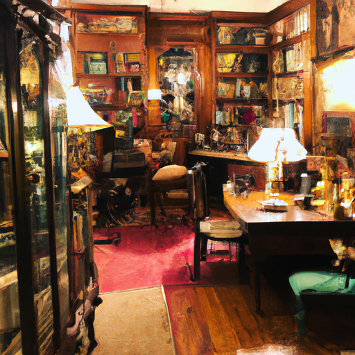
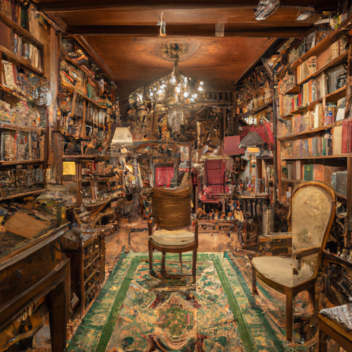
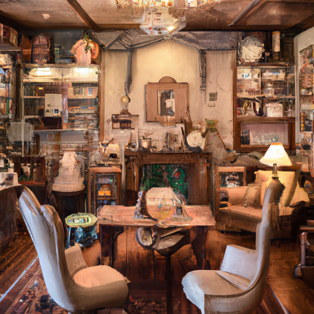

## [a simple life a simple home - reorganizing my cottage](https://www.youtube.com/watch?v=shZuYhJFZ5k)

<table align="center">
	<tr>
		<td align="center">
			
		</td>
		<td align="center">
			
		</td>
		<td align="center">
			
		</td>
	</tr>
</table>

Today I felt the need to calm my racing mind. Sometimes I try to sit and take deep breaths or watch a light-hearted movie. But today I woke up and I knew that some healthy escapism was in order, in the form of some good books.

I also decided to let you guys in on my best-kept secret, and that is that all spare cupboard space in my kitchen is used for storing my many books. I decided today it was high time to confess to my potential future identity as a book hoarder, and do some reorganizing.

One of my favorite movies is called Finding Neverland - it’s a story about the author of Peter Pan. You all are likely familiar with the story of Peter, it’s about a magical boy who takes an ordinary girl named Wendy and her two brothers to a fantastical place called Neverland where children can be young forever. In this world, everyone can fly if they are sprinkled with pixie dust.

I had the pleasure of studying the book when I was a university student. In the story, there are a group of lost boys who spend their time in Neverland going on adventures. The part of this story you may not know if you haven’t read the book is that the lost boys chose to come home with Wendy when she returns to the real world. After a while, the lost boys regret leaving Neverland, and at night their dreams would take them back to that wondrous place. To keep them from flying off in their sleep, they had to be tied down to the bed. Over time, as they grew into adults, they stopped trying to fly, and forgot about Neverland altogether.

In many ways, the author of Peter Pan may have wanted us to take a lesson from the characters in this story. He sums it up in his famous quote “the moment you doubt whether or not you can fly, you can no longer do it.” I believe the characters show us how dangerous it is to get so wrapped up in the real world that you forget to exercise your imagination, or wonder not how things are but how they could be. To be able to envision the world you would like to live in and be the change you want to see, instead of believing there is no point to thinking that way. To spend time dreaming and enjoying all the forms of art that stretch your mind, anything from books to movies and music.

For me, I personally find that reading stories inspires me to continue to have a hopeful and positive outlook. If you saw my last video you know we endured a heatwave, and after it came many wildfires in my area, and shortly after I filmed this video the skies filled with so much smoke that I was no longer able to see my beloved mountains in the distance. The cascades have been blocked out for days now, and understandably it filled me with worry.

In strange times such as these, I notice that there are different approaches to uncertainty about the future. One that I find inspiring is people who take action and make practical steps towards improving their world. Another can be more defeatist, that the future isn’t something to look forward to or try to change. I chose to take an approach directly inspired by the message in the story of Peter Pan. If I choose to lose hope, I will no longer be able to see it. I will forget about the importance of dreaming and believing in a better tomorrow. In letting stories and art and imagination help me visualize it.

I love my home, I believe in a world full of love, and that is what hope has always been. The act of loving. I’ve included some of my favorite books, movies, and music in the description bar. I thought I’d take a very self-indulgent minute to show you some of the more unusual books in my collection. One is this thrifted and stunning copy of Donne’s poetry, my most treasured book is this collection of British Poetry that I found at a thrift store and was signed and annotated by a man named Allen who owned it in 1912, and I found it 2012. As a lover of history, I love collecting antique books. Another favorite is the Diary of an Edwardian Lady. I also admit I have quite a few books that I own because the art inspired me to paint, and I have no idea what most of them are about, I’ll get around to reading them someday. I also have a few treasured books from my childhood, including this very worn copy of flower fairy art.

Thank you for indulging my love of reading today, let me know what your favorite book, movie, or music is. Wishing you a lovely day or night.