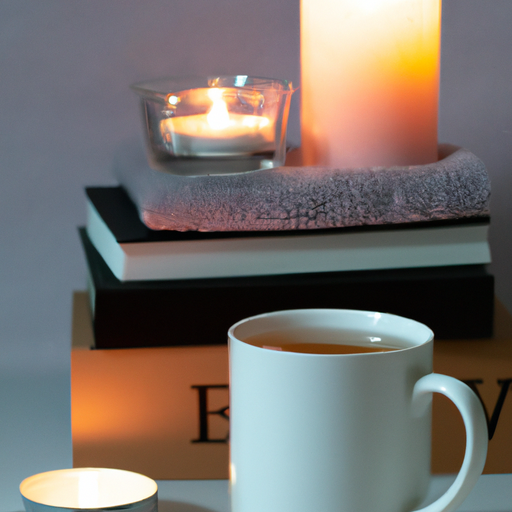
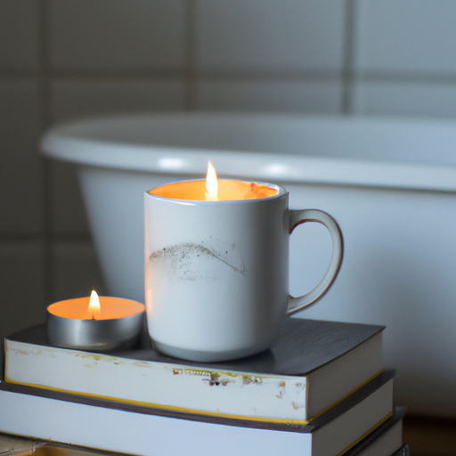
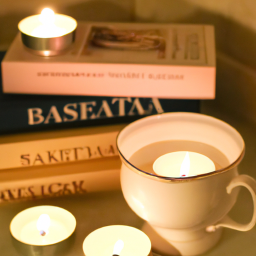

## [an evening self-care routine at the cottage](https://www.youtube.com/watch?v=UKX2_OJtMfA)

<table align="center">
	<tr>
		<td align="center">
<<<<<<< HEAD
			
		</td>
		<td align="center">
			
		</td>
		<td align="center">
			
=======
			
		</td>
		<td align="center">
			
		</td>
		<td align="center">
			
>>>>>>> ffe52613361410ad9d371a0f80e81de4dd24175f
		</td>
	</tr>
</table>

Hello everyone, in this video, I would like to share with you my routine of self-care. I have a video on Instagram where I go into detail about what I use and how I resolved my skin issues. If you are interested, you can check it out. Today, I will give you a general idea of what I do in the evenings and mornings, as well as how I make my own year's supply of hand soap that I keep by my sink.

While I love making my own skin products, most of it is used only on my hands and feet since they are not sensitive places. Sometimes, I make oils for massage, but I don't DIY anything for my face. I have incredibly sensitive skin and need to follow the regimen prescribed by a dermatologist.

When it comes to taking care of my mind and body, I didn't always have a routine. I used to prioritize other things over it, and I suffered the consequences. I was more anxious in the past and self-conscious about the blemishes on my face and back throughout my teens and adulthood. Looking back, I realized that there are barely any photos of me between ages fourteen and eighteen because I avoided them. It makes me a little sad because I would love to have photographs of that time in my life.

The first change that made the biggest difference in my skin and wellbeing was drastically lowering the amount of sugar in my diet. It was really hard for me since I love sweets and convenience food, especially sweet drinks. The only way I was able to do it was by replacing ice cream and goodies with fruit and drinks with sparkling water. Over time, I developed a taste for whole foods and fruits and vegetables, even though they can be expensive. I like being budget-conscious, so I always look for sales and buy in bulk when I can. I also try to stay active and exercise nearly every day.

Another vital aspect of my health is finding healthy outlets for stress and managing it overall. Mental stress plays a significant role, and training yourself to think positively and calm your mind is crucial for long-term health.

Lastly, I have found that being truly comfortable in your own skin and accepting ourselves as we are is the most powerful part of self-care. This applies to everyone. I will share some unusual ways I became confident with my appearance. Many of our self-consciousness is instigated by external experiences, feedback, and social media. By investing my time and money into hobbies and things unrelated to my body, minimizing media consumption related to appearance, and realizing that much of what we are exposed to are just advertisements, I have learned to put a healthy amount of value on my appearance. Over time, how I look became a nice compliment to my identity, but not a focus anymore. I rarely feel insecure about my appearance because I am content with myself and being alone with my thoughts. The body that holds me is the one that has gotten me through so much in my life, and I find the most attractive body to be a healthy one.

Another way I began to love my features, even ones that didn't adhere to the current beauty trend, was by delving into my ancestry and learning about my origin story. As a multi-racial person, I sometimes felt unsure of where I belonged. However, I found confidence in realizing that I reflect the love my parents shared, one so strong that they were willing to deal with the challenges of being a multi-racial couple. I encourage everyone to connect with their past and discover the stories of their people, embracing the origin of the body they inherited.

As you can see, my self-care routine in regards to products I use is quite simple. I don't want to spend potential book-buying money on skin and hair care, so I keep it minimal while prioritizing health. I don't care about anti-aging; I find older people to be beautiful and interesting. I look forward to getting older and embracing a beauty that shows I've lived a full life and spent time outdoors. For my hair, I simply spray it with water every morning to define the curls. It's easy to be convinced by online ads that you need more products than you really do. I value sunscreen, moisturizer, and water on a daily basis. If I want a pampered feeling without spending a lot on products, I use a cool washcloth over my eyes while listening to relaxing music, give myself a scalp massage, or spend meditative minutes massaging my legs or arms with a drugstore moisturizer. I create a calm atmosphere with candles, tea, and an audiobook to train my mind to quiet down.

I hope this video was somewhat interesting to you, and if you want more details, I encourage you to check out the Instagram video I made. I hope you all have a lovely day or night.