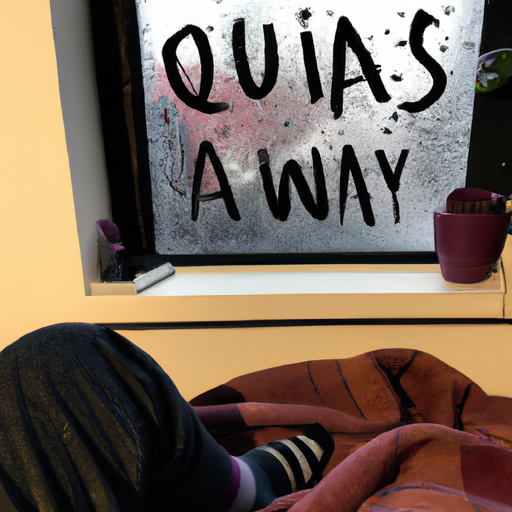
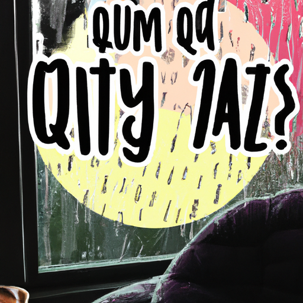
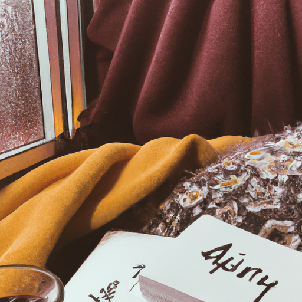

## [answering questions on a rainy day - and realizing my dresses don t fit me anymore lol](https://www.youtube.com/watch?v=mazCrox3rjA)

<table align="center">
	<tr>
		<td align="center">
<<<<<<< HEAD
			
		</td>
		<td align="center">
			
		</td>
		<td align="center">
			
=======
			
		</td>
		<td align="center">
			
		</td>
		<td align="center">
			
>>>>>>> ffe52613361410ad9d371a0f80e81de4dd24175f
		</td>
	</tr>
</table>

Before I begin this video, I wanted to say a huge thank you to those who have supported my Etsy shop or my writing. It means the world and really keeps this channel going. So thank you so much, and I hope you enjoy this cozy little Q&A.

Good morning everyone! I hope you're having a wonderful week so far. Apologies in advance if you hear the rain and wind in the background. It is somehow managing to be sunny and rainy at the same time. It feels like a contradiction to have sun rays and rain, but it's happening nonetheless. This week, it has been a very rainy April. Showers have been very real, and it has been so windy that lawn chairs at times have been flying past my window. So, I decided that it would not quite be appropriate to be filming outdoors when there are flying projectiles through the air. So, I thought I would do something a little cozy, a little cozy chat this week. I know that's not everyone's cup of tea, so if not, I will see you next week with a lot of nature and wildflowers. I hope.

Hello, hi! How are you? It's good. How are you doing? I'm good. I'm filming, so you just interrupted. Come on, just say hi.

I wasn't sure. The first question is, I admire everything you create, but how do you keep your cat away from it? I think the answer to that is, I don't. A lot of things get destroyed, and I have quite a few regrets. But Mavi is an extremely curious and involved, very social cat. So, there's no really keeping her away from whatever I'm doing unless I lock her in a room, which she despises and holds against me for quite a few days. She has me well-trained.

Is there anywhere in the world you would like to travel? I have not really thought about that too much recently. I actually grew up traveling a lot. My dad was in the military, most of you I'm sure know that already. But I grew up doing that, and I think now I'm really enjoying kind of staying put. I know that is so odd. I mean, who doesn't love to travel, right? I do, of course, enjoy traveling, but I've just done so much waiting in airports, waiting at restaurants, waiting at hotels, waiting for cars throughout my entire life that I'm just glad I don't have to deal with all the logistics of travel for a long time. However, if I would go somewhere, you know, I would really love to someday see the Lake District in Britain. I, of course, would love to go back to Prince Edward Island. I'd love to see my brother. He lives in Australia now, and I've never been to Australia. However, if I really had to choose where I'd want to travel, I think right now I would travel to Houston, Texas because that is where my sister lives, and I would love to see her right now.

Have you had any supernatural experiences? I was surprised how often this question popped up. I did not know so many of you had ghostly interests. So, unfortunately, I cannot give you a really good story. Do, though, share your stories down below, whether you believe in the supernatural or not. I do think they make wonderful campfire stories, and they are a lot of fun to listen to. So, definitely share below if you have any. Once, when I was really, really young, I was at a shopping mall with my family, and I got separated from my family. I kind of moved with the crowd, kind of pushed with the crowd into an elevator. It was an extremely busy mall, and it was a very, very scary experience. I was extremely lost and quite far away from my family. And I remember a woman appeared in the elevator. The doors opened, and a woman appeared, and she took my hand and brought me to my family, who were quite a ways away. And she just led me there. And my memory of her was that she was wreathed in bright light. I would call her my guardian angel for years after seeing her. And it was a very special experience. So maybe she was just a good Samaritan, and I just imagined that she was glowing from the inside out and rays of light were coming out of her. But it is interesting that she was a stranger, and my family has no memory of her, and she knew who my family was, which is interesting because if you see my sister and my mother, they have much darker skin and darker hair than me. So most people don't think we're related, and yet somehow this woman knew we were. So it was interesting. So you can tell me what you make of that in the comments section. This is all in good fun, of course. I don't want to be spooky anyone.

Another question I got was several requests for a wardrobe tour, but as I'm in the midst of putting things in storage from winter, I decided it wasn't quite the right time to do that. However, I thought I would share with you some of my favorite spring dresses. I re-wear my dresses often. You probably will see some of my favorites again and again in my videos. I also have some favorite shoes that are from the Dubliner brand. I found they last the longest, and I really value items that I can keep for possibly even a decade or more, which is the case with these boots, and I absolutely love them. And they're super comfortable and warm. So, as I've been trying on all these outfits to show you, I've realized that quite a few of them do not fit me anymore, especially the ones that were already on the smaller side when I got them. I have gained about 10 pounds, I think, since this time last year. And it was intentional. I realized that I was just kind of snacking throughout the day and not always stopping to enjoy a wholesome, nutritious meal. So, I really wanted to make a point of doing that for my health, for my long-term health, and for my present energy. And it has made me feel so much better to take care of myself better. However, there are quite a few dresses that I do need to find new homes for, and I'm realizing that this. So, yeah, so there you go. That's why I'm not showing you as many as I thought I was going to. I will say, however, I do wish I could share with you more sustainable, ethical brand options, and I'm going to do that. That is a big goal of mine. A lot of the clothes I have are from labels I wouldn't buy directly from. They are from ThredUp or they are gifts or thrifted items. And so, I really want to share with you some ethically made options that I think are beautiful. So, that is a goal that is going to happen, and I'm saving up my money because there, it's a lot more expensive. You know, as it should be because everyone is being paid really well, and the clothing is of a high quality. So, I want to do that, but it's going to take me a little bit of time to save up. Okay, back to the normal Q&A.

Another question was, "I'm trying to put my phone away. Any tips?" One tip that might be helpful to you if you really want to cut down on your screen time is to put it away for one entire day, if you're able to. Of course, you know, we all often need to check it for one thing or another, but at least trying to limit it as much as possible. You may be surprised to realize how much you use it and how much time goes to that. And you might find that the feelings that arise might be quite uncomfortable. You might feel boredom or maybe even anxious or just not knowing what to do with yourself. I think that experience, while it might be slightly unpleasant, might help you understand what type of relationship you want with your screen time. You know, if you are so reliant on it that it's really hard to be away from it, that might be a sign that you want to discover other types of hobbies and interests. I would say, however, it definitely takes a little bit of time. There's a little bit of that kind of withdrawal period. I know in college, I used my phone a lot, and then it was very strange to kind of wean myself away from it, and it took a while. But I did find that I am now able to focus on projects such as reading or painting or anything else with a lot more ease. It takes a while to build up that ability to refocus on tasks that are not quite as entertaining as what you might find on your phone. I don't know if that makes sense, but I do love to have soft music in the background throughout the day, sometimes while I'm working on projects. You know, I definitely think there's a balance. It's about using technology and social media in a way that nurtures you. So maybe just developing your philosophy on that will help you find a happy medium between screen time and time doing other sorts of hobbies and tasks.

Will you make another video similar to the Winter Bunny Tale you made before? I do get this question quite a bit. I will leave the link to the video they're talking about below. It is called, I think, "A Winter Tale." I think I, along with my sidekick actor Mr. Darcy, created a fairy tale story and filmed it together, and it was a really fun experience. And it seemed like quite a few of you really enjoyed that. And I would love to create another story like that. I just haven't quite found the right story that I can abridge into a short video. I have a lot of stories, but they're all very long. So I'm not quite sure. But I would love to make a new one.

Carolyn Marie Reads asks, "Which three books do you think everyone should read at least once?" Carolyn is an amazing booktuber. If you don't know what a booktuber is, you can acquaint yourself with the booktube community here on YouTube. And she does some really wonderful, wonderful videos. I really encourage you to check her out. She is just a lovely, lovely human being. And I will link her channel down below. There are two that come to mind immediately, and they are my two favorite books, which is "Once Upon a River" and "The Snow Child." However, I don't know if these are books that I would recommend that everyone read. I just think they're some of my favorite books. If you are someone who has experienced quite a bit of trouble with worrying and anxiety and stress, I find the book "Fear" to be a really helpful book. The book is written by someone who is Buddhist, but I think that no matter what you believe or what your religious or spiritual beliefs are, I believe that at least most people could gain something really powerful from that book. I found it very helpful for me. "The Boy, the Mole, The Fox, and the Horse" is a really sweet, very short, kind of Zen-inspired book that I really love. It's absolutely adorable, and I love that it is poignant because of its simplicity. "The Hobbit" is a fantastic book. It's just a really good book. It's an adventure story. It is a classic. It is funny. It is hopeful. It is about ordinary people doing extraordinary things. I highly recommend listening to it as an audiobook. I apologize, Carolyn, because I definitely didn't answer the question in the correct way. I did not name just three books. I have a very hard time narrowing things down. I really did love those books, and I'm going to put several more of them here. Other books that I really love, because I know I'm going to come up with a lot more.

Another question I had was, "What are your go-to hairstyles and your hair care routine?" I will insert some images of hairstyles I like to do that are really basic. I like to keep things mostly simple. However, when it comes to taking care of my hair, all I do is put some conditioner in a spray bottle, and I spray down my hair section by section in the morning.

So, here are just a few of my basic hairstyles I do every day. They only take a few minutes. I will leave links to an example on YouTube for the last one because it's a bit tricky. The other ones just involve a simple English braid. I have these hair pins I use that are designed for thick hair that I really like. They will not work on fine hair, so you were forewarned. I inherited the thick, coarse hair of my Puerto Rican ancestors, so it's rather rough to the touch. It's not super soft, but I can make a lot of intricate hairstyles with it. So, there are pros and cons.

How tall are you? I am five foot nine inches. So, yes, to those of you that comment saying that I look very, very tall, it is because I am. I am rather tall. Whenever I wear boots, though, I'm easily six feet tall. So, that was something that I was not always comfortable with growing up. It is so important to celebrate your body for so many other things than how it looks. I think that is one of the things I love to do in meditation is to just take a moment to think, my arms, my legs, my head, my joints, you know, to be able to get me more or less where I need to go. I do try to take time every day to really appreciate what my body does for me, life that your body is giving you and your mind as well, to be grateful for that consciousness, for that gift. I mean, I remember looking up once what the odds were you had the opportunity to live a life, and those odds are very small. It really puts things in perspective of what a gift it is to be here right now, what a gift to be here with you.

What do you eat? I get this question so often, and it's very, very boring. That is why I haven't made a video specifically on it. I don't think I could contribute anything of worth. I eat a whole lot of pasta and rice and chickpeas and potatoes and beans, and that's about it. I feel the best when I'm mostly plant-based, and I do love the reducitarianism concept, for the sake of the environment. I try to not go overboard on animal products and kind of limit those while still keeping things simple.

What are some of your favorite movies? I cannot think of any right now for some strange reason. So, I'm just gonna put photos of all of them here because I know they're going to come to my mind the moment I stop filming. But yes, I do have quite a few favorites.

Why are you so happy? I thought this was a funny question because I just wanted to use it as an opportunity to remind anyone watching that I do have the choice to be able to edit these videos. And if I'm having a difficult day or if I am facing a challenge in some way, I do have the opportunity to face that challenge away from the camera. So, I see these videos as a way to tell stories, to focus on beautiful things, and enhance the beauty of this valley and daily life. My life itself is extremely normal. I have good days, I have bad days. I am not always happy. And I do like to share a little bit about that, even though visually I like to focus on beautiful things, mostly nature.

How is married life going? It has been lovely, but it has been a huge transition. I wish that we opened the conversation a little more of how difficult it can be to move into a new house, to transition your entire life, to share a space with someone. It can be such a big change and such a big challenge. And sometimes, as well, not all of it is smooth and perfect. And I think it is good to acknowledge that. It has been wonderful, full of amazing moments, challenges, stressful days, and the adventure of figuring out life together. And I'm so grateful for that.

What book are you currently reading? I'm actually reading "The Wild Tales" by Jackie Morris, and they are absolutely delightful. They're written like old-style fairy tales, and both stories I'm almost at the end of the second one so far. Both stories have just been so enchanting, and I couldn't recommend it enough.

So, if I didn't get to your question, I do apologize. I had to pick and choose. But if you are interested in past Q&As where I may have answered your question, I'll list them down below. I don't plan to do another Q&A for quite a while. This is definitely due to the weather not permitting me to be outside. And so, I hope you enjoyed this, and I hope you have a wonderful, wonderful week. And I will see you very, very soon. Goodbye.