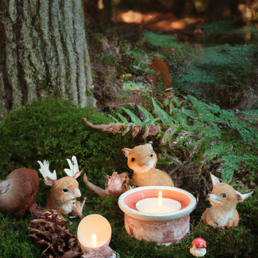
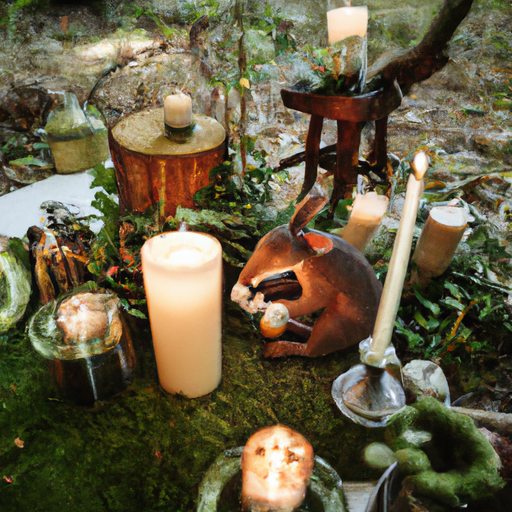

## [back from the hospital - your sign to take care of yourself](https://www.youtube.com/watch?v=PxX5mwkTJCk)

<table align="center">
	<tr>
		<td align="center">
<<<<<<< HEAD
			
		</td>
		<td align="center">
			
		</td>
		<td align="center">
			
=======
			
		</td>
		<td align="center">
			
		</td>
		<td align="center">
			
>>>>>>> ffe52613361410ad9d371a0f80e81de4dd24175f
		</td>
	</tr>
</table>

Hello everyone, I hope you're having a nice week and you are taking care of yourself. I just wanted to stop in and give a very short little note saying a huge thank you for the really kind response in my last video. Unfortunately, I do not have a video this week because I started feeling very poorly several days ago and I just couldn't do my normal daily activities. I didn't know what was going on, but thankfully I was able to get to a hospital about an hour away and they were able to help me. I'm on some antibiotics and I am already starting to feel better. I will no doubt be back to my normal routine by next week, but I did realize I definitely had to take some time to recover a bit as I was quite tired and nauseous from the antibiotics. 

That being said, I have had a little bit of time off from work and I have been doing a little bit of painting. I have been reading a book called Shady Hollow and I was really enjoying it. It's a sort of murder mystery but at the same time, it's set in this really adorable cozy little woodland grove full of sweet little animals, so it's quite funny to read. I've definitely enjoyed something very simple and escapist during this time that I've been in bed quite a bit. I've also been lighting a lot of candles because I always like candles, especially when I'm not feeling super well, and I'm reading a lot of books. 

So no doubt, I will be back to normal by next week. I need to be on these medications for a couple of weeks, but I am hopeful that by next week, I'll already be a lot better. I really do wish I could make a video this week, but I'm just not quite there. Working with my camera takes quite a bit of time and energy, so I definitely wanted to respect my body and my need to take it a little bit easier this week. 

Please take care of yourselves, eat good food, drink a lot of water, sleep well. You know, your health is very important. You know, whatever is healthy to you, internal, external health, mental health, spiritual health, all of that is quite important. So I will see you all next week and I'm sending you all my love. Goodbye.