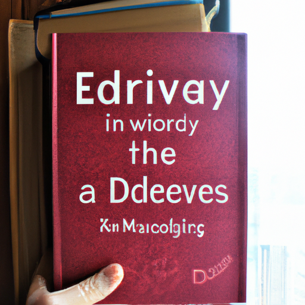
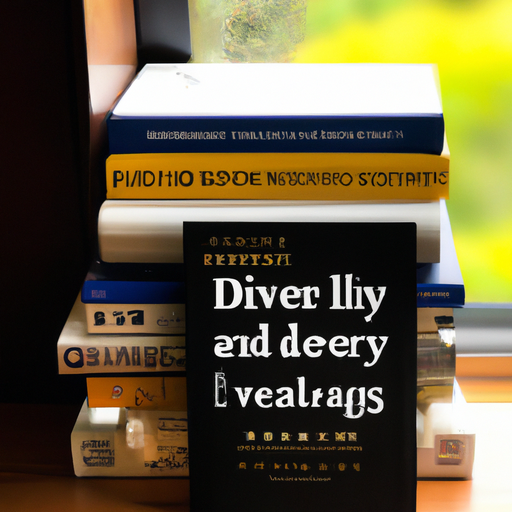
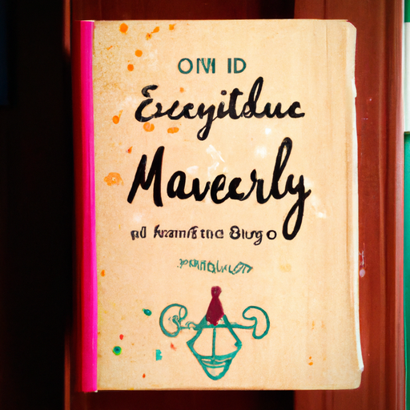

## [books that celebrate the beauty of daily life + tips on how to read more](https://www.youtube.com/watch?v=4OcNQbqkMAs)

<table align="center">
	<tr>
		<td align="center">
			
		</td>
		<td align="center">
			
		</td>
		<td align="center">
			
		</td>
	</tr>
</table>

Hello everyone, it is a beautiful quiet morning over here. I was in a bookish mood, as I often find myself in the spring. I love to take my books outdoors to share them with the wildflowers. It occurred to me that I have the option to make videos related to books on this channel, which is something I've done before. But I've not done a book recommendation specific video, I think. So I wanted to mix those in just now and then. If you are not a reader or interested in books at all, no worries. I will be making my more usual types of videos. I wanted to mix in these more bookish videos simply for my own sake. I know most people will probably not be that interested in them, so no worries at all. But I did want to make this video talking about some books that inspire me. Books that either highlight daily life in a positive way and the beauty of kind of normal everyday things. Or, at the very least, books that have helped me have a new perspective on my own daily life. And hopefully, some of these might be some that you're interested in looking into. Or not, I mean books are so individual. It's really hard to give a recommendation and know for sure you will connect with a book in the same way I will. Some of my favorite books are books that help me see my own daily life, all the mundane ordinary moments, as something more interesting and meaningful. That is my way to encourage myself to always be looking at life in new ways and keeping it interesting and appreciating the beauty around me. And so, I wanted to find books that encapsulated those feelings for me, at least. However, I did want to take a moment before I start with the books to share with you some tips if you are someone who wants to become a reader or is interested in reading more. But I think it is important to appreciate whatever hobby you are into. We're all different and unique, so never feel any obligation to be reading or that you're failing somehow and not reading at all. However, I do find it could be helpful to get you more passionate about reading if you develop your philosophy behind it. For example, for me, reading is my way to build up my ability to concentrate and focus on tasks. To keep a very healthy balance between me and my phone and technology. Making sure I'm taking a break and unplugging and doing more slower paced activities that are more mindful and involve me having to build up that sense of focus and a little bit of that self-control over time as well. And in regards to not being able to find any book interesting enough to finish, I do think it might be helpful to you to try a different genre or a different type of book. Or a book you wouldn't normally expect to read. It might be fiction or non-fiction. It might be a comedy book written by a comedian. You might find a book written by a celebrity or someone that you admire and you might enjoy their work as well in seeing their perspective on their own life or their work. There are so many different types of books, and there's magazines, and there's web comics, and there's graphic novels. All of them involve reading. I have heard that quote kind of float around of "it's all about finding the right book." I hope there's no judgment for me starting out with this book because it is a chapter book and it's extremely simplistic and it is not going to challenge your vocabulary. And it is one that you probably read when you were maybe five years old. However, the Frog and Toad treasury is an absolutely beautiful collection of stories. And Frog and Toad, in my opinion, really know how to live well. They live mindfully, they live slowly, they appreciate every moment. And even the smallest experiences are adventures for them. Everything from just going to the river to take a bath, to going on a bicycle, to planting a garden. All of it is so exciting and interesting to both characters. I will mention it briefly, but the World of Pooh is an absolutely wonderful treasury. And of course, Pooh Bear is all about elevating the ordinary things in our lives and appreciating every little bit. Especially food, I think he really appreciates food so much. So if you're interested in giving a classic book a try, this might be a good option. However, I know the writing style of very old books is not for everyone, so you are forewarned. If you love poetry, you might enjoy the Lost Spells. These are a collection of poems and art illustrations that are all about nature and animals and plants. And for me, because I live in a natural area, it really elevates my experience. However, even if you don't live in an area with obvious nature all around, nature is still there. It is very present, from the air you breathe, the wind, the clouds, the trees. I feel that books like these encourage us to slow down and notice all those beautiful things around us that might be hard to find sometimes. If you have a tree near your house or you are able to go somewhere where there are trees, or even just watch documentaries about forests and trees, you absolutely need to read The Hidden Life of Trees. I will not show this book in too much detail because I dropped it in a mud puddle while taking it on an adventure and it looks very worn out. The creator of this book has such a compassionate and beautiful approach to understanding the forest and tree life. Going into detail about tree families, how trees communicate and connect with each other and with us. It will change your entire perspective and it will make you feel very connected and hopefully very passionate about being part of the incredible movement of preserving our forests and wildlands for future generations. Another classic book that I really enjoy is The Wind in the Willows by Kenneth Grahame. I know because this is a classic, some of the vocabulary in it is a little dated. And that is always the case, I think, with pretty much all classics. Some words had completely different meanings in the past as they do now, or they were just simply used in different contexts. And so, it's definitely something to keep in mind whenever you read classic books because it is not for everyone. The Wind and The Willows tells the story of Mole and Ratty and Toad and all these curious, some of them eccentric, creatures that live on a riverbank. And all the adventures they get up to, some of them quite surprisingly dangerous too. Mole and Ratty are enchanting characters and I love the way they communicate. There also happens to be a free movie on YouTube called The Wind and The Willows. I'm not sure what year it came out, I will put it here, but it is a cartoon and it portrays this story, in my opinion, even better than the book version. It is so delightful and funny and cute. Now, I do not have any of his books written for adults, but I do have his children's treasury, so I thought I would share it. It is James Herriot's Treasury for Children. And he also wrote a lot of books for adults, so if you're not interested in the children's treasury, you can check out his books for adults. However, the children's treasury does have beautiful paintings in it. So, I mean, if you're me, you would go for the one with the paintings, but that's just my opinion. James Herriot was a veterinarian who wrote many enchanting books about his experience working as a vet in rural areas. And he has so many adventures and hilarious stories to tell. You are forewarned because he's a veterinarian, he does go quite into detail about the surgeries and procedures he has to do on pets. Sometimes there are sad things that happen, but I feel that overall, it is such an incredible collection of stories he has written that just make you want to fall in love with the little things and just appreciating all the little moments in your life. The audiobooks narrated by Christopher Timothy are some of the best narrated audiobooks I think have ever been created. So I actually encourage you to listen to them more than read them because I grew up listening to those stories and they're just so, so funny and enchanting and heartwarming. This one is The Penderwicks by Jean Birdsall. It is a National Book Award winner. It is a delightful book all about a bunch of siblings enjoying their summer break and all the shenanigans they get up to. And it is also heartwarming and it is about friendship and creating memories together as a family. The Evolution of Calpurnia Tate does not have its dust jacket because I'm very good at losing the dust jackets of books, so that is unfortunate. But the main character, Calpurnia Tate, in my opinion, is kind of an American reincarnation of Anne from Anne of Green Gables. And she is such a delightful personality. She is spunky and she has a big family and she has a very close connection to her grandfather who shares her interest in nature. It is such an enchanting book about showing how you can create your own magic in your life, even when things outside of you are limiting you in some shape or form. The Forgotten Garden by Kate Morton is just a beautifully written, kind of almost slightly poetic book that has intrigue and mystery. And it is a historical fiction book as well. There is a young girl in it who has been abandoned and she has a suitcase that has a book of fairy tales in it. And it is kind of her only symbol that is able to connect her to her past. And it is a really interesting, mysterious story. And I think it is beautifully written. Another children's book that I really think you should not overlook is Jill Barklam's stories. I just chose one at random, I picked up The Secret Staircase. But they are absolutely delightful stories. They're very simple stories, but I think that the reason I love them is because of the art. There is so much to look at in her art and in her drawings, and it is such a visual treat. The Borrowers by Mary Norton is a book that was very close to my heart growing up. Even though it's about tiny people that live in a house, and you may wonder how is that related to elevating ordinary life. But in my opinion, it made my imagination just run wild. When I was reading this book, I was imagining all sorts of possibilities of little tiny people and fairies and animals and all sorts of things. And I absolutely loved the experience of reading it, and it offered a new perspective on daily life. It also inspired the Studio Ghibli movie The Secret Life of Arietty, which is enchanting. And if you have not watched it, you definitely need to. Now, this is a fantasy book, but I feel like it falls into that category of Slice of Life fantasy, meaning that it is all about romanticizing daily life and enjoying the little things. And that is Legends and Lattes by Travis Baldry. If you enjoy fantasy stories, fantasy characters, if you like DND, I'm sure you will love this book. The main character is called Viv, and she's opening up the very first coffee shop in her town. And a lot of the townspeople do not know what coffee is. And there are all sorts of characters and fantastical creatures that come visit. And they even hire a little mouse to be the cook at the cafe. And it is just about the cutest little character, and he is so passionate about cooking. And it's just a very cute, very feel-good story. You are never too stressed out reading it, and that's what I love in books. Next to last of my recommendation, I have recommended before, so I'm going to be brief. But it is the Shady Hollow books. I actually liked the first Shady Hollow book, but I really loved the second two. And there, I believe, is going to be a fourth one out in November. And so, I encourage you to try any book in the series you are interested in. While there are some overarching plots, you can kind of pick up any story in the series and still know what's going on. They're more episodic. Now, this is a murder mystery, and it is again about talking animals. However, so much of the book is focused on amazing food and exploring this beautiful little town called Shady Hollow. And all the adventures the main characters get up to. And to be honest, I feel like the murder part of it ends up not being as important. It's more of the experience of Shady Hollow itself. It is definitely a surprisingly low-stress book, and I love the descriptions of the libraries and coffee shops. It is just enchanting. The very last book I will recommend is a picture book, and it is Journey. And you might think that I'm recommending it to you if you have children. However, I am recommending it to you, whoever you are, because I think it tells a very important story about reconnecting to your inner child and connecting to your inner imagination. Okay, thank you so much for humoring me if you have made it this far. You must be someone who likes books. I know there are a lot of adult fiction books that are all about elevating the ordinary things in life. So I definitely would love you to recommend those. My recommendations, I know, are rather unique. A lot of them are related to children's books or fantasy. And I know that my recommendations are a little bit different. But that is why we have room down below for you to share yours. So I hope you enjoyed this, and I'm sending you all my love. And I will be back with my more usual content next week. So I appreciate all the support. I will see you very, very soon. And take care. Goodbye.