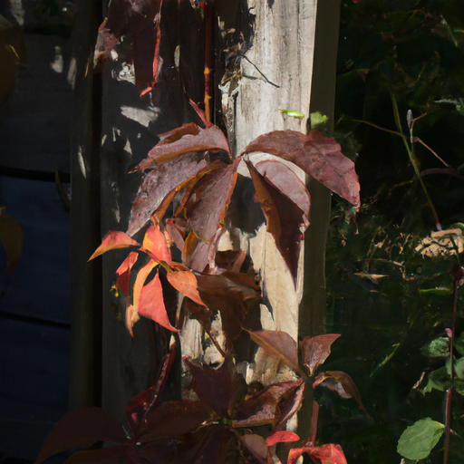
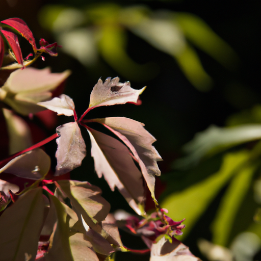
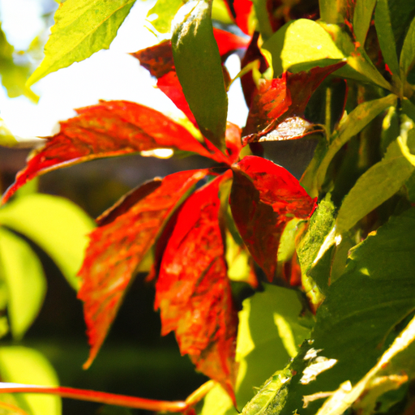

## [celebrating steady living - settling down 9 to 5 s and sacrificed dreams](https://www.youtube.com/watch?v=4FguF3forVw)

<table align="center">
	<tr>
		<td align="center">
			
		</td>
		<td align="center">
			
		</td>
		<td align="center">
			
		</td>
	</tr>
</table>

I was at the plant nursery today, one of my favorite places in my town. I was looking for a new Virginia creeper to plant by the trellis of my cottage. While I was there I noticed one of the very large trees has recently had some branches cut back. The flowers around it looked a bit ragged, and the very kind gardener explained that they were having a hard time adjusting to being exposed to the sun now that the shade was gone. She assured me that while the plants were struggling at the moment, over time their roots would reach deeper and their bodies strengthen, and they would learn to thrive in their new environment, even if it wasn’t what they may have preferred.

Nature’s resilience and willingness to thrive wherever it is will never cease inspire me. The gardener as well told me that no matter how the plants struggled, she was a committed steward of the land, and would keep an eye on them if ever they needed some extra help. Her words got me thinking about the beauty of a commitment relationship, in this case of a human and a garden, and how there was a time in my life where I feared obligations like that. My life has changed a lot.

As a teen, I saw commitment to an 9-5 and relational commitments as things that impacted my freedom and ability to pursue my dreams. And I see that in movies and books and online, this is a common belief in my society. We celebrate people who break free of the mold and do things differently, often going on a very individual adventure - usually free of multiple commitments and sometimes even their own family. They often discover a lot about themselves and who they are in the process. I notice many characters in movies randomly pack their backs, empty their bank account, and go off to see the world.

Of course, there’s nothing wrong with this, but I don’t think it’s feasible for most of us, at least not me. And before I go further, remember that I can only speak from the perspective of my own story, it isn’t a universal truth, and of course I would love to hear your thoughts. Personally, I think we do not always highlight enough the beauty of a life lived in one place with strong bonds, obligations, and commitments. Or lives lived for others as much as for ourselves, sometimes even to detriment of your own personal dreams.

My mother came from a very poor family who tirelessly worked to get her the opportunity to go the US, learn English, and be a first generation student. She dedicated her life to helping her own family live comfortably and provide for myself and my siblings. Both she and my father worked hard to give us stability and support. I have no doubt they have given up certain dreams for us, accepting that their children would impact their entire lives. I really want to celebrate the incredible life long sacrifices so many people make for others, I think it’s beautiful.

Sometimes, your own dreams need to change depending on circumstance, and that’s ok, new dreams can be just as rewarding. If I have a child, my dreams will change, when my parents are older, and if my rabbit escapes and eats my entire garden I will have to rethink things too. My dreams are important, and I pursue them in practical ways, but it’s just not possible sometimes, and then I restructure that dream or commit myself to living a new one. I wish we celebrated more the people who work jobs they don’t necessarily love or not living in their ideal place - but it doesn’t matter, because they love their families and friends and will do what is needed to take care of them.

I transitioned to a new job and moved to this place not because I necessarily wanted to, it was because it was the only place I could get the temporary help I needed from my parents. I was actually giving up much of what I thought of as freedom by coming here. But, in time, I grew to see the idea of living freely in more relative terms. As a teacher I felt a great obligation to my job. I have a relationship that takes time and commitment to maintain, and it is an enormous obligation in and of itself.

My abuela lived with us for many years when I was a child, as it is typical in Hispanic culture to have many generations under one roof. Through that experience I became dedicated to the idea of one day providing for my own parents as a caregiver in any way I was able. This was another obligation that I have welcomed into my life, further cementing me here and committing myself to live in one place for the longterm. I have found lasting satisfaction in forming bonds with a place and in its people. While it makes it harder to leave, there’s something very special about living this way as well.

It’s how most of us live, our lives greatly impacted by responsibility of family or children or a job, and I think that’s why we elevate the stories of people who live differently, who have unusual jobs or live in unusual way. And I’m most certainly not saying that these people are wrong in any way to live differently, I support them completely if that is what brings them joy. I just wanted to take a moment and celebrate the people who don’t have those opportunities, or have put their own wishes on hold for others.

Of course, I know the weight of expectation put on you by other people, and know that that is not always a positive burden to bear, and that there is definitely a time and place to walk away from commitments when they are detrimental to you. And that is a brave thing to do. My boyfriend was born and raised here and he takes such great pride in being able to know all the mountains peaks by name, and notice the changes over time. He has an extremely detailed knowledge of the area that few people can boast. He’s a surveyor and spends many days each year traversing the mountain slopes on the hunt for clear and Smokey quartz crystals. I’m amazed by his vast understanding of this valley, and it inspired me to spread my roots and dedicate myself to a life of learning to understand my home.

As you can see, one way I have done that is through learning the art of growing new life in the garden. If you notice that there’s a lot weeds, it’s because there is. But I do my best with the time I have, and and that’s all we need to do. Sending my love.