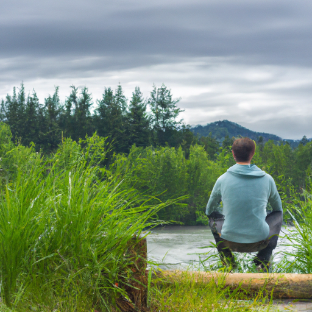
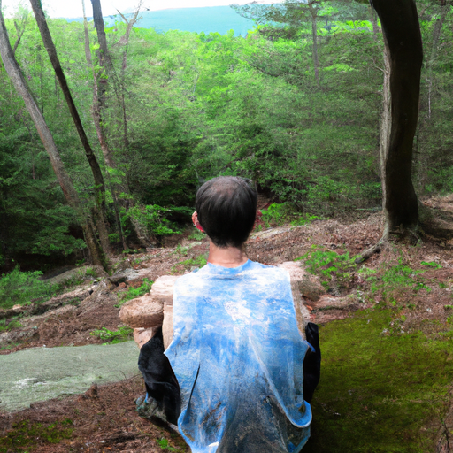
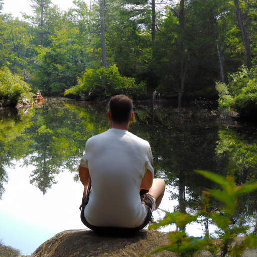

## [choosing to accept your personality - a New Year Resolve](https://www.youtube.com/watch?v=YXrA6df3dqU)

<table align="center">
	<tr>
		<td align="center">
			
		</td>
		<td align="center">
			
		</td>
		<td align="center">
			
		</td>
	</tr>
</table>

It is nearly the end of the year, and I hope you are proud of yourself and all you've accomplished just by getting through. This year has been a historical trip around the sun, one that we won't be forgetting anytime soon. It has been a time of hardship and loss, but your inner strength has been tested, and you have come through stronger than ever. I am so proud of you.

I was grateful to be able to safely welcome the new year with some of my family. I see them often, and we deeply enjoy our time together, speaking a mix of English and Spanish. We talk and laugh uproariously. I feel so blessed to have them. You may find this strange, but I was so close to my parents and siblings growing up, and so introverted, that I didn't really make any other friends until I became an adult and lived alone. That's when I realized how much I needed human connection, but not in the way mainstream society has normalized it.

Right now, I am not able to sustain a life of much socializing, going to parties and events. I need time alone every day, and while I do enjoy the excitement of getting out of my comfort zone and meeting new people, I don't do it often, and that suits me. I'm blessed to have a boyfriend who understands this and shares my energy levels. We've built a strong relationship through the similarity of our spirits.

In my society, sometimes I feel as if we value humans who take drastic and bold actions over those who are more quiet and sensitive, and consequently undetected. I myself admire people who can attract the attention of an entire room, give a speech or performance, and seem completely in their element. I have a brother who is, in some ways, quite extroverted, and I greatly look up to him and enjoy his personality. For a long time, I wanted to be like him and others who I admired. But, it isn't who I am, and I had to come to terms with that.

People like myself must confront life at a slower pace, taking their time and not letting the busyness and rush associated with modern living take over, lest they begin to wither and cave under the pressure of commotion. I had to stop trying to mold my personality and see it for what it was. Only then was I able to thrive and know what my spirit needed. In terms of lifestyle and socializing, I'm not weaker or less interesting because I like to be alone - I am who I am, and whoever you are, I hope you embrace it as well.

If you have ever raised a pet, you know that training can only go so far, and that individual creatures each have quite distinct personalities that even they cannot control. We embrace it in them and others, yet cannot always accept our own. I hope this coming year, you seek to be a better version of yourself, not someone else. Through doing this, I resolved long-held feelings of loneliness and insecurity. I was comparing myself with personalities so different from my own that I felt alone when, in fact, there are many people like me - more or less introverted - who need differing levels of quietness in their lives to hear their own thoughts.

Maybe you are not this way, but you might know someone who is and seek to understand them better. Whatever this year holds for you, see it as a journey that will offer you many opportunities and lessons. It is up to you whether or not to take them. I will be with you on that journey, and I will see you in 2021.