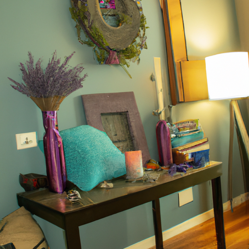
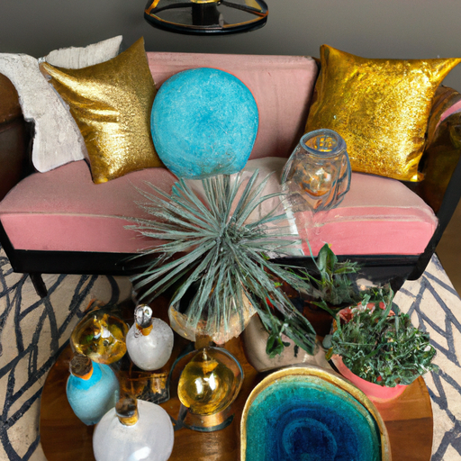
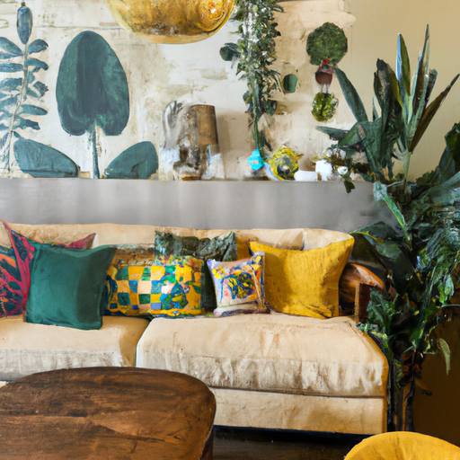

## [creating a wonderland cottage home - why your interior space matters](https://www.youtube.com/watch?v=CidKMkyqRGA)

<table align="center">
	<tr>
		<td align="center">
			
		</td>
		<td align="center">
			
		</td>
		<td align="center">
			
		</td>
	</tr>
</table>

Hello everyone, this week I wanted to share some of the progress I’ve been making in my new home. I’ve been ever so slowly trying to find time outside of work to put things in place and organize. I have however found some time for my flower garden, made plans to tidy up the property and of course adopted more house plants because apparently three dozen isn’t enough.

I am currently working on painting the walls and so far it is taking forever, but I hope to show you what I’ve been up to you very soon. At the end of this video I’m going to go more into detail on how I transform my space using simple techniques focusing on secondhand, repurposed and gifted items for a very unique look.

However, I will say that changing your space doesn’t always mean bringing new items into your home. Instead, before I make any decisions I like to focus on my senses, usually that means sitting and experiencing the space, considering how I want to feel when I enter my home, be that vibrant energetic or peaceful and tranquil. A consideration for me is what my pets enjoy as well: for example, my cat and bunny like some light and quiet. Aegir loves classical music and rugs.

For the sense of sight, I like to hang fascinators in my windows and all types of fun little items made of glass. They capture the sun rays and cast rainbows on the floor as well as curtains that filter the light.

I also think how a space smells has a conscious and subconscious effect on how we feel, so I consider candles and diffusers to be important.

In order to transform a normal piece of furniture and make it more unique I like to change the knobs as well as add a little decorative accents. For example, this dining table is quite warm and I will be sanding it and painting it very soon… stay tuned in the next week or two for a more or less completed house tour so you can see how the space is starting to come together and hopefully feel inspired to imbue your personality into where you live and really set free your creativity.

Of course, my house wouldn’t feel complete if it wasn’t for my pets and cozy evenings after work baking with them. The home is not 100% complete, but I did want to share at least what I have done and I also am going to share a completed home tour hopefully next week because we are finally finally mostly complete with renovations. You also probably know I’m passionate about budgeting and finances and frugality where possible and also take sustainability into consideration. For me, my answer is to purchase secondhand where possible. Because I am an Etsy shop owner I of course love to support others in order to help other businesses across of the world. I also try to purchase some items locally that I normally wouldn’t get secondhand, for example I have a very hard time finding rugs that are not smelly. Some very rugs have a smell that I can’t get out of it no matter how many times I shampoo it. So that is one thing I decided to get new.

I don’t think that there’s any reason you need to buy expensive items, I think it comes down to - for me at least - some basic principles that make a huge difference. And those are in regards to your senses and for me whenever I am thinking about how I want to make a space more conducive to helping my anxiety helping me feel like my best self. I think that so many videos I see focus so much on the visual appeal I love making videos that are all about visual beauty in nature and a homeless… but I think that is perhaps the least important part, in a way, because I think how your space feels encompasses so much more than it’s aesthetic quality. The one thing that I do always think about is sounds. I like to hang up items such as soft wind chimes or have a little fountain running in my house calling and brings me back to nature. One of my favorite things is having a little water fountain, music, or ambient sounds on a very very low level can really make a big difference. I know some people just prefer complete silence in their homes, but if you are someone that likes interesting nature sounds you could take that into consideration, and that can be involved into your home on a very low budget, you know, a small fountain or wind chime is pretty easy to do. I also like to hang a birdfeeder near my house that I get a lot of birds coming nearby and all their sounds. How your space smells is also very important for me especially because I have a lot of pets, it can smell like a dog hair very quickly. I love to use smokeless incense or oil or my preferred which is usually a candle in order to make the space smell really fresh and nice, and of course that goes hand-in-hand with sweeping in vacuuming. But is something that really makes a big difference and smells do make a difference with how we feel. It really does impact us more than we think.

I also like hanging little glass fascinators on my window if I get direct light so that it casts little rainbows on the ground, it makes such a wonderful difference even if you have a space it’s simple just having that light come in in such an interesting way I always find it really makes me happy. I also really love to use little decorative edges I don’t know what they’re called but I’ll show some images of them but I’d love to use little decorative edges (decorative corner brackets) in order to add something really interesting to a window or a corner in my kitchen, it always makes such a difference. It’s very specific to my style which is a little more old fashion and whimsical but I thought I would offer that as an option as well. I love hanging things in my windows that are always interesting I love having plants having life in my space even if you don’t get direct light you can plant light and just bring in so much life into your home.

I hope this is somewhat interesting to you, it’s definitely a passion project for me I just love decorating and now but I’m going go ahead and and try painting the walls a little bit and show you how strange lady I am that I want to paint birds on my wall. Yes, maybe if you are a little fairy at heart you may also want to imbue your space with some pixie dust but if not, listen to your heart. It’s not about things it’s about how you feel in your space. Sending my love, goodbye.