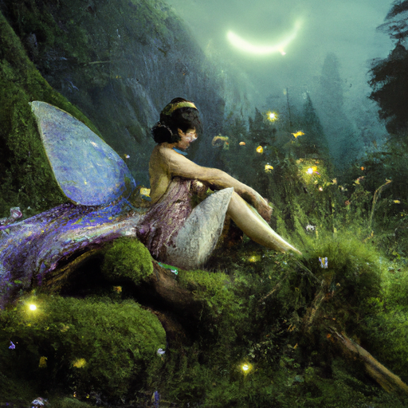
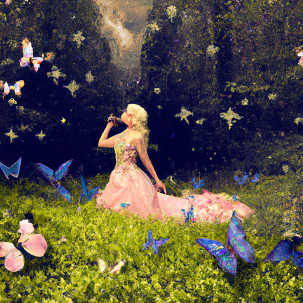
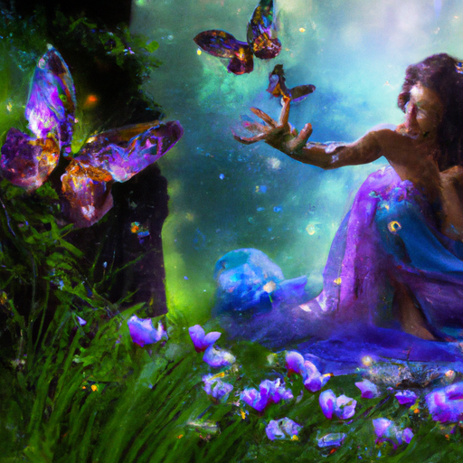

## [embracing who I am - days alone in a mountain cottage](https://www.youtube.com/watch?v=pVU3Wl9fT_Q)

<table align="center">
	<tr>
		<td align="center">
			
		</td>
		<td align="center">
			
		</td>
		<td align="center">
			
		</td>
	</tr>
</table>

Today, I went on a quest to find a secluded meadow in the mountains. I brought my camera and backpack, and for a moment, I stopped, breathed, and admired the view. I then began to search for the magic. I pursued a butterfly for twenty minutes before it evaded me. Obviously, I spent time looking for fairies. I fell a few times on slippery rocks, got quite sweaty, and was tempted to be grumpy on the way back due to an old knee injury acting up. But when I got home and looked over the footage, I remembered how the effort to get there was well worth it.

I’ve reiterated the sentiment a couple of times, but these videos are the product of the part of me that loves art and storytelling, and there is a reason that the visuals seem more reminiscent of a fairytale perhaps than stark reality. I seek out unusual angles and ways of portraying beauty because I think there’s value in looking at the world that way. To imbue what I do with my imagination and romantic sensibilities. Visualizing myself as a character in my own book of fairytales, only I can’t read ahead to find out how it ends. And that’s the best part.

For example, since I’ve started making videos, I have embraced being a total weirdo on my nature walks. I sometimes wear my favorite dresses, walk barefoot when I can, and don’t worry about what passing hikers may think if they find me crawling along the ground to try to get a photograph of a butterfly. Instead of admiring the flowers from above as I walk past, I stop and wonder what it would look like from a different angle. I like to imagine myself as a little wood mouse and get down on my knees and look through the grass. It’s amazing what you notice.

In the same way that we go to watch a movie in a theater, see an art exhibit, watch a play, or read a fantasy book, I firmly believe there is a lot of benefit in enjoying your imagination and taking a little break from the more mundane and worrisome aspects of life in order to breathe deeply and exist differently for a while. Possibly to entertain that romanticism on a daily basis, seeing each day as a new chapter to a wondrous tale.

Personally, I believe our view of reality is far too narrow. For example, many people don’t see the dream world as part of their reality, and yet when we go to sleep and have dreams, we are experiencing it, and it is a very real part of our lives. I remember when I was a child and firmly believed unicorns existed, and I would readily argue with anyone who told me otherwise. But as an adult, I’ve realized that whether or not they ever physically existed isn’t really important because they exist in this world through our art, ideas, and stories. They are a part of our reality.

Similarly, perhaps healthy forms of escapism aren’t escaping at all, but simply broadening the spectrum of the life experience. Perhaps, it’s simply a question of embracing what you love and not where but how you want to live, and beginning to do it right now. As long as we are not evading the challenges of life and making progress in our story and development, I find that fantasy and romanticizing aspects of life have enormous power to help us unlock our potential.

Lastly, I think that the greatest benefit I gain from looking at life this way is that it relies on embracing a more positive and hopeful outlook. After working as a teacher, I know that our little people are looking to us as an example of how to handle a future that at times can feel very uncertain. By showing them that we need to seek out the beauty of imagination and nature and be the artist of our own lives, we can make lasting change. And our life story becomes a legacy of not only what we did but the people with whom we connected.

We need to understand our reality, to experience the tragedies and heartache. To know them fully and ask ourselves what can we do to help. And then we have to know how to dream, to imagine a better world, to seek out the good in order to build peace. To nurture our own dreams when others doubt themselves. Maybe I’m an idealist, but I wouldn’t want to be anything else.

About three years ago, I was living in an apartment right by a highway that was so close it experienced a mini earthquake every time a truck went by. It was infested with rats. It was disgusting and definitely not up to code, but it was the only place I could find on short notice. I lived with a couple that were constantly fighting and calling the police. One night, I was woken up by firefighters because a drunk driver had backed into our gas pipe and the house was flooded with fumes. It was definitely not an easy time, but I deeply embraced my love of stories and exercised my imagination more than ever during that year, and it really helped me stay positive about the future while finding little ways to improve the present.

I read so many books during that time and rewatched my favorite movies again and again, and every weekend I would take the bus to a little park and spend time writing very bad poetry. I tried to see my story as something that was ever-evolving, and that has turned into a theme I apply to my days. That is what I’ve always sought to do in these videos, to present reality not always as it is, but how it could be sometimes. Of possibilities and magic.

Like most of us, I spend the majority of my time working and submerged in that more mundane reality. But when it comes to these videos, I can create something that helps me appreciate it more. To seek to capture the special moments so that I can remember it better.

Lastly, I wanted to say a big thank you to everyone who has connected with me in regards to this channel. It is so beautiful to meet so many kindred spirits from all over the world, to receive your outreach of words and art and letters, and to find people who value the act of dreaming together. Sending you my love.