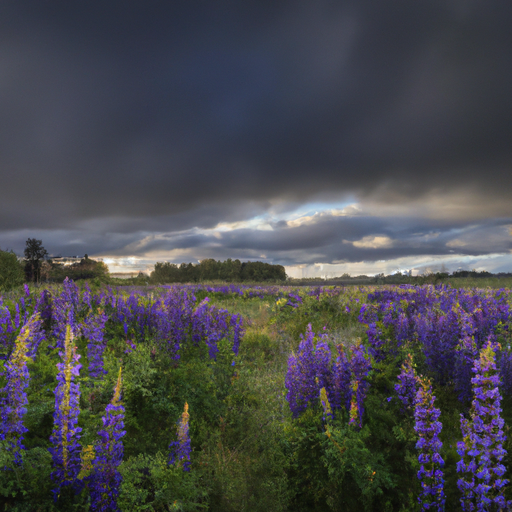
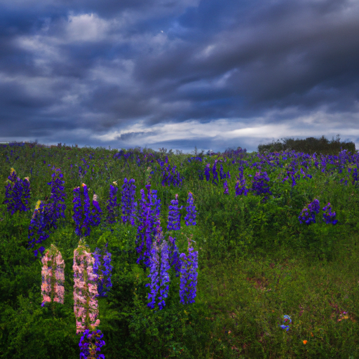
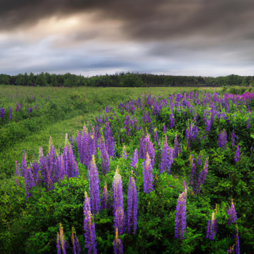

## [enjoying my own company while living rural I m happier as a non-perfectionist](https://www.youtube.com/watch?v=ILDKbb2b1ho)

<table align="center">
	<tr>
		<td align="center">
			
		</td>
		<td align="center">
			
		</td>
		<td align="center">
			
		</td>
	</tr>
</table>

[Music]

It is a beautiful morning. The wildflowers are dancing in the wind and looking quite pleased with themselves. I'm enjoying a long walk with my husband, watching as storm clouds mix with a gentle sun. The weather has been changeable lately, as we all are. I think we can be sure that in our own lives, sunshine will be followed with periods of rain, and vice versa. I think that is one of my favorite things about being alive - that everything is impermanent and changeable. 

During hard times, I take comfort in knowing things will change. During good times, I know I must appreciate the moment because I have known the rain. I even appreciate death because I think it gives meaning to life. And I've come to appreciate a lot of things that we sometimes fear or find uncomfortable, and see the beauty in it.

[Music] [Music] Most scary things are not quite so when taken out into the light. I feel the same in regards to myself. There's nothing to dislike or fear in me, not when I really look at it. What I dislike is only pain, wishing to be soothed with love. And what I fear is only a call to grow and find my courage.

[Music] [Music] [Music] With my sister one day, telling her about a small personal challenge I was trying to overcome, and I said, "I was so frustrated that I can't just change myself at the snap of my fingers. I can't just immediately be who I want to be. I know I should love myself, but why can't I simply love? Why is it so hard to apply what I've learned?" Her response resounded with me. She said, "Paola, let's say you snap your fingers and you're suddenly exactly who you want to be. You've grown and matured in all the ways you need to. You are perfect. What then? What is the point of your life? Where do you go from here? Will you even be proud of that person?" I kept thinking of that long after I finished talking to her, as it felt deeply true. There is no thing that brings me greater joy than going through the process of learning from life and celebrating my achievements along the way. From then onward, I wanted to accept that the process of becoming your best self takes a lifetime. There isn't any point in negative self-criticism if I've accepted that my journey is about making mistakes and learning from them.

[Music] Becoming an observer of your own choices, actions, relationship dynamics, and even emotions is an incredible tool in becoming your best friend. Because you see yourself as just that, a friend. Someone you must take care of and support, as well as challenge. Now, you may think that that's obvious - being self-aware is just that, observing yourself and reflecting. But we often do so much in our lives where we don't apply that sense of reflection. We say things we don't mean or are unkind to ourselves and others without wondering why we do that and what does that tell us about ourselves. How can this awareness help us practice humility, which I will always believe is the starting point to all great change for the better? When I look at myself through humble eyes, I see why constant criticism isn't humble at all. Because it is as if you expect yourself to be perfect when it's impossible. This has helped me change the way I talk to myself and slowly, ever so slowly, become my best friend.

[Music] [Music] [Music] [Music] [Music]

I don't know if you can actually hear me. It is not too windy, but there are so many bugs and birds out and about. I'm not sure if I'm going to be audible at all, but since this is one of my favorite places, I decided that I would give it a try. Are you going to join us?

I had to readjust the camera a little bit due to my dog breathing very loudly into the microphone, so here we are. Hopefully, you can hear me at least a bit. I had a bit of a hard week, to be honest. I kind of overloaded myself with stuff to do, and that is something I tend to do in the springtime because it is finally warm. I have all this newfound excitement for the spring and this new season, and I don't always know how to reel myself back in. And so, I felt myself feeling a little bit overwhelmed, and I did not like the headspace I was in.

Due to not feeling super great, I decided to come out here to another one of my favorite little spots around my home. This is only about a mile or so away from where I live, and it is worth the walk. I love the bright purple of the lupins and the larkspur mixed together over here, and the smell of the lupine is so distinct and it never fails to calm me down.

Whenever I do make videos about being overwhelmed, I do find it interesting that quite a few people always comment that I don't seem overwhelmed at all. And I thought I'd use that as a great example for a lot of people. You know, you don't really know what they're feeling on the inside, and you can't always tell on the outside. I am someone that likes to keep those things quite private, and there's actually a downside to that because I think that it makes it more difficult for me to let others know when I need a bit of a break. And so, it's been quite important to me as I grow older to grow into a more assertive person and someone who's more clear with what they need and their boundaries, which I know can be really hard for a lot of people to do.

One technique when I'm feeling off in any way, it doesn't matter the emotion, usually is to find a lovely place to sit. You obviously do not need a field of flowers. A peaceful corner of your room is just fine. And using that opportunity to observe your feelings instead of being them. It's thinking about it more like, "I have feelings that are rather sad" or "feelings that are overwhelming," and you are not those feelings. You are not defined by how you feel, and those feelings are not who you are. You are so much more than that. You can, over time, learn to observe your feelings so that they do not quite have the same weight over you. But that can be hard to do. It's a very, very long process. I'm still on that process. Sometimes just sitting and practicing that, separating myself from how I feel, re-labeling how I feel instead of saying, "Oh, I'm so upset. I can't stand it." Instead, being, "These feelings are rather uncomfortable right now, but they're very manageable. It will be okay." And relabeling those things and transforming my experience helps me so much.

Yeah, I should probably wrap this up. Oh, I probably need to get home. I did hear that there were storms on the forecast, but I did not realize they were going to be coming so soon. Well, I hope you enjoyed this beautiful lupine field with me. It means so much to share it with you. For anyone interested, always down below, I share links to some charity and conservancy groups that mean a lot to me. If you have enjoyed these videos, if you love nature, if you love preserving wildlands, do check out those links or find your own ways to contribute. Because this field is too beautiful, and I want places like this to last forever. And so, I appreciate you humoring me and hearing me out. And I hope you have a wonderful, wonderful week. And I'm gonna head home before I get rained on or lightning or something worse. So, sending so much love. Goodbye.

[Music]