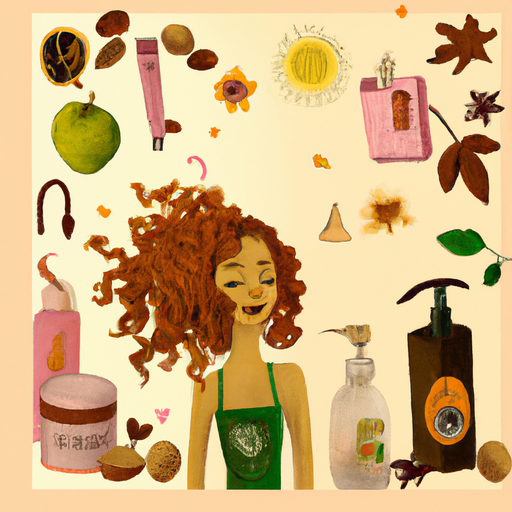
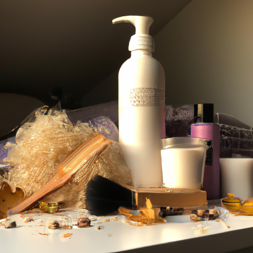
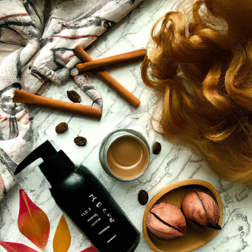

## [everyday self-care at my cottage - simple steps to start my day](https://www.youtube.com/watch?v=_bcO3eMDJmM)

<table align="center">
	<tr>
		<td align="center">
<<<<<<< HEAD
			
		</td>
		<td align="center">
			
		</td>
		<td align="center">
			
=======
			
		</td>
		<td align="center">
			
		</td>
		<td align="center">
			
>>>>>>> ffe52613361410ad9d371a0f80e81de4dd24175f
		</td>
	</tr>
</table>

Good morning everyone, it is 7am and I'm starting this rather gloomy autumn day with this simple routine. Taming those curls and, if I'm feeling like it, picking out some jewelry. Well, into my adult years, I had quite severe cystic acne, so I never enjoyed my morning routines as I would usually have to look in a mirror. I wish I could give my past self a hug and tell her to be patient, that things would change in time. I thought I'd share how I improved my skin and more about my personal routine in the last part of this video for those who are interested.

On another note, these jars and canisters I used to house my personal items were thrift store finds. This Japanese style floral piece is my absolute favorite. I've recently discovered some new favorite perfumes. I think applying them is one of my favorite parts of the morning. I love cozy smells, it has such a positive impact on me.

I got up very early today because I wanted to make some treats before my main work of the day. And I wanted to make spice cake, which is perhaps one of my all-time favorite cakes, especially in Autumn. Because I just love the flavors of vanilla and cloves and cinnamon and Nutmeg, and this cake just has everything. It tastes just like a gingerbread man and it is perfect for this time of year when things are getting really cold. What I need to do now is exercise a bit of self-control and not keep tasting the batter before I put it in the oven.

After my cake was done, or unfortunately overbaked in this case, though it was still quite tasty, I put it to cool and went out with Iger to find some seasonal decorations. The snowberries are so abundant right now, they are beautiful. And while not edible, sadly, I decided to bring home some to make a wreath. To me, yarrow and snowberries represent strength and peace, and those are two symbols I love to have in my home. They remind me to face the coming winter and new year with a courageous heart and to nurture my dreams.

On impulse, I decided to use some snowberries to decorate my spice cake. But don't worry, I didn't let anyone eat them. They are purely decorative. But sometimes, I think choosing beauty over practicality is okay, especially when it comes to decorating a holiday treat such as this.

I hope you're having a wonderful week. I did want to kind of change the topic to something a little light-hearted and just share with you a little bit of my personal routine because I know I do get questions about that, and I am quite flattered. Thank you, I appreciate the kind words. And I thought I would share my very simple kind of routine that I have since I made a video about a year ago on self-care. My routine has simplified even more because I was still dealing with the kind of last remnants of skin problems that I had throughout my teen years and my young adult years. Both my sister and I dealt with a lot of skin problems growing up. I had fairly severe cystic acne and just acne that would take over my entire face. It made me quite self-conscious.

I think sometimes it's easy to downplay problems with your skin because it seems like a very small thing to focus on. But the reality of having skin problems is that you are in quite a lot of pain and discomfort all the time. It really goes so far beyond appearance. As for skincare, I just use a normal kind of basic moisturizer from my dermatologist, as well as different products from my dermatologist. I'll leave them down below, but they have completely transformed my skin. When I was really young, I did try to go on Accutane, but I ended up having a really severe reaction to it. It was awful, so that was not an option for me. But yes, through a lot of lifestyle changes, for the most part, stress management, but also taking the advice of a dermatologist so many years ago, and also on YouTube, there's a lot of amazing dermatologists as well. I have come a long way, so I encourage all of you who are facing any sort of skin condition or ailment, just take your time, be patient.

As for cosmetics, I do like to keep it really simple, but I do really have a lot of fun with cosmetics. I love glitter, so I definitely love to put a little bit of glitter on my eyes now and then. I have been using these perfume oils. I have another one as well from the Mythology Candle Company. This one is from Perfume Oil Expressions. Neither of these are sponsored, I just wanted to share that. It is by far my favorite type of perfume. I always had ones that you sprayed and had all the alcohol in them. For me, I found that these stay a lot longer and you need to use a much smaller amount of them, and you don't really need to reapply them. I will share some of my favorite scents. I have quite a few. I tend to really enjoy floral scents or kind of brighter, fresher scents.

I also wanted to share that I do actually wear glasses. I don't wear them for the camera because the glare is really intense sometimes. So, I do wear glasses. I have contact lenses as well. But yeah, that's a part of my routine as well. If I'm not putting in contact lenses, I'm putting on my glasses. If you are also a blind little bat, welcome to the club. I do get a lot of questions about my hair routine. It is very simple. I put some leftover conditioner in a spray bottle with water and I spray down the curls every morning, section by section, and just kind of freshen them up for the day. Or if, like on many days, I'm not ready to mentally deal with an enormous amount of curls, I just brush it all back and then it tends to stay more or less a little straighter. I have enough hair for, I think, at least two people, and it's extremely thick and curly. And so, while that does sound like a blessing, let me tell you, I find all sorts of things in my hair. I was at the grocery store not too long ago and a woman came up behind me and told me there was a bee stuck in my hair. And that poor bee was desperately trying to escape my hair and it couldn't because there was so much of it. I felt awful. I took the bee outside to the garden and yeah, I hope it's okay. What a day, what a nightmare. So yes, anyway, it feels so funny to be talking about this, but you know, I think it is really helpful sometimes to other people.

I'm wishing you a wonderful week. The most interesting thing about you will never be your external appearance. And I'm sending you all my love. Goodbye.