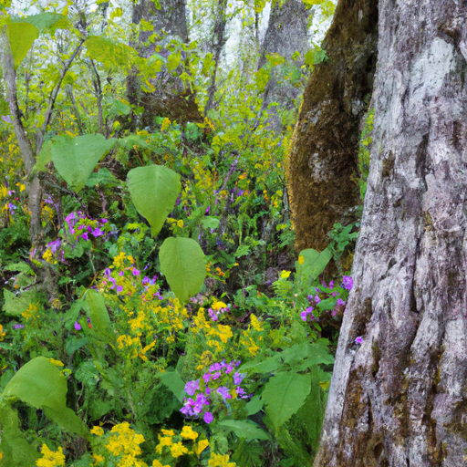

## [everything is about to change again - property tour and life update in the countryside](https://www.youtube.com/watch?v=JoZLSuB7LLI)

<table align="center">
	<tr>
		<td align="center">
			
		</td>
		<td align="center">
			
		</td>
		<td align="center">
			
		</td>
	</tr>
</table>

Good afternoon, there's been a lot of spring rains lately and it's been so welcome and brought about an extremely abundant mushroom hunting season i've been thoroughly enjoying adventuring through previously burned areas and finding morels hidden among the ash and soot today i wanted to share what i've been up to as well as a little property tour as in my last video i didn't really get around to it i'm doing a walkthrough with my camera about 12 minutes into the video so please skip to that if you wish i personally find a lot of satisfaction in creating longer videos encompassing more of my day and as i see it a lot of this video is showing you where i live in a more expanded sense because i think many locals would agree that when you live in a place like this your valley is an extension of your home so this time of year i love to create a little simmer pot with some of my favorite fragrances and flowers you can add some of your favorite things and just leave it there on the stovetop as a floating bouquet or you can put it on a low simmer and it will smell delightful it is such a simple and beautiful way to honor spring perhaps you can see it in my face but wedding plans have been amping up recently. I am getting married, by the time that this video goes up i'll be um getting married in a week and so I have a lot to do and so I did not quite get enough sleep last night I have to admit it just happens sometimes and i'm a bit tired and I knew that the one thing that always revitalizes me when i am feeling a little bit worn out is spending time with the flowers and going out to somewhere i have not been before if you can hear little sounds in the back luke and i collected all these pinecones and pieces of moss in order to put inside these solar powered lanterns for gifts for everyone and the kitten is playing with all of it due to popular support for the name mavi after the mavi tree we did name kitten mavi you can say it mavi is probably more correct but mavi seems to be easier for a lot of people to say so we're sticking to that and yes she is a little spitfire she has so much energy right now she's discovering how to move her limbs and she's just really enjoying life to the fullest and it is really inspiring me to do so too so while i was hiking through the wildflowers i did find a little piece of wood shaped like a diamond and i remember i was so excited and i sent a photo of it to my fiance because i just thought it was the most wonderful thing because it had a hole in the middle um just the perfect size for looking through so according to fairy legends there is such thing known as hagstone which is a rock with a naturally forming hole in it and legend has it that if you peer through that hole you will be invited to look through a portal into the fairy realm to me even though it was not a stone it was a piece of wood it felt very much like perhaps a potential fairy portal so my inner child was um was very pleased very pleased to have found it it was quite a treasure she's being so noisy i'm sorry if she's been interrupting this whole thing why are you so noisy anyway i took it and i kept it in my pocket for safe keeping and i put it in my pocket and then closed the pocket with a little button and when i got back from my hike i couldn't find it it wasn't in my pocket anymore and i was so disappointed because i thought it was such a fun little treasure to bring home but yes i am i think perhaps fairies are playing tricks on me because um yes i i really wanted to show that little fairy portal to you so yes there is the uh tragedy of the fairy seeing stone that i found and lost under mysterious circumstances so um there you go there's the um story that would have enamored my seven-year-old self to all i think that when we revisit things from our childhood or revisit activities that we love to do it's very often that we sometimes add a layer of self-judgment to what we're doing and so it keeps us from truly thoroughly letting ourselves go and enjoying it and so i think it's a wonderful practice to just let that go i know that i looked at the world with so much wonder and awe as a child and finding that magic again is powerful and i think that if we let go worries of what someone else might think or what another side of ourselves might think of that other side that that inner child um we can discover so much more about what we truly love you're looking for little treasures or little fun nooks and crannies that you wouldn't have noticed if you were just treating the hike as a workout or as a kind of obligatory you know practice and i've been sitting here watching my bread rise so i think it is just about ready to put into the oven all my family is coming to visit even my abuelita from puerto rico they're all going to be here soon so i wanted to make them bread as a celebration of seeing them all some of them that i have not seen for years that is what the order of the day is and of course there's no greater treasure i could give them this time of year but morel mushrooms because morels are very mysterious and fascinating thing that grows in this area this time of year so now i'm going to go prepare the bread and put it in the oven and i will see you soon mavi oh my gosh what have you done i have the bread here and i can't help myself i need to share with you perhaps one of my favorite most comforting sounds and it's this sound so i did think that today i would show you a little bit of a property tour it is difficult because i do have neighbors here and they are much closer than they were at where i used to live and so i don't want to show their houses simply because i i wouldn't feel comfortable doing that but i will show you a little bit right now of kind of how it looks and give you a sense of what it feels like out here in the spring because it's a very wonderful very romantic time for lack of a better way to describe it just with all the flowers out it feels so luscious and so green i won't show you a garden tour quite yet a lot of the wildflowers i'm growing like the calendula and marigold really take off when it warms up in summer so i'm gonna wait until then to show you what i'm growing but in the meantime i thought i'd show you a few little clips of what it looks like outside even though i'm going to avoid showing neighbors homes so when you walk out our front door the very first thing you see is this very interesting art piece luke is building us an arbor for the wedding and he's trying to make it out of aspens that were burned in the fire last year he hasn't quite finished it yet but it is looking lovely all around the house is a couple feet of gravel which help protect it if a wildfire comes through which unfortunately is very likely this little path leads up to the house and is very popular with my dog all around here are trees and shrubs and flowers and it feels so luscious it is hard to believe it's gonna get so dry in a couple months and here unfortunately is more shaky visuals because apparently i cannot stand still for even one second while holding my camera but yes we do not have paved roads everything is dirt and it gets quite dusty but iker enjoys it because it does not hurt his paws and in the summer when the pavement usually gets too hot for him he can still walk on these roads thankfully it doesn't take too long to get into town it is a little bit of a drive we do get some phone service here so we're able to use the internet using a hotspot and hope to get starlink someday soon and here you can see an old tree house that my fiance luke built when he was a little boy it is on my future in-laws property i think it is so sweet that we can live right next door to where he grew up so living in the forest means that we have to take extra precautions for certain animals for example we've already had a bear get into our trash a couple times and we've had to come up with new solutions there's a lot more squirrels and other animals in the trees and my dog has to get used to the added commotion this property definitely feels very different from where i used to live but i'm enjoying the adventure of discovering it the most abundant plants growing on the property are larkspur balsam root arnica lupin spring beauties bluebells as well as a lot of service berry bushes the list goes on and on if you were ever curious to know about the plants in your area i highly recommend using a phone app if you don't have access to experts it can be a wonderful way to get started learning what each plant is you may be surprised by what is growing near you in the past i've used the app picture this and it worked really well for identification and gives you a starting point so that you can go ahead and cross-reference the entire property has this lovely natural fence it was made to keep in horses because as you know this is a renovated barn and luke's father used to keep horses here we live on about an acre and are connected to a community area in the forest we do have several neighbors which is wonderful they've all been so welcoming and kind it has been so exciting to start a new life here i'm sending all of you my love and i hope you enjoyed this and next time you see me i will be married so that is really exciting sending sweet dreams and i'll see you soon.