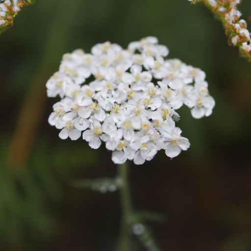
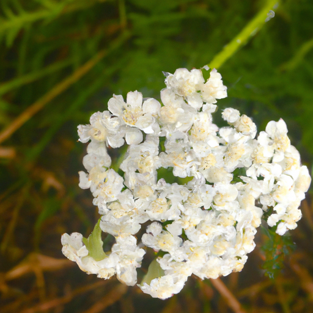
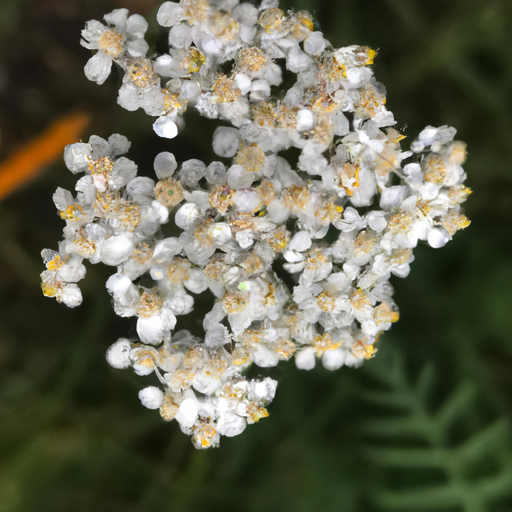

## [failed dreams and rural living - re-writing my story](https://www.youtube.com/watch?v=Xt_zJQ1Z4Ok)

<table align="center">
	<tr>
		<td align="center">
<<<<<<< HEAD
			
		</td>
		<td align="center">
			
		</td>
		<td align="center">
			
=======
			
		</td>
		<td align="center">
			
		</td>
		<td align="center">
			
>>>>>>> ffe52613361410ad9d371a0f80e81de4dd24175f
		</td>
	</tr>
</table>

Someone recently asked me if I have achieved any of my dreams, and come to think of it, I did in a way. But they also failed me. I reached some of my goals, but those achievements didn't give me what I was looking for. I wanted general happiness, of course, and courage, self-worth, and satisfaction in my way of living. Slowly, quietly following the pace of the seasons. I still stop and wonder sometimes if I'm missing out on something big living this way, and I think that's a common feeling no matter what life we choose.

Since it was such a rainy day and there were not so many hikers and other foragers out because of the weather, I decided that I would go out and collect some yarrow because I have some new recipes that I've been wanting to try with the arrow. And depending on where you live, you may see them all over the place. They look like this, they're these tiny little white flowers, and they are incredibly healing and have an amazing history. Anyway, I have gone to the little forest area right behind my home, and so we'll see what we find. And I'm excited to take you with me.

So, I have successfully found a basket full, and so we're gonna take them home, dry them, and experiment a little bit. A surprising amount of people purchase homes in this area only to move away the next year, saying that it was too quiet, the winters too cold, not enough social gatherings and opportunities. All of these are valid, and much like the old folk tale of the city and country mouse, I know that this is where I truly belong and feel most fulfilled. Though it isn't a lifestyle meant for everyone, even though sometimes I still do doubt my path, I know that I can always find answers in nature.

For example, yarrow is a plant with a rich history and yet is considered by most to be a troublesome weed. It is an interesting metaphor for finding fulfillment in life. As a quiet and sensitive person, we may sometimes wish we are louder and brighter, a gorgeous luscious rose instead of a diminutive weed. I think we all have those insecure moments where we wish we felt more brave and notable. But perhaps we're forgetting that, like yarrow, you can't know much about a plant simply by looking at it. Their strength lies within, in something deeper, something others may not always notice.

I take great wisdom from this flower, remembering that we should never question our worth. Instead, we need to recognize it and not compare value with others. We just need to grow and offer healing to those who come in contact, much like the simple wild yarrow. When I started the journey of healing my body and mind after many years of self-harm, I realized that it had to begin with opening that little corner of my heart that felt somehow I deserved to be mistreated. Every time a past bully had called me names or hurt me, I thought for some reason it was no more than I deserved. That was the fundamental shift that had to happen, the belief that I am worthy and good. And you, you are also worthy and good. Because it begins with believing we're good enough to get help, to love, to begin from wherever we are, mistakes and shortcomings, and go forth on that journey of who we will become. And that person doesn't need to achieve anything to be extraordinary.

So yes, perhaps my dreams failed me in a way, distracting me with the false promise that success or reaching your worldly goals will make you value yourself by default. So now, I wake up each morning and rewrite the story. Paula isn't living in order to achieve great things. She doesn't need to prove herself. Instead, she's here to simply be. And through that process, she will find her greatness and her voice and her self-love. And so, I hope will you do.

As I am sitting here enjoying my tea and shortbread and a good book, I realized that it has been quite a while since I really took time to enjoy a moment like this. I've been quite caught up with work, but also in the process of continuing to move into the house and try to get some plants planted and just get a lot of things done. It's a wonderful reminder of how important it is to take those steps to take care of yourself so that you can better take care of others and be more authentic and giving in that way. And have more of that energy and vibrance and zest for life that I think only comes when you are well-fed and well-rested and at peace with yourself. And really taking those moments to take care of your physical, mental, and spiritual life.

At least in my case, one thing that I did recently was I found these little transparent decals that I put in the windows in order to keep the birds from flying at the windows. Because I was very concerned about the risk of any little bird losing his life by hitting the window panes. And so, I put them in the windows, and they look absolutely darling. That's just a fun idea for you in case you've ever wanted to decorate your windows.

But that being said, I think I'm going to go out and garden a little bit. I highly encourage you to try yarrow lemonade if you have yarrow growing in your area. It is a really fun recipe, and I think whenever I work with flowers, I'm always fascinated by the interesting flavors you get from them. Because yarrow is normally a very bitter plant, but when made into yarrow syrup and combined with lemon, it creates a really interesting and lovely taste, in my opinion. But as always, it is not for everyone.

Anyway, I hope you have a wonderful day, and I'm sending you all my love. Thank you for everyone who pre-ordered my book. I really deeply appreciate it. It has been so exciting to finally have something available that I've been working on for gosh, I think a year now. So, it is available worldwide. I will leave links down below. And thank you, everyone. Thank you so much. Thank you all so much. I'm sending you all my love, and I will see you very, very soon. Goodbye.