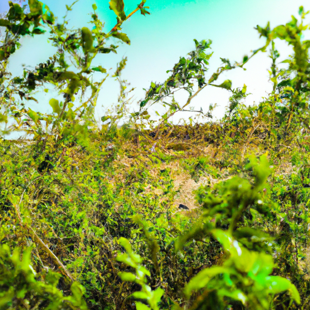

## [falling in love with a messy life - a note from the wilderness](https://www.youtube.com/watch?v=V1OSzXe5HMs)

<table align="center">
	<tr>
		<td align="center">
			
		</td>
		<td align="center">
			
		</td>
		<td align="center">
			
		</td>
	</tr>
</table>

Thank you, hello everyone. Today, I am harvesting some wild flowers from a variety of wild shrubs growing on my property. Many of these bushes are not often found in urban areas due to their petals often being released quite quickly. Some bushes grow berries that fall and cause sticky residue on sidewalks. Many of these species are considered, therefore, rather messy, but I like them and I especially like to see them growing in wild places where they don't need to be tidy or perfect but can instead thrive untamed. For me, they symbolize the strength that comes from building a deep root system that can find water and nutrients to support life even when times are hard.

I still experience uncomfortable emotions, but I've improved on accepting things as they are, messy and otherwise. I make videos for the most part when I'm feeling positive and cheerful, but I don't always feel that way. While I share with you the things I love about life here, there's a lot of imperfection as well. I've had some experiences in my younger years that left me feeling deeply lost with low self-esteem. Life certainly felt messy back then. Fast forward to today, things are much better and completely different, but now there are new questions. Questions about my career and what I want to do next year. My siblings now live far away, one on the other side of the planet, and I miss them dearly. In terms of relationships with others and personal challenges, everything is wonderfully imperfect but also perpetually evolving towards something new, something better, though not always easier. And perhaps it should be that way. If everything was easy, I'd have no reason to grow like the wild shrubs on my property. It is only harsh conditions that make their roots venture deeper into the soil to find something to help them withstand the storms.

Foreign teach us what to value, overwhelming experiences teach the importance of growth, mistakes can lead to experience, self-criticism to wisdom, emotional overwhelm to emotional intelligence, fear to spirituality. Much of what seems negative can also bring about great healing and strength. Thank you.

[Music]

Foreign

I started moving forward when I accepted that what had happened so far in my life is simply what had happened. Yes, perhaps some of it was unfair, some was painful, especially the experiences that leave invisible scars. But it happened, and all that is left for me to do is wonder where do I go from here? I had to stop giving power to those who brought me pain and instead give that power to myself and appreciate how far I've come.

Foreign

To paraphrase Christopher Robin, what if you are actually stronger than you seem, braver than you believe, smarter than you think? Who would you be? Who is that person? Things are messy sometimes and unfair and complicated. There will always be someone out there that is something I wish I had or is better at something than me or seems to be more put together. But I'm trying not to hold regret and self-criticism in my heart because so far in my life, it has never served me. Now, every morning, I ask myself, where will I go from here? And that question is starting to feel more and more exciting.

Foreign

You find me out here next to my bed of bleeding hearts and Sweet William. I'm so happy that they're doing so well. They were just these tiny little sprouts last year, and this year they're like three, four feet tall. So it is amazing, and I'm just so happy with them, how well they've been growing. It is interesting how when it comes to plants, if you find just the right spot for them to be, with just enough sun, just enough water and moisture, they thrive and they bloom. I often think of that in regards to ourselves, that often small adjustments in our own lives can make such a big difference.

At this moment, I'm not quite sure what I'm going to title this video, but one thing that is coming to mind at the moment is how important it is for me to appreciate and accept all the more complicated or messier times in life when things are not going as I had dreamed or planned. It really is because of those challenging times that you do appreciate the good. And I know that is hard to accept in the moment, but for me, it's always been true. It's because I have known what it's like to be at rock bottom that, at least for me, I really can truly appreciate right now feeling so peaceful and grounded in this new phase of my life where I am really tackling challenges head-on and not trying to run away from emotions and memories anymore.

One thing that comes to mind is the example of my own mother. She grew up in poverty, and her mother grew up in a very horrible, unsafe living situation and had a very difficult childhood. For my own mother, she used to tell me the story of how she would find old copies of Reader's Digest and cut out the photos in the back that tended to be landscape paintings and photos. She would paste them on the door of her bedroom, and when she was feeling anxious or stressed or overwhelmed due to the very difficult life situation she was in, she would spend time looking at those images and letting their warmth and the beauty of nature warm her and inspire her to keep going and to keep looking for the positive and the light.

In these videos, I love to focus on things that make me happy and make me feel positive. But of course, there are so many messy things that happen in my own life and everyone's. But I do like to use this channel as an outlet for things that help me continue to feel renewed and find joy. Speaking of, I'm going to be making a video soon talking about YouTube and changes and what's going to be happening. I think it's going to be a very big video, and I'm going to share a lot, so stay tuned for that because I've been meaning to make it for quite a while. So you can expect that video in a month or so. And in the meantime, I really should get out of the rain because it is starting to really pour down. So, um, all right, I guess, uh, I guess the skies are telling me it's time to wrap this up. I'm sending you so much love. I do have a special thing happening on my Etsy shop this week. It is just an idea I got that is brand new. I don't think I've done anything like this before. I'm going to be selling mystery letters with some poems and other little scrapbooking materials inside, along with a bundle of my very favorite art pieces. And so it's going to be a handwritten note, and when you order it, you can write along with your order some comments or questions you would like me to address in the note. It will be a sort of fairy mail, and it is kind of a test run, so I only have about two dozen or so envelopes. But I wanted to let you know I'm excited to put together some really special letters for some of you. So I'm sending you all my love, and I will see you very, very soon. Goodbye.