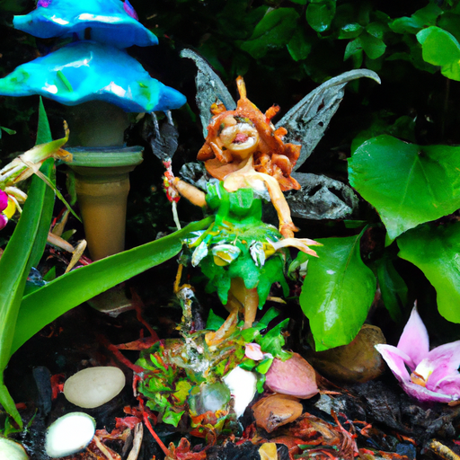
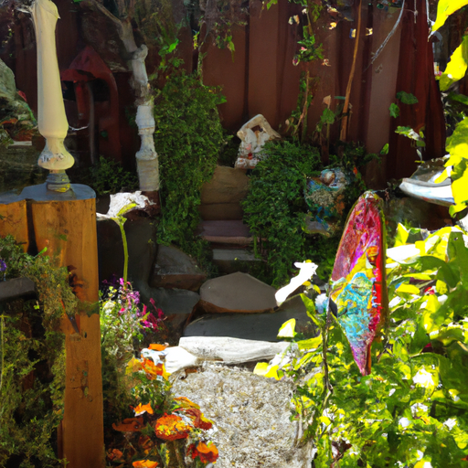
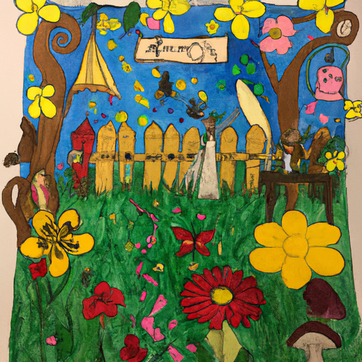

## [give yourself permission to be happy and heal](https://www.youtube.com/watch?v=J1UXWgXRDdA)

<table align="center">
	<tr>
		<td align="center">
<<<<<<< HEAD
			
		</td>
		<td align="center">
			
		</td>
		<td align="center">
			
=======
			
		</td>
		<td align="center">
			
		</td>
		<td align="center">
			
>>>>>>> ffe52613361410ad9d371a0f80e81de4dd24175f
		</td>
	</tr>
</table>

Today I'm visiting a very special place on the coast that reminds me of a world you'd find in Alice in Wonderland or The Secret Garden. It is an enchanted and magical Glenn and I found myself feeling completely content and at peace here, and I let myself be happy. I have some family members that are going through a hard time. The news has been a bit dismal, small and big worries alike would just love to arrest my consciousness and demand attention right now. But I decided that no, I deserve to accept the healing and beauty all these plants are so generously offering me. Asking for nothing in return. By rejecting it for the sake of worrying about what I cannot change would be a sad thing. Instead, I decided to offer the feelings of love and wholeness I was experiencing to the world around me. Because if we're all waiting around for things to be just right for us to allow ourselves to heal and to be at peace, then we're never going to get there. Thank you. So we can choose to ruminate until our last breath, or we can find a new way, a gentle path. And we can understand that considering the ever-present darkness in the world, if we don't know how to find peace despite it, I wonder if just maybe we're missing out on the best part of being alive. We need to practice holding the emotions in our hearts we believe everyone should enjoy. And we can do that without invalidating all the struggle within us and around us. For I know it is impossible to be happy all the time, and sometimes our burdens or situations will simply weigh us down, and that's okay. But I think it's important to find little moments to be at peace and to hold a space for love and even joy if it arises within us. I find in a world where we're constantly updated on violent news, everyone seems so angry over politics, and doom scrolling is all too easy. It may feel like you aren't allowed to be happy sometimes, but I don't believe it is a selfish act when it is done with love and awareness that we're connected to everyone and we're all learning how to be better together, to help each other, and how to be content in a complicated world. It can get so dry where I live, you know, about this time of year. Everything has turned brown or wilted, except for things that have access to water. And it is the natural cycle of life. Over there, where it is so sunny and so cold in the winter, but taking little breaks from that and coming over here more to the coast and just seeing the beauty and the abundance is so refreshing. I love my home, and I certainly wouldn't want to live anywhere else, but coming over here has been really magical, and I think I needed a bit of a vacation. I like to think that different types of fairies live in all parts of the world, and I definitely think there's a very specific type that lives over here, ones that like the dew and the moisture and the moss. This is one of the most magical gardens I've ever been to, and I have been to a lot because that is one of my hobbies, visiting gardens. This is the Heronswood Gardens, and I will leave links down below. You absolutely have to visit if you ever get the opportunity. It is way too special to pass up, and if you don't believe in fairies, you will by the time you finish walking through this garden, I guarantee it. The smells, the sounds, everything is just so wonderful, and I think I'm gonna go find a quiet place to go sit and contemplate nature, to do a little meditative quiet time. It is so healing, and I'm so glad I've been starting to put that into practice every single day. I think it is so beneficial to everyone to spend some time just being sometimes. Thank you. I hope this week you allow yourself some moments to be at peace, to heal a little bit more, to find contentment even when it's hard. I also hope you appreciated some musings while wandering in a fairy garden and daydreaming of fairy tales and acts of kindness. Sending some fairy wishes your way and so much love. So very grateful for the opportunity to be here right now. I thought that I would take a moment to sit here and focus on my breathing, hopefully with all of you. I can imagine most people are going to want to go and do something else right now, so for those interested though, I think it can do all of us a lot of good to take just a few minutes to stop and sit and be okay with just being here and being alive. We don't need to be entertained, we don't need anything to distract us, we can just be. So I'm going to go ahead and do that for just a little while, and I hope you can do that along with me. So what I'm going to do is lean back just the slightest bit, focus on my breathing, bring my breathing from my chest down to my belly, and focus on that. And I'm going to go just breathing in for a few seconds and then breathing out. If you sit still for long enough, there are so many more things you notice. It is so interesting. Thank you for spending this episode outdoors with me. I know that not everyone enjoys, you know, the nature more nature-focused videos, but those who do, thank you. It is one of the most important parts of this channel to bring awareness to beautiful places and to inspire other people to not only connect with nature but seek to preserve it. So thank you, and I'm sending you so much love, and I will see you soon.