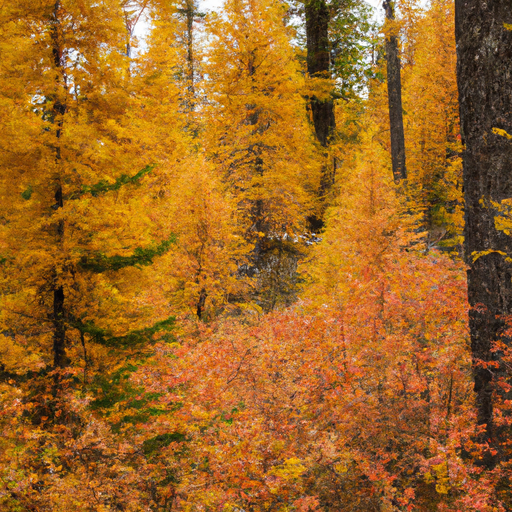
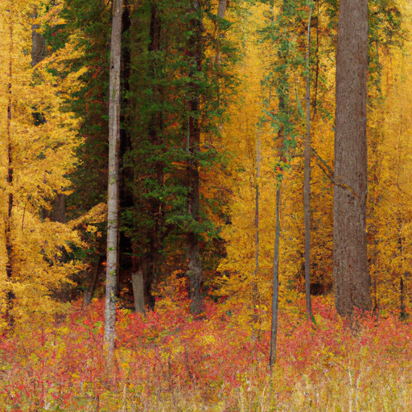

## [how I find energy to live everyday - my new expectations](https://www.youtube.com/watch?v=sS_QHTJSuaA)

<table align="center">
	<tr>
		<td align="center">
<<<<<<< HEAD
			
		</td>
		<td align="center">
			
		</td>
		<td align="center">
			
=======
			
		</td>
		<td align="center">
			
		</td>
		<td align="center">
			
>>>>>>> ffe52613361410ad9d371a0f80e81de4dd24175f
		</td>
	</tr>
</table>

The magic of autumn is upon us. The palette of the forest has shifted into gold, with Tamaracks and red Huckleberry leaves. Recently, I was reminded of a favorite quote by the children's author Roald Dahl, and I feel that it encapsulates so many of my feelings this autumn. "Watch with glittering eyes the whole world around you, because the greatest secrets are always hidden in the most unlikely places. Those who don't believe in magic will never find it." For me, autumn is a perfect time to rediscover that fairy magic.

Whether or not we have the energy to tackle every day with enthusiasm, we do have the potential to travel infinite interior worlds, learning about ourselves and others in the process. I made a previous video describing myself as someone who does not have large stores of energy, and it is something quite natural to me that I've accepted. I will always naturally be someone who takes things slower and gets easily overwhelmed, and this is something that I think applies to anyone who has ever felt overwhelmed or perhaps uneasy over the responsibilities of living as an adult and having such high expectations of ourselves.

It is so important to celebrate each and every accomplishment. It can be as small as taking time to pick out a thoughtful outfit, vacuum, wash dishes, be assertive, or in my case, spend some quality time baking and enjoying the ambiance of autumn. Allowing myself some quality time that often feels out of reach in the midst of a busy work schedule.

There was a time in my life where sitting down and eating a wholesome meal was just about the hardest thing for me to do. I will share more about this story someday, but the fact of the matter is that I would never have progressed further in healing my relationship with myself and food without celebrating every time I step and gently correcting myself when I falter. I still find great value in getting up each day and acknowledging each successful step instead of looking at the day as a whole, seeing it as full of many little opportunities for living well.

I usually don't bake in the evenings, but I decided to try it out and see how it went. I really immersed myself in the experience by lighting a lot of candles and really getting into that autumnal atmosphere. It was just really wonderful and very meditative. For the record, I do know that every time I light candles, I make some people nervous. I can promise you I'm extremely careful with my candles, and I always take a lot of care when I'm lighting them. But I do deeply enjoy the atmosphere, especially this time of year when it starts to feel a little chillier, especially in the evenings and mornings. I really appreciate it, so I'm going to keep pursuing this experiment of an apple pie and/or an apple peach pie, and we will see how it goes.

I actually don't have too much experience making pies. My husband, Luke, is actually a very experienced pie maker. He has a cookbook all about it, and he's made a lot of very delicious pies. So I usually leave that up to him. I was a little bit intimidated because last time the pie that I made exploded. Thankfully, this pie did turn out well, and I ended up pretty much eating a good portion of it right out of the pie pan, and it was just delightful.

There is a lovely woman in my town who has a sweet little thrift store, and I got these little cream and sugar pieces from her, and they were just so cute. They were like two dollars, so I am just taking a moment to really appreciate all these really sweet things. And of course, all this squash and even my little tiny pumpkin, which I think is just about the cutest thing.

One of my favorite things this time of year is that the grocery stores just get full of this beautiful painted corn, and it's just so beautiful. I just love decorating my house with it. And so many little things I've been enjoying this week. I'm sending you all my love. Thank you so, so much, and I will see you very soon. Goodbye.