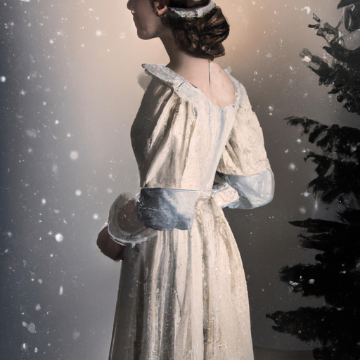
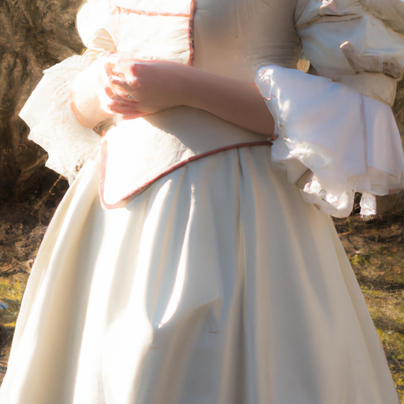

## [how I found my path - a day in a rural cabin in winter](https://www.youtube.com/watch?v=1n_4ZOUAYFw)

<table align="center">
	<tr>
		<td align="center">
			
		</td>
		<td align="center">
			
		</td>
		<td align="center">
			
		</td>
	</tr>
</table>

Good morning, days are starting late over here as we don’t have sun until 9 at the earliest. It makes it easy to sleep in or read spooky wintry stories in the soft light, before the day takes over.

Over a year ago I purchased a historically inspired gown. I wanted to wear it to a fantasy fair, but unfortunately didn’t get the chance to go. I decided that today, in celebration of the season it would be only apt to finally put it on. I appreciate you humoring me as I play dress up.

For some reason it reminds me of clara’s nightdress from the nutcracker by taichovsky. I used to dance ballet as a child. Sadly, I was told I grew too tall to be accepted in the advanced programs, and that my height would make me look mismatched from all the other dancers, and so my dream to play clara would not be fulfilled. Instead i got to play an evil rat, which was a bit of blow for a child who desperately wanted to be a fairy princess.

At the time, I felt like a dream of mine had been shattered, not understanding that the limitations of one dance academy didn’t mean I couldn’t continue to enjoy ballet. Looking back, it seems like such a faraway memory, something so small and insignificant. But it was one of many moments were I felt, however briefly, like I didn’t measure up and the path I intended to take was now veering away in some unknown direction.

This continued to happen. As an adult I interviewed for jobs and didn’t get called back. I submitted my writing and art to magazines and was rarely, if ever, published. Over time, through a series of failures and occasional wins I was left thoroughly confused as to what I was good at. Maybe I wasn’t a genius in any specific field, no hidden talent that I just had to find in order to do something amazing.

I was not the smartest person I knew, nor the most sociable, or popular. I had been painting my entire life, and yet I had artist friends who could create photorealistic drawings within a few days, when I would just turn up some rushed bunny sketches. Maybe, I began to think, I was just an average person. It made sense, it wouldn’t be a term unless many of us are. And it’s funny, because it was only by accepting that possibility that I found my path. I stopped trying to be the best - it was liberating, because the journey began about doing what I could with what I had.

For example, the best art was what brought me joy to create, even if a bunny fairy will not hang in a prestigious gallery anytime soon. And I don’t mean this to start a debate over whether or not you or I are average - because all of this relative. Intelligence and talent is often misunderstood, and I know that now. You could have all the book knowledge of the world, be business tycoon, solve the mysteries of the world, but if you can’t figure out how to be happy, or love unconditionally, then aren’t you missing something worth knowing? Doesn’t your intelligence fail you at a crucial point?

My search for meaning involved keeping true to the mysterious, winding road ahead, shrouded in mist. Eventually, it brought me here. To my home, to selling my art at farmers markets and eventually online. I now consider myself both intelligent and talented in my own Paola way. I am in my own category, as are you. It isn’t in a competition if we chose not to participate. Because winning usually involves other people measuring your success and approving that title. Why would you ever want to give anyone else that power over you?

I don’t know, maybe you do. I definitely don’t have things figured out. Maybe I’m just a rather odd woman, wearing a fancy gown for no practical reason, making an overly detailed gingerbread houses, constructing fairytales through the lens of her camera, and trying to live a meaningful life.