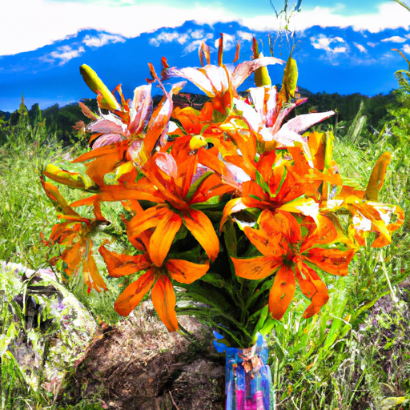
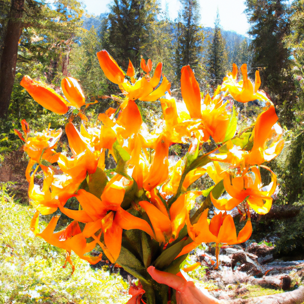
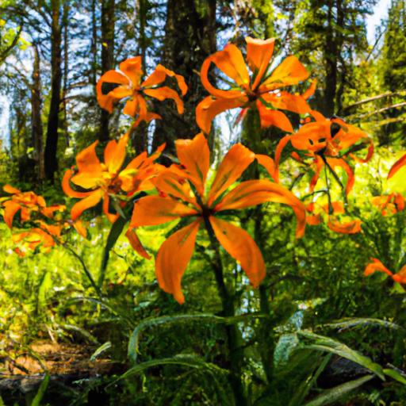

## [how I make every day matter - living a small dream](https://www.youtube.com/watch?v=mdkX_H1dc-A)

<table align="center">
	<tr>
		<td align="center">
<<<<<<< HEAD
			
		</td>
		<td align="center">
			
		</td>
		<td align="center">
			
=======
			
		</td>
		<td align="center">
			
		</td>
		<td align="center">
			
>>>>>>> ffe52613361410ad9d371a0f80e81de4dd24175f
		</td>
	</tr>
</table>

Today, I'm going to the mountains of my home in the pursuit of a very Noble flower. It is known as the Wild Tiger Lily, also the Oregon Lily, the Columbia Lily. It goes by many names. Lilies are social flowers, they like to grow in small groups. If there are too many of them in one place, they may get crowded. But with a few close friends, they flourish. I can relate to these lilies. I feel at my best around family members and choice friends. I'm not a social butterfly, neither am I disconnected. I'm somewhere in between, and I like it that way.

Embracing connection was the antidote to the loneliness I felt years ago. And I find that not only humans, but animals in nature provide that source of friendship. And speaking of friendship, I decided to go visit a very special person today. I took pictures of the lilies I found to an artist who has mastered silversmithing. Her name is Nicole, and she makes absolutely enchanting creations. As she worked, she allowed me to watch her process, as well as sneak away for a few moments to explore the wonders of her magical studio. I loved spending time with another creative soul, and couldn't have been happier with the result. If you'd like to see more of her work, I will leave information down below, as she makes amazing jewelry as well as art pieces.

As she worked, Nicole told me her story. How she always wanted to dedicate time to her art and was very passionate about nature and conservation. And how eventually, she found a way to start her own business. It was inspiring to see someone who just kept working towards their dreams, no matter what. Even when it took a long time and there were setbacks along the way. What a wonderful reminder that we can all make our dreams happen, though it may materialize in a way we did not anticipate or on a timeline we did not plan.

I spent most of the day away from home and didn't return until the sun was setting and I was quite hungry. My new art piece inspired me to make a meal using the daylilies growing in the garden. Fried buds taste like buttery delicious vegetables and paired well with a coconut curry using some peppers and beans from both my garden and the grocery store.

As I've gotten healthier, cooking has become an increasingly enjoyable process. This morning, I made oatmeal with butter, banana, honey, and cinnamon. For lunch, I had cream cheese bagels with sprouts and tofu. I try to cook and eat quietly, focusing on the motions of preparing my food as well as consuming it. It was an important part in healing my relationship with what I eat.

At the end of the day, I've rather self-critical in negative thoughts. And those are always a reminder to me to practice joy and respond to how I feel with encouragement. Focusing on a more empowering mindset that helps me remember that this day was full of so many blessings. Everything from lilies to art and a good meal to a shelter to come home to. It was a beautiful day, and I wish the same for you. Thank you. I have been absolutely mesmerized by this piece. I have never worked with metal or done anything related to jewelry, and it was so incredible to see her work. And I actually picked some daylilies this morning, and I realize now that they look so similar. Don't they look beautiful? There are so many lilies growing around the valley right now. There are tiger lilies, there's Glacier lilies, you know, just all sorts of beautiful flowers. It got me thinking about how I think that all of us have a creative side to who we are. You know, if we are able to kind of be open to that.

Nicole actually does an extremely unique style of silversmithing. She makes all of these things by hand. She does not use molds. She is definitely a kind of groundbreaking in her approach to working with these metals. So I will share all of her links down below in case you're interested in learning more about her. And I thought I would use this as a moment to talk about something that has been hard for me since I have started this channel. Whenever you put your art out into the world, you get mixed reactions. When I started making videos, which to me, this is an art form, but also sharing my own art, I got positive reviews as well as criticism. And when I first started, that was hard to take. It was hard to hear people saying that they really didn't enjoy what you were doing and what you were putting out. Or that they didn't even think you should be allowed to put things out into the world. And it is never easy to take criticism. But whenever I think of art, that kind of comes to mind because I think the whole point of art is for it not to be about how other people react and what other people say or do. It is about your own personal journey and your own relationship with what you're doing.

I hope this Lily can encourage all of you to make sure you put people's feedback in a healthy place. To not overuse it in terms of defining who you are and whether or not you should try new things or put yourself out there. You know, it really is up to you at the end of the day. And I think we all stand in our own way way more than we would like to admit sometimes. And it is so important to be aware of that and push ourselves a little bit out of our comfort zone now and then. I think it is probably good for us all, at least it is good for me.

Well, I think I might have to go back up to the mountains now and see if I can find some glacial lilies to compare. This Lily can be true to who you are this week. Enjoy your own creative side. Enjoy the parts of you that other people might think are odd or strange or weird. I have been called strange, weird, childish. I've been called so many things. And if I internalized all those words, I wouldn't be able to keep doing this. And it is so important to know who you are and to know that your innate worth is already here, no matter what. In the same way that Nicole and I like to put our art out into the world, I hope you put your own self out to the world and your own creativity in all its shapes and forms. And don't be too afraid to have courage and be kind, my favorite princess quote forever and ever.

Thank you for all the support of my Etsy shop and my own work as an artist. It means the world. Please feel free to show Nicole some support as well. Again, all her links are down below. You can connect with her. She is an incredible person. So I'm so fortunate to have met her. Sending you so much love, and I will see you again very soon. Goodbye.