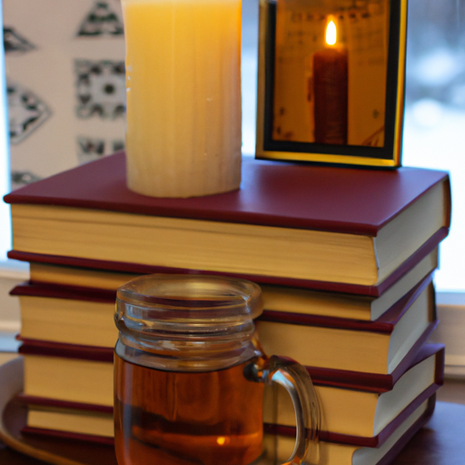

## [how I stay mindful with my budget - adjusting to life with a new home part 2](https://www.youtube.com/watch?v=1AZl-EUyhNk)

<table align="center">
	<tr>
		<td align="center">
			
		</td>
		<td align="center">
			
		</td>
		<td align="center">
			
		</td>
	</tr>
</table>

A couple years ago, I visited a lavender farm that was absolutely full of sweet little buzzing bees. I brought home several jars of wildflower honey, finding the taste to be quite unique. I don't use honey very often in my cooking, so this winter I decided to break out those old jars and use them in a recipe for honey wine. If I can name three things I deeply enjoy in my home life, it is candles, books, and delicious warm drinks, so this was a fitting way to spend a winter afternoon and pay homage to the coming spring.

Moving on to last week, I had a chat about the guidelines I follow in order to spend mindfully throughout my day. As Luke and I are currently attempting to stay on a budget and plan for our future family, it is important to be conscious of our spending habits. Firstly, when it comes to decorating our home, I keep in mind the perspective that the best, most peaceful, and loving environment is cultivated with good memories, love, friendship, and laughter. A home that nurtures these things is all that is really needed. The same applies to clothing. No amount of new pieces will disguise a soul that isn't thriving and seeking joy in the everyday. An open heart, a positive outlook, and kind words are what make people beautiful. Items, while practical and useful, cannot offer this to us. If I wish to impulsively spend, I write down the item I'm considering and, if possible, walk away. I give myself a couple of days to think about if I really want it, and very often my feelings change, and I realize that my inclination was simply coming from a place that wasn't as mindful.

When shopping, I ask myself if there is an alternative to the item I can use or make at home. This question is helpful in regards to buying storage containers and more practical home items. Often, I have boxes or things laying about the house that I can repurpose if only I consider my options. In regards to clothes, I try to mend and fix what I already have. Often, on websites like thredUP and in secondhand shops, I can keep an eye out for brands that I like. For example, several of my dresses are from a company that I don't often support directly but pop up on thrifting websites regularly. I also have some very nice boots that I take in for repairs. Sometimes, it makes a huge difference in my spending habits.

As you know, I buy thrifted items when possible. My local shops are always overflowing and more than happy for someone to take something away. As I peruse items, I often stop to wonder if what I'm adding to my home would make it feel cluttered or add significant extra stress in regards to cleaning. It helps me keep what I buy to a minimum. Of course, I value having a home with items that are special to me. I'm certainly not a minimalist. My love of vintage items and art supplies would not allow it. But I do try to keep surfaces clear so that I can tidy easily.

I find developing a meditative or spiritual practice always helps me disconnect in a healthy way from material things and remember that only the essentials are really needed for a full life. I also try to be aware of how advertisements instill a scarcity mindset in me, insinuating that I need an item to be happier or fulfilled. This is not true, and once I'm aware, I find myself naturally shifting my habits and reflecting on my own insecurities and resolving those in ways other than consumerism. While it might take initially some self-restraint and dedication, I find the benefits are overwhelmingly positive.

I have been pleasantly surprised by how simple and easy it has been to make this change. I think the challenging part, as always in a house with a lot of pets, is to make sure everything stays clean and no cat paws touch everything because I have such a curious cat and she has a tendency to get into anything I do. So thankfully, it all worked out and we are going to get some Mead. But it was really fun to make, and the honey that I used is local honey that comes from all the wildflowers in the area, and I just love the taste of it. So I'm very excited to see how it turns out. I only have about 27-26 days to wait now until it is ready to put in the bottles, and I have created my label because "fairy nectar" I think is a very appropriate term for this type of drink. It is so delicious. I tend to get an upset stomach if I have any substantial amount of a drink, so I'm just going to have a very small amount, and I think that is how this sort of drink is meant to be enjoyed anyway, just in very small little cups as a dessert.

As you can see, there has been a bees and beeswax theme to this video. I have received quite a few beeswax candles lately. You may not know this if you have bought beeswax candles at the store that are mixed with other waxes, but when you get completely natural 100% beeswax, the smell of the candles is so delicious. You do not need any added scent because it just fills your home with this amazing aroma.

I hope you enjoyed these little tips that I shared about mindful spending and how I like to think about my budget. It has been a year of so many changes budget-wise, with finally being able to get a home. So we have had a lot more to think about, and it has been a good challenge but a challenge nonetheless to rethink everything about our spending and do our best to economize where we can and live within our means as much as possible. I definitely rely on my Etsy shop in order to keep creating these videos, so I definitely appreciate every one of you who has supported my shop. There's never any obligation, but there is much appreciation.

So thank you for me. I find it to be extremely helpful to grow in awareness of advertising and how so much large-scale advertising works in order to create insecurities in ourselves. I think this is true for everyone, but I could see how it can be extra intense for women because there is so much clothing and cosmetics advertisements that often send messages that make you feel like you need these products in order to feel better about yourself or be more acceptable to others.

I find as well it is helpful to journal about my spending habits and things like that. I think I remember when I was much younger that I would sometimes have this feeling that if I had this one piece of clothing, it would just make me feel so much better. And that feeling was always short-term because all it took was a couple of days, weeks, months later to go into another store and see another item that I was just sure was going to make all the difference. I think we do fall into that cycle quite easily of thinking that these physical things will somehow ameliorate feelings inside. And as far as I know, it has never made a lasting impact. The only things that have led to more long-term fulfillment is working on my own confidence and my own self-esteem. I think developing those feelings come from within and to develop a practice of meditation or even your own spirituality, if you are a spiritual person, and if not, just more grounding of yourself and really wondering where your feelings come from. What can you do that is not related to simply giving in to consumeristic tendencies that can nurture you? I find for me, getting a lot more involved in my community, getting passionate about projects that I have in mind, reforestation projects, conservation projects, and being part of those things and volunteering really makes an enormous difference. Of course, personally, my more spiritual life is extremely important to me, and I do always say that reticently because I know that not everyone is inclined in that direction and not everyone has any interest in developing that. So I simply share that from my perspective, it has always been extremely helpful. But if that is not for you, I know that grounding meditation and focus exercises can help in getting in touch with your feelings, your inner thoughts, and sometimes that can be a little bit alarming. It's almost like it might stir up a lot of feelings to spend time with a lot of things that you have brushed under the rug for many years. I know for me, really facing my tendency towards anxiousness and stress made those feelings come up and feel more difficult to handle in the short term. But in the long term, I've learned coping mechanisms and strategies to change my thinking and become a lot more positive, peaceful, and grounded.

While I deeply value so many physical things in my life, I'd love to go to thrift shops, I love candles, I love books, I don't need them. And I'm always making sure that if I'm receiving something, I can make plans to give something as well, especially within my own community.

I am sending you so much love. I have such exciting news, and it's really hard not to talk about it. So I will see you very soon, next week in about six or seven days. I will share the news, and it is just going to be the most amazing thing. If you have a guess of what it is, do share it down below because I do want to talk about it, even though I can't. So stay tuned. I'm sending all of you my love, sending well wishes for a lovely week, and I will see you soon. Goodbye.