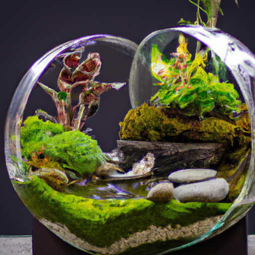
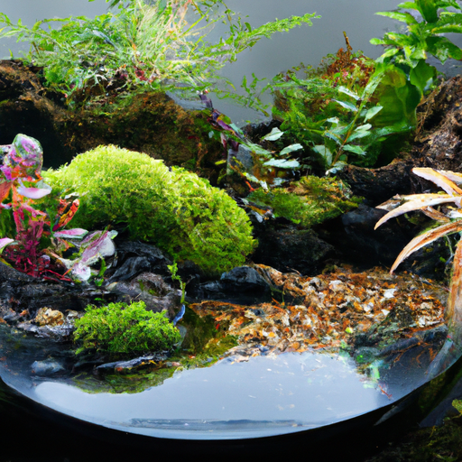
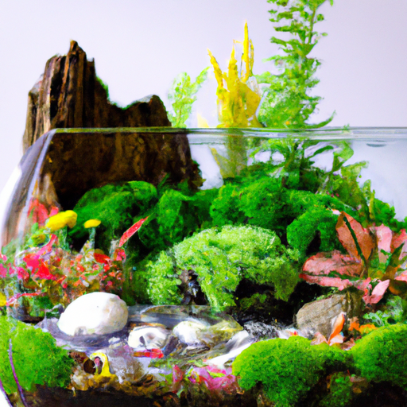

## [how I thrive when life is too much - overcoming crippling anxiety one day at a time a gentle story](https://www.youtube.com/watch?v=huio_O08Gws)

<table align="center">
	<tr>
		<td align="center">
<<<<<<< HEAD
			
		</td>
		<td align="center">
			
		</td>
		<td align="center">
			
=======
			
		</td>
		<td align="center">
			
		</td>
		<td align="center">
			
>>>>>>> ffe52613361410ad9d371a0f80e81de4dd24175f
		</td>
	</tr>
</table>

I found myself appreciating the sound of nature, spending more time without distractions simply being and listening. That is one of the most powerful tools I have in combating those internal stresses that often accumulate throughout our days, particularly when work and relationships and busyness take over. It's natural to get caught up in these things, but what is unnatural, I believe, is never taking a moment to slow down and allow yourself to be in the company of your thoughts, even for only a few minutes in the midst of a hectic day. Doing this helps me sustain a peaceful mind and befriend my own thinking, allowing those tensions and worries to show themselves not as monsters that will make me want to run away, instead they are simply a part of life and it's up to me to improve my relationship with my feelings. I can learn to manage anxiousness in order to slowly create the daily experience I yearn for, not a perfect experience, not without its tricky moments, but overall much improved.

I made a video a while ago on how anxiety has impacted me on a level that at one point I could no longer function normally. Since then, I've made enormous progress. I first started tackling my relationship with anxiety by working very hard at it. I went overboard policing my own thoughts and trying to control what I thought and how I felt. Sometimes I would shut down my emotions altogether and tap out for hours, watching a TV show or desperately trying to avoid being in quiet. This inevitably made things worse over time, so I realized I had to transform my method.

Instead of treating my daily hikes as workouts, I started to treat them as mindful walking experiences where the movements I took were more rhythmic, not too fast nor slow, but steady. And I did my best to focus on my senses, on touch and sound. If you're someone like myself who experiences anxiety in their entire body, not just their mind, and can often feel like they just want to stay in bed and hide away from everything, these gentle movements have slowly, over the course of months, changed a lot for me.

I've been working on this little terrarium for the better part of an hour, and it's been, for the most part, in silence. I've been listening to my own breathing, listening a little bit to the little water fountain I have running in the corner of my home, my cat playing, the sounds of the birds and the squirrels outside. It is amazing how once you slow down and start listening, how much noise there actually is to often enjoy or that is interesting or hopefully calming. I think if you are in an apartment or in some place that is quite busy outdoors, you may enjoy playing some ambient nature sounds in your home or have a water fountain like I do. I have found working on simple but focused little projects like this is so important for me, especially doing it as a sort of ritual of quiet contemplation and listening and mindful breathing. It does wonders for calming.

I love little projects like this as well because they bring nature from the outside to the inside, and I find that being in a home with plants, with other life, with a sort of family that relies on you to take care of it and to keep watch over it, is also something that really helps me as well.

With that being said, I think I'm gonna spend several hours working on some work projects, and then hopefully when the day is done, I will spend a little bit of time journaling if I get the opportunity. I highly recommend giving a terrarium a try. They look so beautiful in the house. You might want to design them several different ways depending on what type of plant you are going to use. So I'll leave some links down below if you're interested to learn more.

For me, it benefits me to write down my thoughts and feelings each day, while also taking time to write myself a kind and encouraging response to how I feel. Doing this consistently has helped me problem solve and manage much better. So much of our media is designed to elicit strong emotional reactions, and for me, I need to make sure not to be overloaded and, in a way, allow boredom and other experiences into my life. They have an incredible ability to kick-start our healing journey and creativity.

Staining relationships, work, career, community projects, and all sorts of other things are incredibly beneficial to me, but they do leave their mark, and sometimes I do find myself anxious at the end of the day. So these are some things that have helped me, perhaps they will help you as well.

I have been working on these paintings for a couple weeks, and they're so small that I've been just using the very smallest paint brushes I have, and it takes a very long time and you need to be quite patient. My grand plan is that by the time this video is up, I will have made these into prints for my little Etsy shop. However, in preparation, I wanted to accompany some of these art pieces with poems, and I find that writing poetry is perhaps one of the most healing writing practices I have done throughout my life, apart from journaling, which I started recently, which I didn't do before but has been extremely helpful for calming me and helping me settle down at the end of the day.

Perhaps it's just because I'm creatively inclined, but poetry has just always had a very special place in my heart, and I don't always think I write good poetry at all. I think that sometimes it's quite horrendous poetry, but I do like to just continue trying and working with words because I've always felt that the words I use and the words I put out into the world reflect on me.

So I will share an example of the poem draft I'm working on: "The little mouse sleeps in a field of thistle down, ever amazed by the wonder of a quiet world. These are sacred days," he whispers to Rabbit. "A slumber once again takes hold. They traverse a valley of shared dreams and lie beneath the twilight realm, speaking noble things we already know yet often forget upon waking."

And I have one more draft of a different poem to accompany my stag because I wanted to do a painting of a stag for a very long time, and so I finally did complete one, a simple one at that, but I did want to do a little poem for that one as well: "I am the guardian of the fairy folk upon the golden glen. You will find me prancing along the forest path, over fairy rings and memories that you left as you wandered by lantern light. Barefoot and hopeful that someday you will find the source of the wonder. Be patient, o sweet child, and let your light guide you."

That little poem I'm gonna take with me on my twilight walk with Iger this evening, and I'm going to read it out loud under the stars. And I think it's just a really lovely and calming ritual that always ends the day with a lot of mindfulness and meaning. And it always reminds me to stop and take a moment to appreciate how the day's gone because it is so easy to rush through the days.

Long story short, I find that embracing that sort of boredom, I don't feel like that's the appropriate word, but it's the only one I can think of, of when you kind of are free from distractions and quick gratification, particularly in the form of technology, I find that I absolutely love technology, but if I often use it too much, I find that it is so easy to fill up my minutes instead of allowing myself to have some time to just simply be and simply think. If I use these minutes differently, how would I want to use them and how could that benefit me? Calm, quiet focus in the way that it heals my body and my more physical feelings of anxiety when I'm having a difficult day is magical.

Now that I've been painting for quite a while and my neck is quite stiff, I'm going to go upstairs and get changed and get prepared for a little twilight walk with Iger. I'm sending all of you my love. Do take care of yourselves. I send you all the encouragement to work towards any healing you're looking for or simply finding more balance into your day. I think always the key is to embrace the process of coming to understand what it is you need to lead a happier life.

I was recently gifted these stackable watercolor trays, and I highly recommend them. They're multiple layers, and then you have a little cover for them. I find that my watercolors take a little bit longer to dry out, so that's always quite useful. It's already getting dark.